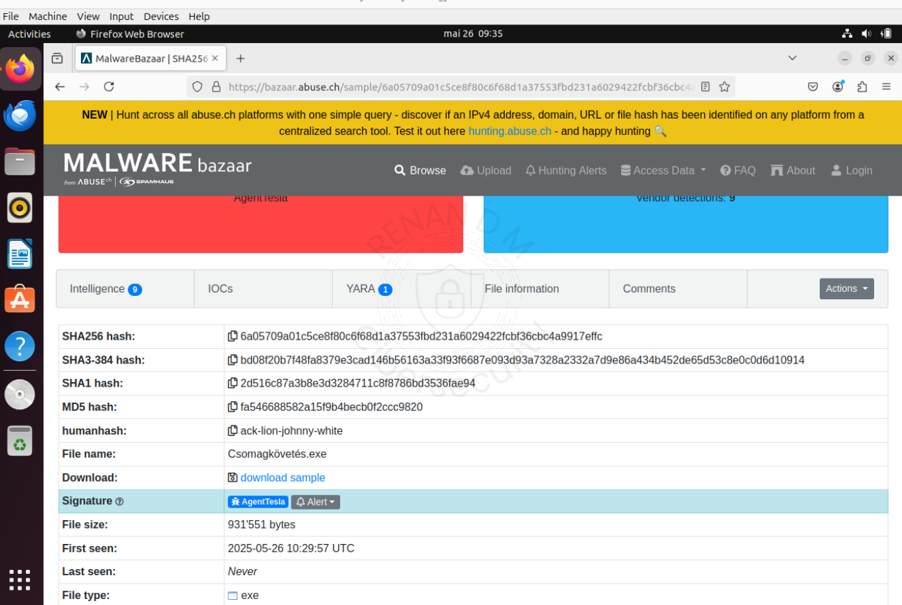
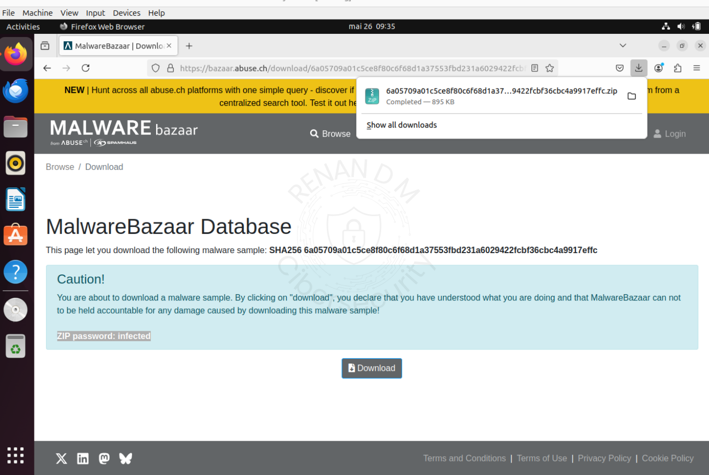
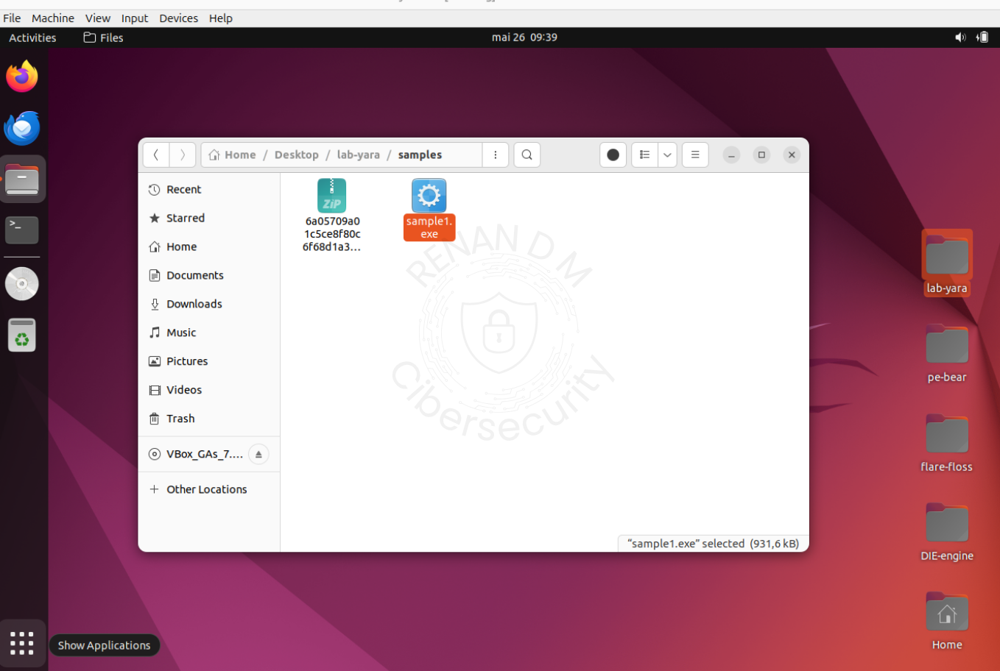
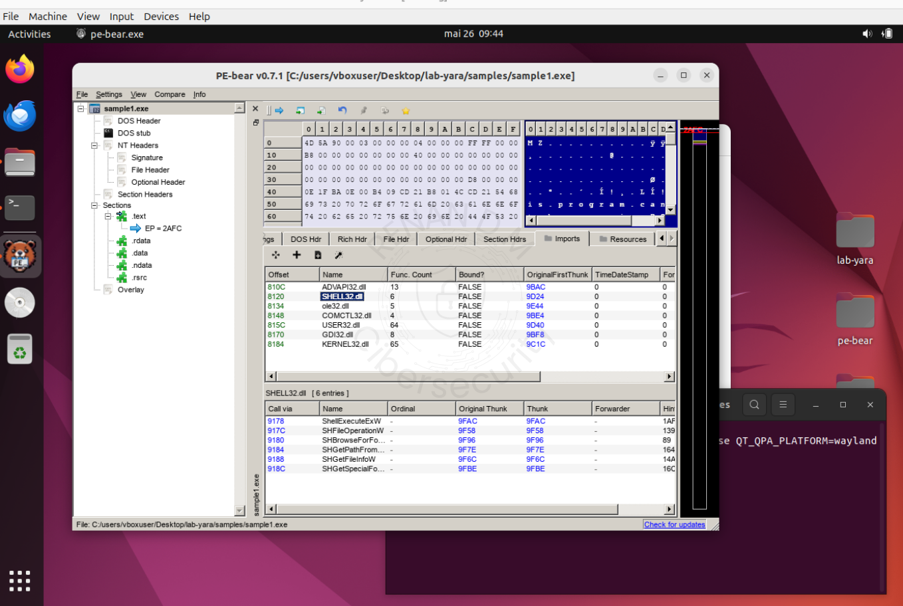
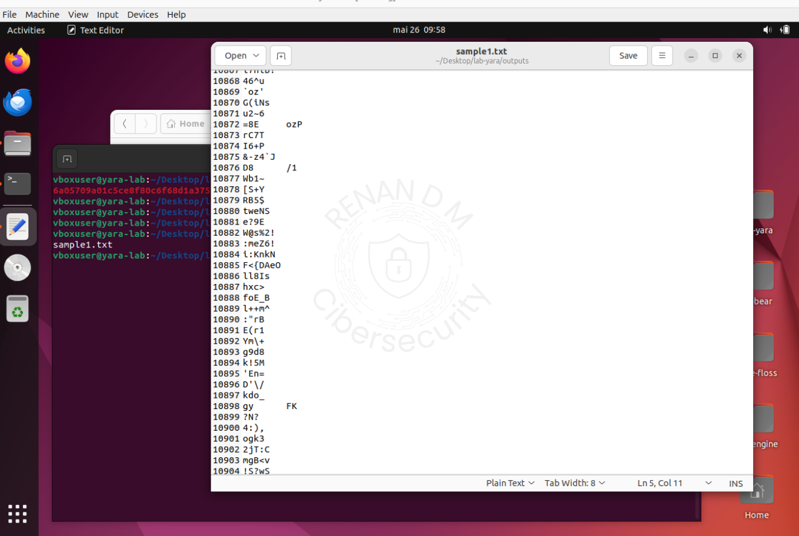
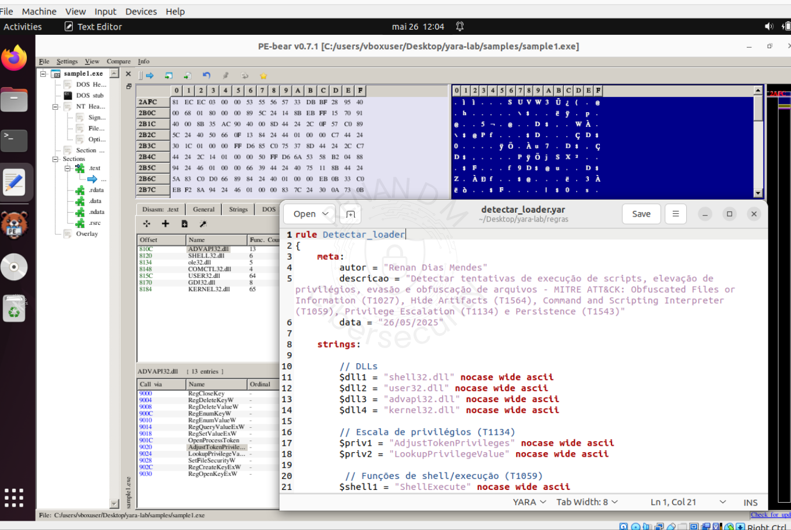
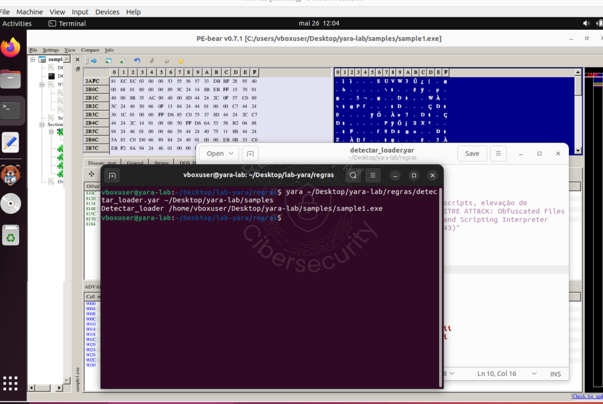

# Análise de Malware — Trojan Dropper/Loader

**Data da análise:** 26/05/2025 
Autor: **Renan Dias Mendes** 
Estudo com foco na extração de características, uso de ferramentas e criação de regra YARA.

---

## 1. Coleta da Amostra no Malware Bazaar

- Escolhi uma das amostras mais recentes:
                                                       

- Sample escolhida: [`Csomagkövetés.exe`](https://bazaar.abuse.ch/sample/6a05709a01c5ce8f80c6f68d1a37553fbd231a6029422fcbf36cbc4a9917effc/)
 
**Hash:** `6a05709a01c5ce8f80c6f68d1a37553fbd231a6029422fcbf36cbc4a9917effc`  
**Família:** AgentTesla
**Nota técnica:** Apesar do MalwareBazaar marcar como AgentTesla, análises comportamentais e VT indicam GuLoader/Makoob.
**Tamanho:** 931 KB





---

## 2. Isolando do Ambiente

- Desconecte a internet da VM (rede NAT desativada)

- Verifique com:
```bash
ping www.google.com
```


---

## 3. Preparando a Sample

- Para facilitar eu renomeie para sample1.exe

Extraia o zip para ~/Desktop/lab-yara/samples
(Senha: infected)



---

## 4. Análisando com DIE (Detect It Easy)

Abertura no DIE:


## Resultado:
- Linguagem: C
- Compilador: MS C++
- Packer: NSIS / Obfuscado
- Strings ocultas, possível empacotamento.

> Com essa ferramenta podemos compreender qual a linguagem e o compilador utilizado.

---

## 5. Análisando com PE-bear

- Acessei a aba Import para compreender quais dlls estavam sendo solicitadas por essa aplicação




### DLLs Identificadas:

- kernel32.dll
- advapi32.dll
- user32.dll
- shell32.dll

### Funções suspeitas:

- AdjustTokenPrivileges, ShellExecuteExW, CreateProcessW, WritePrivateProfileW
- LookupPrivilegeValueW, GetPrivateProfileW, RegCreateKeyExA, GetCommandLineW, ShGetSpecialFolderLocation

> Boa parte das aplicações utilizam as dlls shell, user e kernell tambem, então é importante ver quais funções estão sendo chamadas por essas dlls.

---

## 6. Teste com FLOSS

```bash
floss sample1.exe
```

- Resultado: apenas referências ao NSIS. Sem strings úteis.

> Nada de útil...


---

##  7. Teste com strings

```bash
strings sample1.exe > ~/Desktop/lab-yara/outputs/sample1.txt
```

- Resultado: extremamente genéricas e nada úteis.



---

## 8. Criando uma Regra YARA

- Essa regra foi criada com base nos imports extraídos com PE-bear:

```bash
rule Detectar_loader
{
    meta:
        autor = "Renan Dias Mendes"
        descricao = "Detectar tentativas de execução de scripts, elevação de privilégios, evasão e obfuscação de arquivos - MITRE ATT&CK: Obfuscated Files or Information (T1027), Hide Artifacts (T1564), Command and Scripting Interpreter (T1059), Privilege Escalation (T1134) e Persistence (T1543)"
        data = "26/05/2025"

    strings:

        // DLLs
        $dll1 = "shell32.dll" nocase wide ascii
        $dll2 = "user32.dll" nocase wide ascii
        $dll3 = "advapi32.dll" nocase wide ascii
        $dll4 = "kernel32.dll" nocase wide ascii

        // Escala de privilégios (T1134)
        $priv1 = "AdjustTokenPrivileges" nocase wide ascii
        $priv2 = "LookupPrivilegeValue" nocase wide ascii

         // Funções de shell/execução (T1059)
        $shell1 = "ShellExecute" nocase wide ascii
        $shell2 = "ShGetSpecialFolderLocation" nocase wide ascii
        $shell3 = "SHFileOperation" nocase wide ascii
        $shell4 = "SHBrowseForFolder" nocase wide ascii

        // Evasão e obfuscação (T1027) e Ocultação (T1564)
        $ev1 = "WritePrivateProfile" nocase wide ascii
        $ev2 = "GetPrivateProfile" nocase wide ascii
        $ev3 = "GetSystemDirectory" nocase wide ascii

        // Execução de comandos (T1059) e Persistência (T1543)
        $exec1 = "GetCommandLine" nocase wide ascii
        $exec2 = "CreateProcess" nocase wide ascii
        $exec3 = "RegCreateKey" nocase wide ascii 
        $exec4 = "RegEnumValue" nocase wide ascii

    condition:

        //Magic Number MZ encontrado com o PE-Bear
        uint16(0) == 0x5A4D and 
        //Arquivos menores que 2mb
        filesize < 2MB and
        //utilizar 2 dos $priv* e 2 dos $exec* ou
        (2 of ($priv*) and 2 of ($exec*)) or 
        //3 dos $exec*, $priv* e $env* e qualquer uma das $dll*
        (3 of ($exec*, $priv*, $ev*, $shell*) and any of ($dll*))

}
```


> O complicado são as condições, caso elas forem frouxas de mais os malwares podem passar, caso forem muito restritas irá gerar vários FP(Falsos Positivos). Para mim é a parte mais tensa...

---

## 9. Testando a Regra

- Salvei como: ~/Desktop/lab-yara/regras/detectar_loader.yar

```bash
yara ~/Desktop/lab-yara/regras/detectar_loader.yar ~/Desktop/lab-yara/samples/
```

- Resultado esperado:

```bash
Detectar_loader /home/vboxuser/lab-yara/samples/sample1.exe
```



> Detectou :)

---

## 10. Referência do MITRE ATT&CK
- [`T1059`](https://attack.mitre.org/techniques/T1059/) – Command and Scripting Interpreter  
- [`T1027`](https://attack.mitre.org/techniques/T1027/) – Obfuscated Files or Information  
- [`T1543`](https://attack.mitre.org/techniques/T1543/) – Create or Modify System Process  
- [`T1134`](https://attack.mitre.org/techniques/T1134/) – Access Token Manipulation   
- [`T1564`](https://attack.mitre.org/techniques/T1564/) – Hide Artifacts


## 11. Considerações Finais

- Primeira regra YARA criada do zero, sem ajuda externa.
- Sample moderna e altamente ofuscada.
- FLOSS e strings não retornaram dados úteis.
- PE-bear foi essencial para análise de imports.
- Utilização do MITRE ATT&CK para classificação dos comportamentos suspeitos.
- DIE indicava compatibilidade com Windows XP, mas sample roda em Win10 (confirmado via AnyRun).
- Próximos labs focarão em deobfuscação e integração com ambientes reais (SIEM, sandbox, etc).


