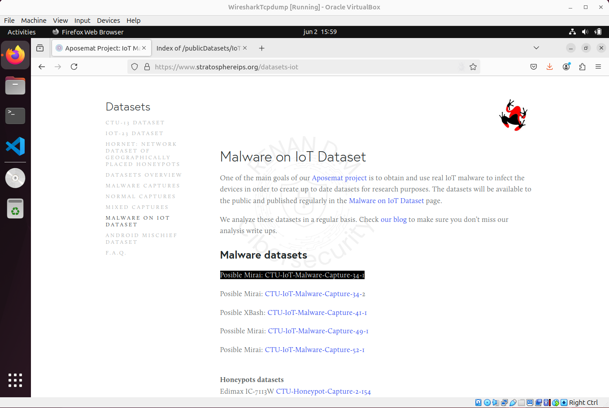
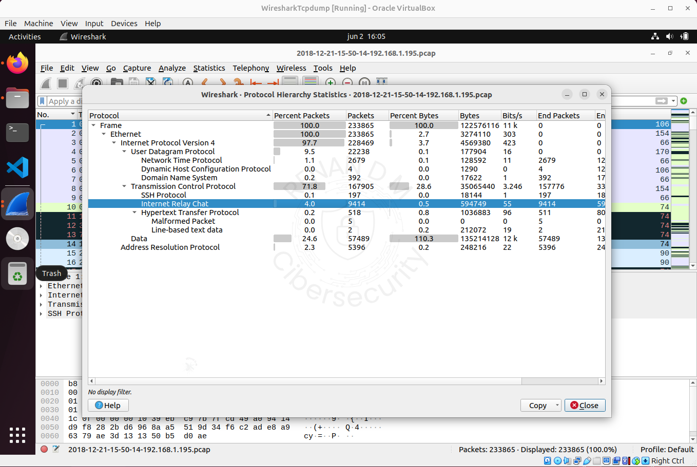
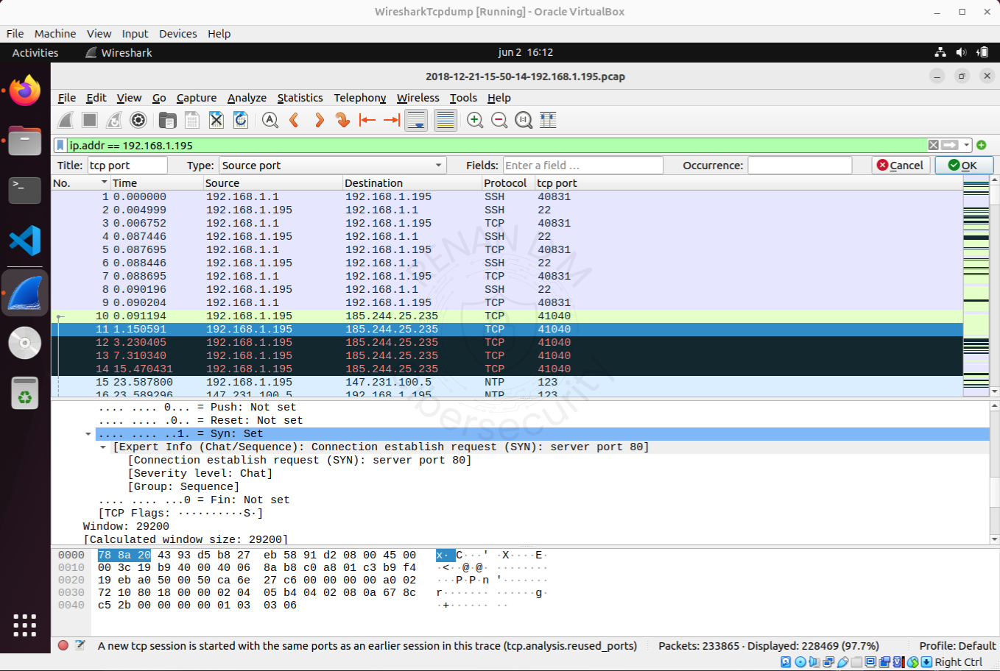
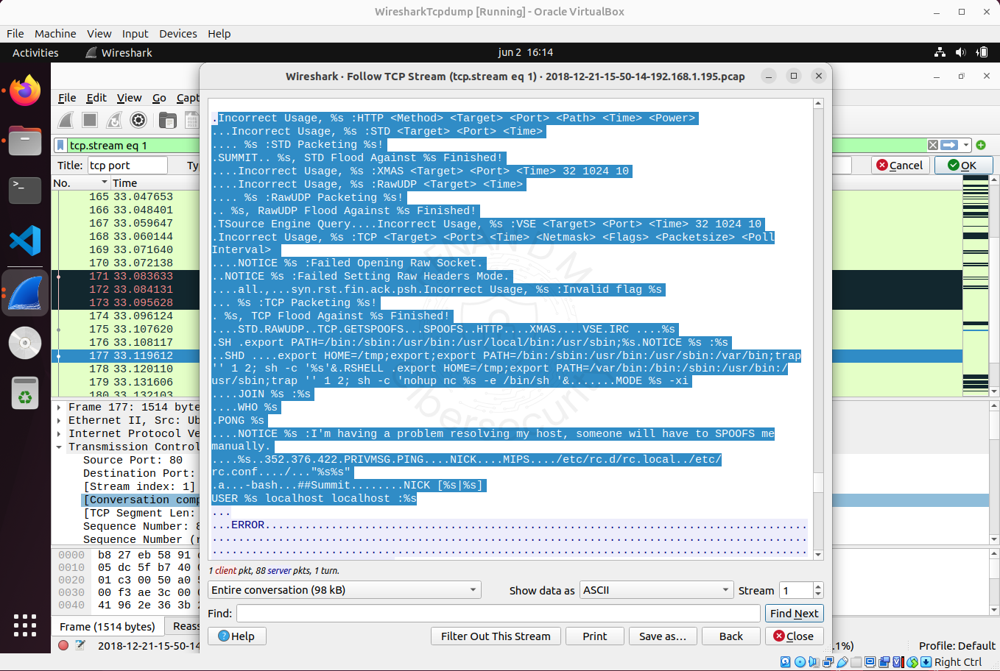
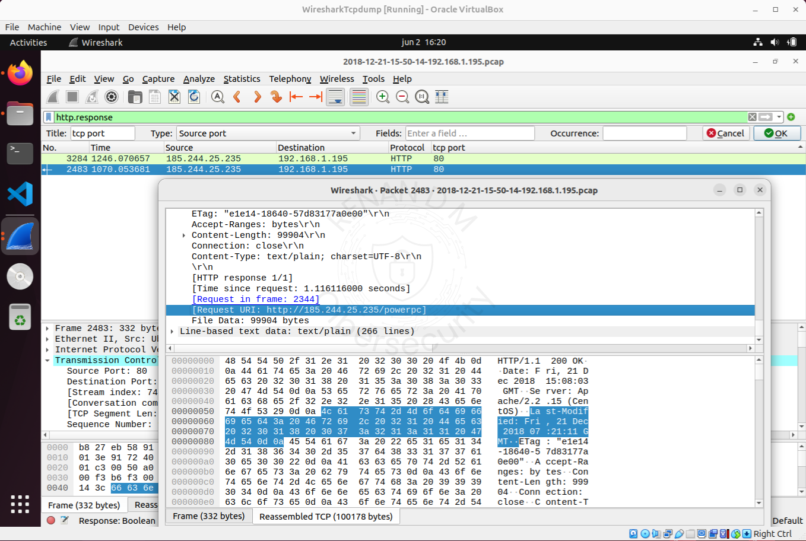
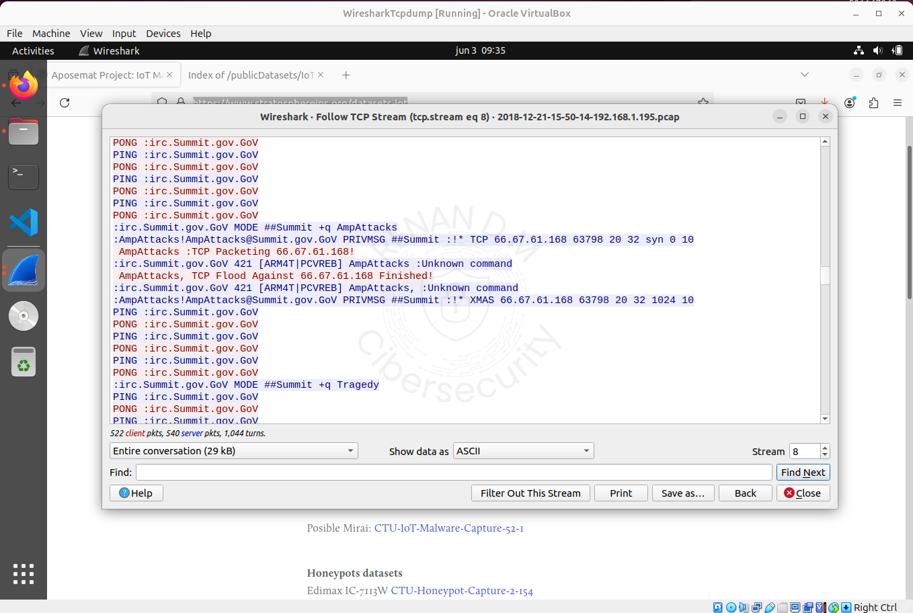

# Análise Forense de PCAP — Botnet IRC + Persistência SSH

**Data da análise:** 02/06/2025  
Autor: **Renan Dias Mendes** 

Estudo com Wireshark a partir de um tráfego capturado (.pcap), identificando atividade típica de botnet com C2 via IRC e persistência por SSH.

---

## 1 – Fonte do Arquivo PCAP

- Fonte do PCAP:  
  [Stratosphere IoT Dataset](https://www.stratosphereips.org/datasets-iot)  
- Cenário e captura específica:  
  [CTU-IoT-Malware-Capture-34-1](https://mcfp.felk.cvut.cz/publicDatasets/IoTDatasets/CTU-IoT-Malware-Capture-34-1/)

  

---

## 2 – Identificação Inicial dos Protocolos

- Ao abrir o `.pcap`, já notamos tráfego SSH e TCP suspeito, com volume anormal de conexões.

---

## 3 – Análise da Hierarquia de Protocolos

- Análise da hierarquia mostra alto volume de tráfego, com destaque para SSH e IRC.

---

## 4 – Filtros TCP e IP Suspeito

- Foi adicionada a coluna `tcp.port` e aplicado o filtro `ip.addr == 192.168.1.195` para analisar o host suspeito.

---

## 5 – Indício de Acesso via Script Malicioso

- Identificado tráfego na porta alta `40831`. “Follow TCP Stream” revelou um possível payload.

---

## 6 – Rastreio de IPs Envolvidos

- Identificado o IP externo `185.244.25.235` comunicando com o host interno.

---

## 7 – Confirmação do Envio de Malware

- Host interno realiza download direto via HTTP do C2.

  

---

## 8 – Identificação do Payload Fragmentado

- Fragmentos de payload identificados com filtro `http.response`.

---

## 9 – Exportação dos Arquivos HTTP

- Arquivos transferidos foram exportados para análise.

---

## 10 – Comunicação via IRC (C2)

- Host infectado se comunica com `irc.summit.gov.GoV`. Comandos de bot visíveis via TCP stream.

  

---

## 11 – Persistência via SSH em Porta Alta

- Conexão ativa detectada via SSH na porta `40831`.

---

## Considerações Finais

- Host `192.168.1.195` realizou downloads de arquivos infectados a partir de `185.244.25.235`, instalou bot, iniciou C2 por IRC e estabeleceu persistência via SSH em porta alta.

- O malware realiza reconhecimento da arquitetura do sistema, mantém comunicação via heartbeats com o servidor e responde a comandos como `!tcp`, `!xmas`, `!spoof`, entre outros.

- A análise de DNS confirma que não houve redirecionamento — o download foi direto pela URL do servidor.

---

## Indicadores de Comprometimento (IOCs)

| Tipo              | Valor                                        |
|-------------------|----------------------------------------------|
| IP C2 externo     | `185.244.25.235`                             |
| Domínio malicioso | `irc.summit.gov.GoV`                         |
| IP interno        | `192.168.1.195`                              |
| Portas            | `40831` (SSH), `6667`, `80`                  |
| Comandos vistos   | `!tcp`, `!xmas`, `!spoof`, `!nick`, `!flood` |
| URLs acessadas    | `.bin` via exportação HTTP                   |

---
