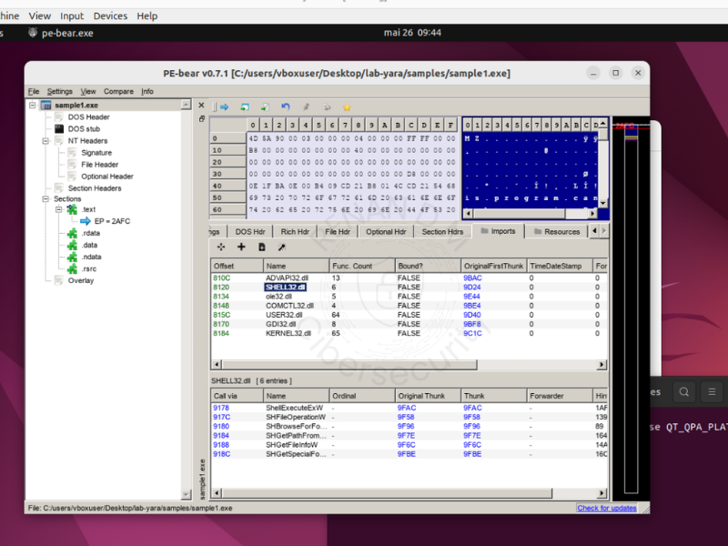

# 🕵️‍♂️ Análise de Malware — Casos Práticos e PoCs

  

Estudos de caso e provas de conceito aplicando ferramentas como Wireshark, tcpdump, YARA, PE-bear, DIE e FLOSS para análise estática e dinâmica de malwares e tráfego malicioso.

O foco está em:

- Extração de informações relevantes
- Criação de assinaturas YARA customizadas
- Identificação de técnicas de ofuscação e persistência
- Avaliação de comportamento e indicadores de comprometimento (IOCs)
- Correlação das técnicas observadas com a matriz **MITRE ATT&CK**
- Análise de malwares com canais HTTP(S) C2.
- Estudos de persistência e movimentação lateral.
- Identificação de técnicas evasivas e ofuscação em tráfego.
- Análise de campanhas phishing e ransomware.

---

## 📂 Estrutura Atual

| Pasta                 | Descrição                                                                                 |
|-----------------------|---------------------------------------------------------------------------------------------|
| [01-Trojan-GuLoader](01-Trojan-GuLoader/README.md)       | Análise detalhada do malware Trojan Dropper/Loader incluindo identificação, extração e criação de regras YARA. |
| [02-Botnet-IRC-SSH](02-Botnet-IRC-SSH/README.md)             | Análise detalhada de tráfego de botnet com canais IRC e persistência via SSH, identificando comunicação C2 e exfiltração. |

---

## 🎯 Objetivos

- Entender a estrutura e funcionamento dos malwares estudados.
- Desenvolver técnicas práticas para identificação e mitigação.
- Documentar processos para replicabilidade e aprendizado.
- Correlacionar as técnicas utilizadas pelo malware com a matriz MITRE ATT&CK para melhor contextualização do comportamento malicioso.

---

## 🚀 Futuro

- Inclusão de novas POCs com diferentes famílias de malware.
- Análises complementares com sandboxing e comportamento dinâmico.

---

> ⚠️ *Todas as análises são realizadas em ambientes isolados e controlados, respeitando boas práticas de segurança.*
