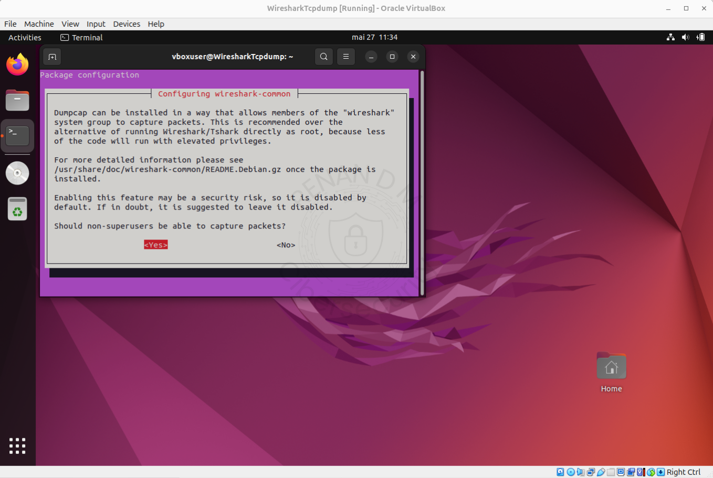
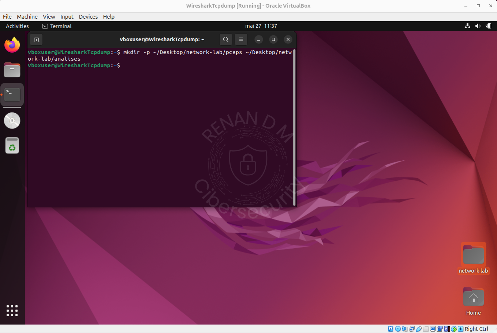
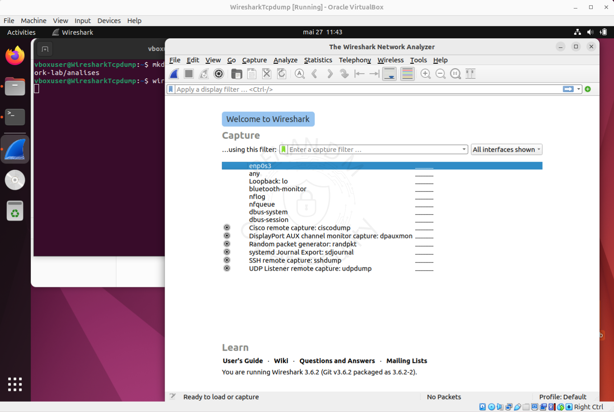
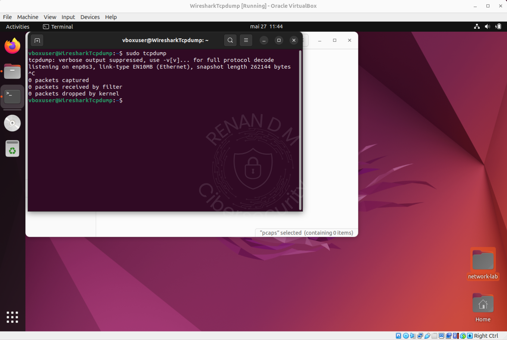

# 🧰 Instalação e Configuração: Wireshark + Tcpdump

📅 **Data da instalação:** 02/06/2025  
💡 Guia rápido para instalação e teste do ambiente de captura e análise de pacotes com Wireshark e Tcpdump.

---

## 📥 1. Pré-Requisito

Antes de iniciar, siga o guia abaixo para configurar o ambiente geral da máquina:

👉 [Instalação do Ambiente Geral](../../../Instalacao-do-Ambiente-Geral/README.md)

---

## 📦 2. Instalação do Wireshark e Tcpdump

Execute o comando no terminal:

```bash
sudo apt update && sudo apt install wireshark tcpdump -y
```
Durante a instalação, será exibida uma mensagem sobre permissões de captura para usuários não-root.
Selecione "Yes" e pressione Enter.





## 🗂️ 3. Criação dos Diretórios de Trabalho
Para manter o laboratório organizado, crie a seguinte estrutura de pastas:

```bash
mkdir -p ~/Desktop/network-lab/pcaps ~/Desktop/network-lab/analises
```



## 🚀 4. Testes de Execução
Verifique se o Wireshark foi instalado corretamente:

```bash
sudo wireshark
```



Verifique o funcionamento do Tcpdump:

```bash
sudo tcpdump
```




## 🧱 5. Estrutura Final do Ambiente
- ✅ Wireshark funcional com interface gráfica
- ✅ Tcpdump funcional via terminal
- ✅ Diretórios organizados em ~/Desktop/network-lab
- ✅ Permissões corretas com sudo
- ✅ Ambiente Linux com suporte a teclado pt-BR e copiar/colar


