# 🧰 Instalação e Configuração do Ambiente — YARA + DIE + PE-bear + FLOSS

📅 **Data da instalação:** 25/05/2025  
💡 Guia de instalação das principais ferramentas de análise estática de malware no Ubuntu.

---

## 📥 1. Pré-Requisito

Antes de iniciar, siga o guia base:

👉 [Instalação do Ambiente Geral](../../../Instalacao-do-Ambiente-Geral/README.md)

---

## 🧪 2. Instalação das Ferramentas de Análise

---

### 🔍 DIE (Detect It Easy)

- Repositório: [DIE GitHub](https://github.com/horsicq/Detect-It-Easy/blob/master/docs/BUILD.md)

```bash
sudo apt-get install qtbase5-dev qtscript5-dev qttools5-dev-tools libqt5svg5-dev git build-essential -y
sudo apt-get install qtchooser qt5-qmake -y

git clone --recursive https://github.com/horsicq/DIE-engine.git
cd DIE-engine

# Compilação (demora bastante)
bash -x build_dpkg.sh
sudo dpkg -i release/$(ls release)

die
```
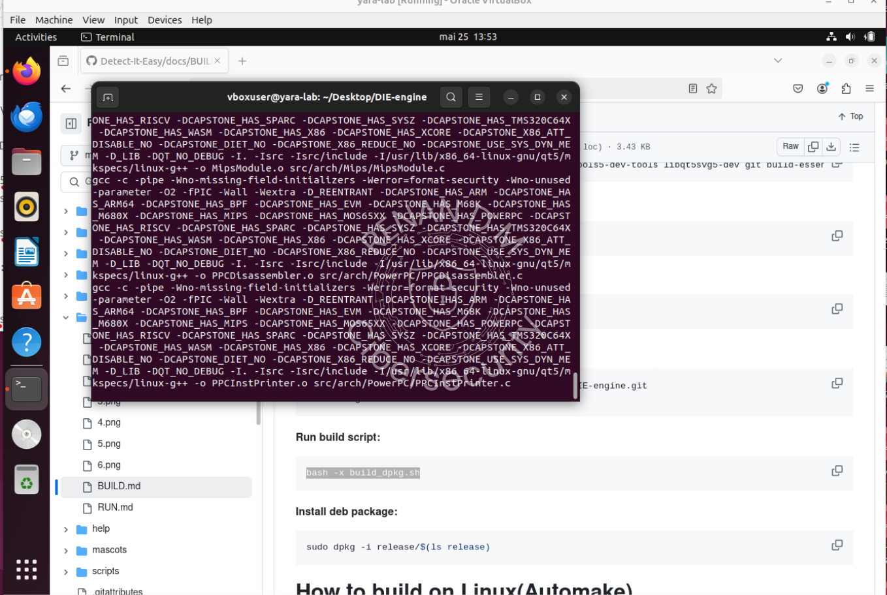
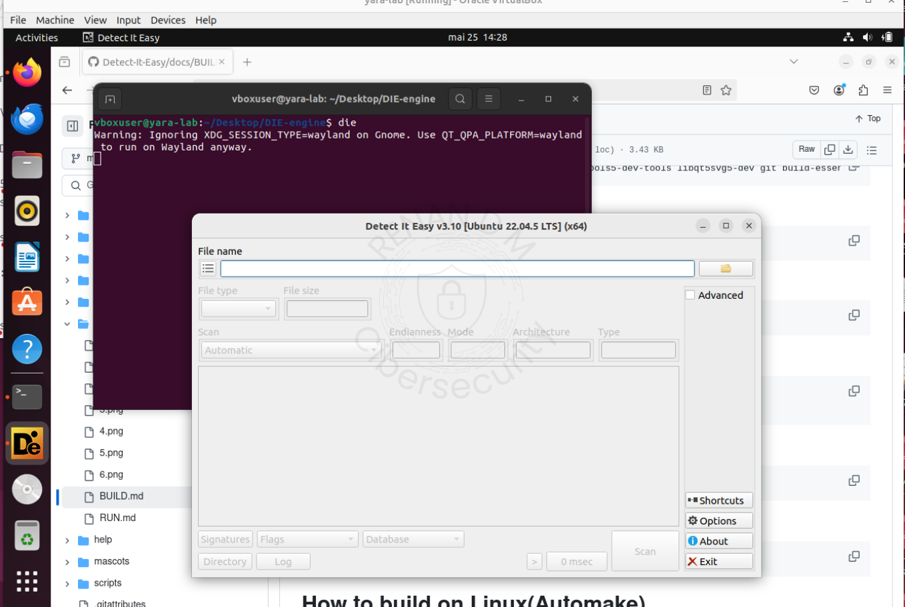


### 🐻 PE-bear (via Wine)
Repositório: [PE-Bear](https://github.com/hasherezade/pe-bear/releases)

Baixe a versão x86, extraia na área de trabalho e renomeie para pe-bear.

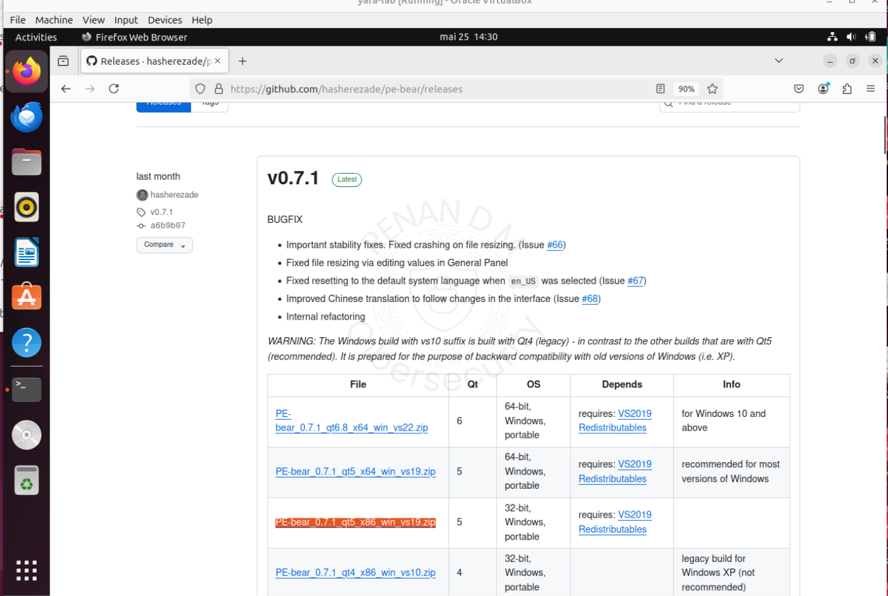

```bash
sudo apt install wine winetricks -y
winetricks corefonts
winetricks vcrun2019

cd ~/Desktop/pe-bear
wine PE-bear.exe
```
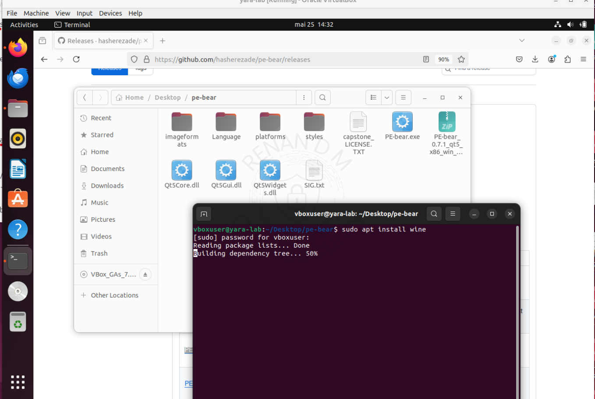

### 🔧 Criando atalho no terminal

```bash
nano ~/.bashrc

# Adicione ao final:
alias pebear='cd ~/Desktop/pe-bear && wine PE-bear.exe'

# Salve com Ctrl+X e Enter
source ~/.bashrc
```
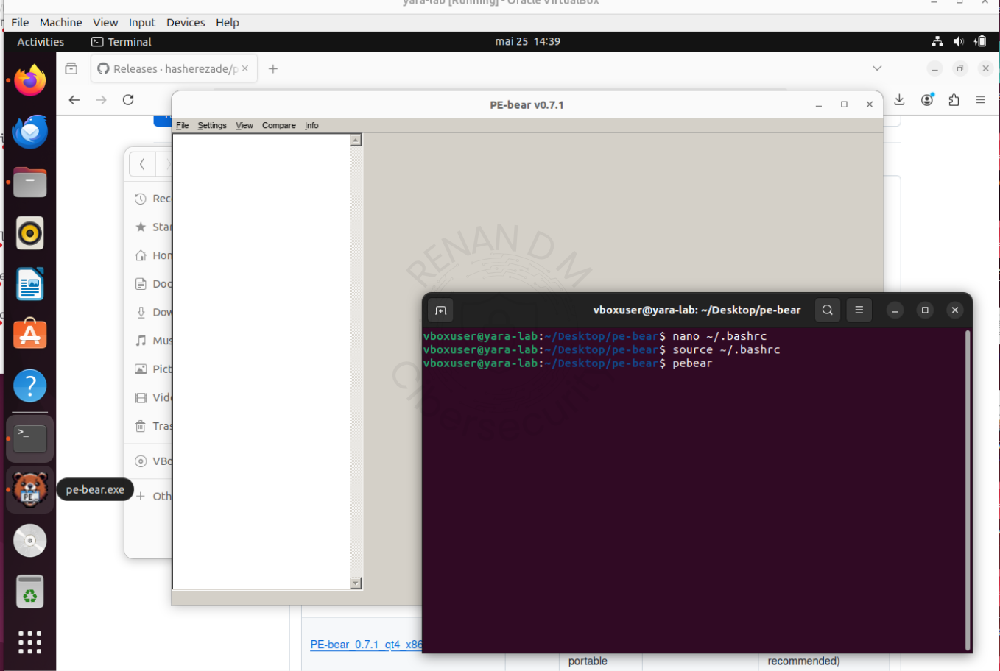


### 🧠 FLOSS (FireEye / Mandiant)
Repositório:[Flare-Floss Github](https://github.com/mandiant/flare-floss)

```bash
git clone https://github.com/mandiant/flare-floss.git
cd flare-floss

sudo apt install python3-pip -y
pip install -r requirements.txt
pip install .
```
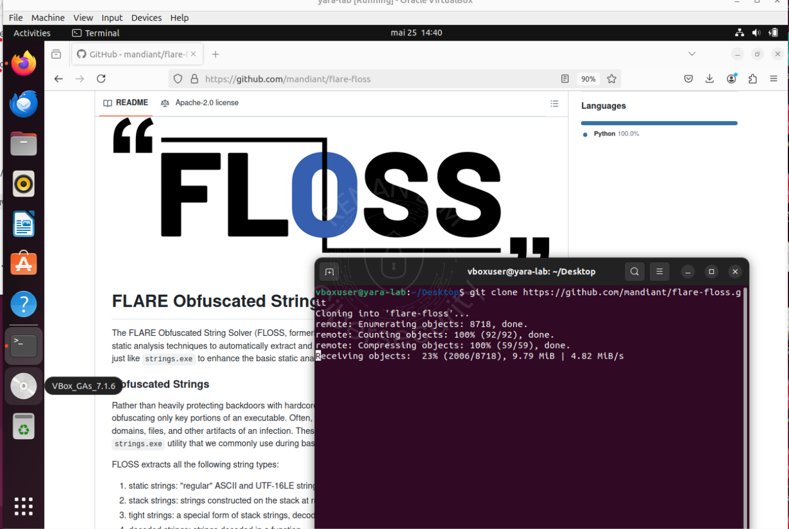   
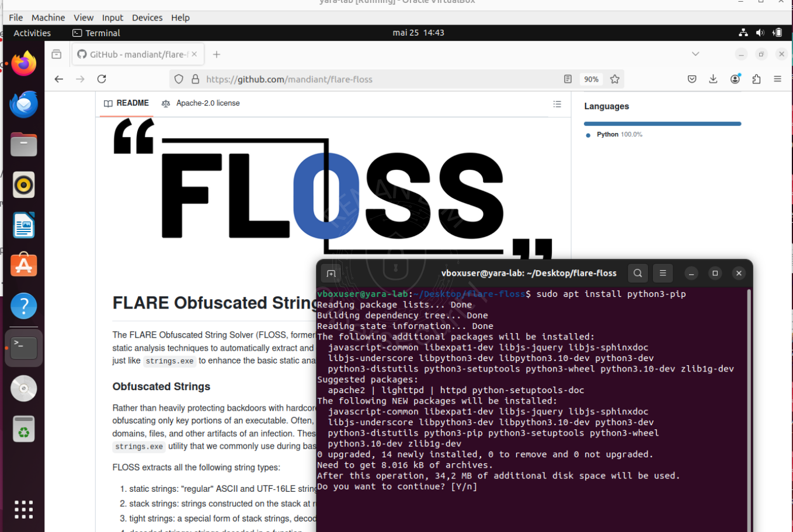

### 🔧 Ajuste de PATH (se necessário)

```bash
nano ~/.bashrc

# Adicione ao final:
export PATH="$HOME/.local/bin:$PATH"

# Salve e aplique:
source ~/.bashrc
```
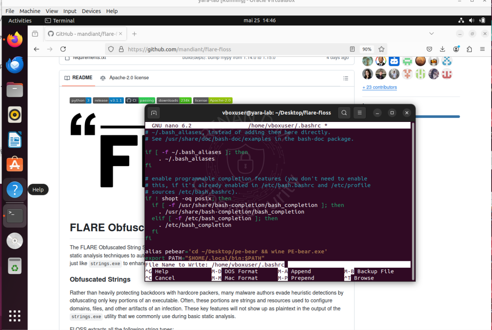

### 🔍 Testando:

```bash
cd ~/Desktop
touch texto.txt
floss texto.txt
```
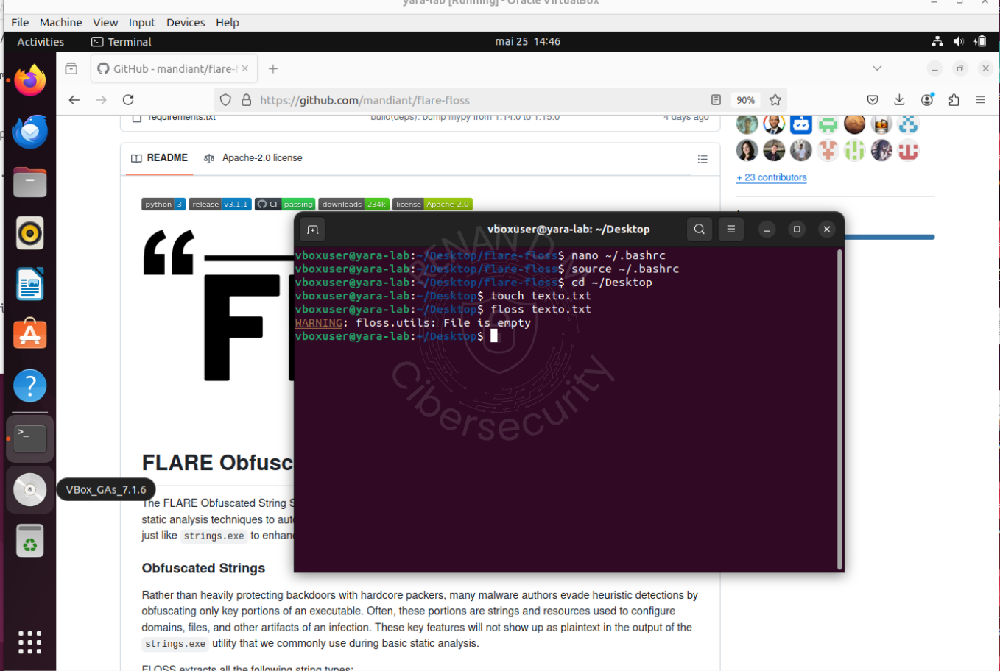

### 🧬 YARA

- Instale via terminal:

```bash
sudo apt install yara -y
```
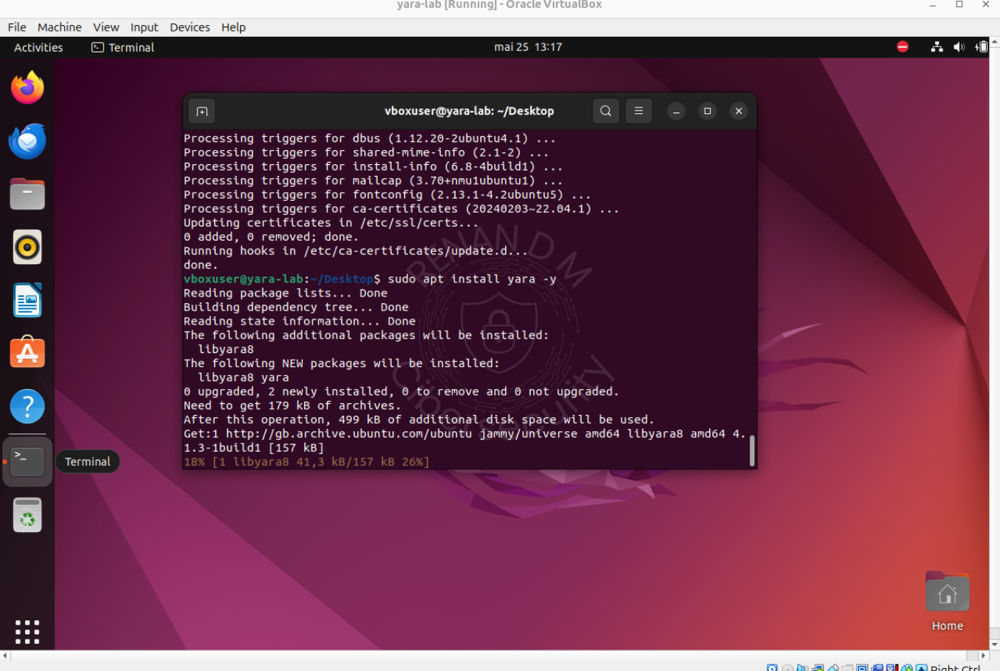

Crie a estrutura de diretórios:

```bash
mkdir -p ~/Desktop/lab-yara/{regras,samples,outputs}
```
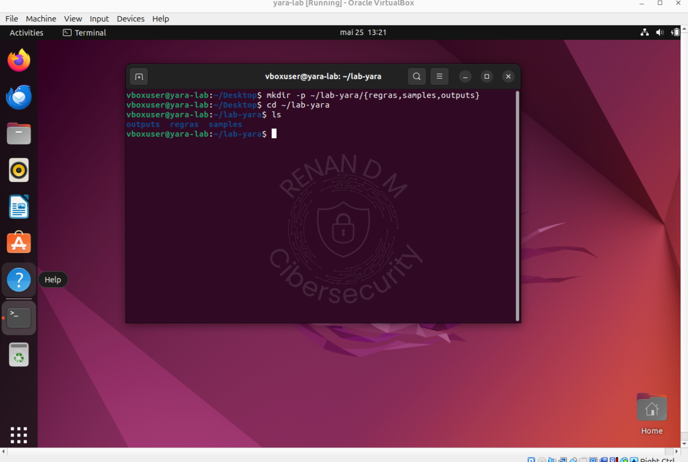


## 🧱 Estrutura Final do Ambiente
- ✅ DIE instalado e funcional  
- ✅ PE-bear operando via Wine com atalho pebear  
- ✅ FLOSS executável via terminal  
- ✅ Teclado pt-BR e copiar/colar habilitados  
- ✅ Diretórios organizados no Desktop  
- ✅ Pronto para análise estática de malware  


