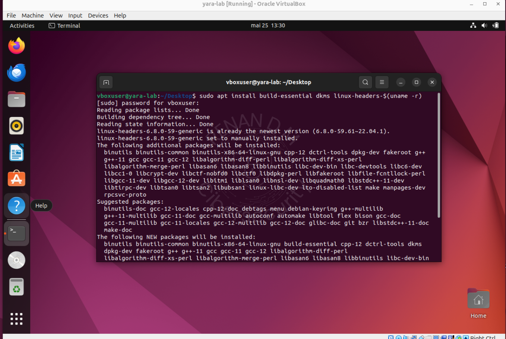

#  Instalação e Configuração Geral do Ambiente

-  Passo a passo completo para configuração do ambiente com Ubuntu 22.04 Desktop utilizado nos labs.

##  1. Baixando e Instalando o Ubuntu 22.04  
 Data: 25/05/2025

- Acesse: [https://releases.ubuntu.com/jammy](https://releases.ubuntu.com/jammy)


- Crie uma nova VM no VirtualBox com nome, hostname e senha definidos:


- Inicie a instalação:

 
 

---

##  2. Corrigindo Permissões de Sudo

- Teste o comando:

```bash
sudo -i
```


Se falhar, reinicie a VM e entre em modo recovery:

Pressione ESC várias vezes durante o boot

Vá em Advanced Options > Recovery Mode

Selecione Root - Drop to root shell prompt


Após pressionar Enter na opção será solicitado a senha que você definiu na configuração do lab, depois disso execute os comandos:

```bash
mount -o remount,rw /
usermod -aG sudo vboxuser
reboot
```


Reinicie a VM normalmente e teste o comando sudo -i

---

 ## 3. Configurações de Teclado e Clipboard

Vá até Settings > Keyboard e altere o idioma:


-  Habilitando Copiar e Colar (shared clipboard)

No VirtualBox, com a VM desligada, vá em:

Configurações > Geral > Avançado > Área de transferência: Bidirecional


---

## 4. Instalação dos Adicionais para Convidado

Inicie a VM e no menu superior clique em:

Dispositivos > Inserir imagem de CD dos Adicionais para Convidado

Irá aparecer um icone de CD na barra lateral do ubuntu.

Abra o terminal e execute os comandos:

```bash
sudo apt install build-essential dkms linux-headers-$(uname -r)
cd /media/$USER/VBox_GAs_*/
sudo ./VBoxLinuxAdditions.run
```




Reinicie a VM após a instalação.

---

## 5. Instalação Curl

```bash
sudo apt install curl -y
```
---

## Estrutura Final do Ambiente
-  Ubuntu 22.04 instalado
-  Permissões sudo funcionando
-  Teclado em português configurado
-  Copiar/colar entre host e VM ativo
-  Curl instalado
-  Adicionais para Convidado aplicados
