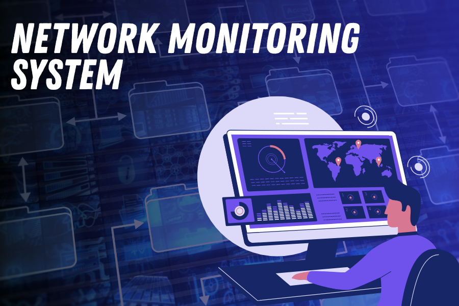

# 🛰️ NMS — Network Monitoring Systems

  

Esta seção concentra os laboratórios voltados à detecção de ameaças em redes locais, com ambientes simulados que reproduzem situações de redes corporativas.

O objetivo aqui é simples: entender como detectar, responder e mitigar ataques usando ferramentas open source. 

---

## 📦 Estrutura Atual

### 📁 `Splunk+Suricata/`
> Integração entre o IDS Suricata e o SIEM Splunk para detecção e resposta.

👉 [Ver pasta](Splunk-Suricata/README.md)

---

## 🛠️ Em breve...

> Novos laboratórios serão adicionados, com foco em ampliar as possibilidades de análise e resposta a incidentes:

- 📦 **Wazuh**  
  Monitoramento de hosts, análise de logs e alertas de anomalias.

- 🧩 **Elastic Stack**  
  Visualização, correlação e hunting em tempo real.

---

## 📌 Objetivo

> Construir um ambiente técnico completo e funcional, que sirva tanto como base para estudos quanto como referência para quem está começando ou evoluindo na área de cibersegurança.

---

> ⚠️ *Todos os testes foram realizados em ambiente isolado. As ferramentas utilizadas são de código aberto, e os experimentos têm fins exclusivamente educacionais.*
