# 🛡️ Mitigação Manual de Alertas com Splunk + Flask + iptables (SOAR Manual Generalista)

🎯 **Objetivo:** Realizar resposta manual a alertas detectados pelo Suricata, via dashboard interativo no Splunk integrado a um backend Flask que aplica bloqueios/whitelist em tempo real usando ipset e iptables. A ideia é compreender de forma mais aprofundada a manipulação dos eventos recebidos pelo Splunk ao invés de simplesmente integrar com uma solução já pronta como TheHive+Cortex

- 📄 Documento criado por **Renan D M**
- 🗓️ Atualizado em **25/07/2025**

---

## 🔗 Ferramentas Utilizadas

- 📊 Splunk Enterprise

- 🧱 Suricata IDS

- 🌐 Flask

- ⛔ iptables + ipset

---

## ⚙️ Requisitos Iniciais

- 🔍 VM 1: Suricata + Splunk + Flask 

---

## 📁 Etapa 1 – Criação do Lookup CSV

```bash
cd /opt/splunk/etc/apps/search/lookups
sudo nano ips_tratados.csv
```
Conteúdo:

- src_ip,acao,data_tratamento

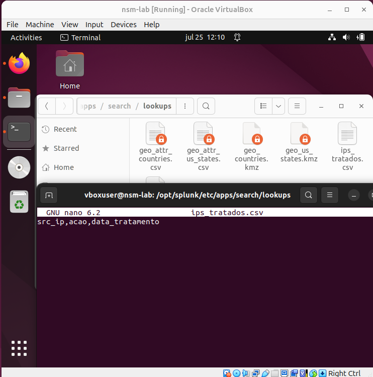

- Adicione as permissões:

```bash
sudo chown vboxuser:vboxuser ips_tratados.csv
sudo chown vboxuser:vboxuser /opt/splunk/etc/apps/search/lookups/
```

---

## 📦 Etapa 2 – Registro do Lookup no Splunk

- Acesse: Settings > Lookups > Lookup table files > Add new

- Nome: ips_tratados.csv

- Salve e finalize
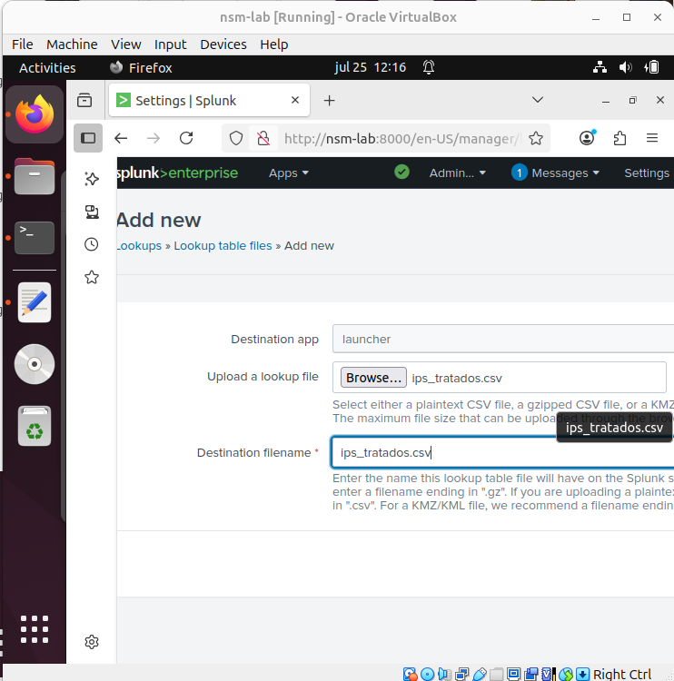

---

## 🔎 Etapa 3 – Criação do Dashboard Interativo

- Acesse a aba search e utilize o filtro de busca:


- index=main source="/var/log/suricata/eve.json" event_type=alert


**Obs:** Esse filtro é generalista para capturar todos alertas gerados pelo suricata.

Salve como novo dashboard (Classic Dashboard)

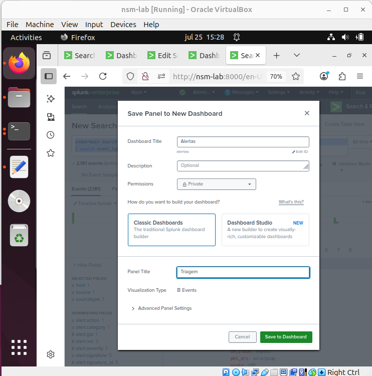

- Vá em Dashboards > Edit Source

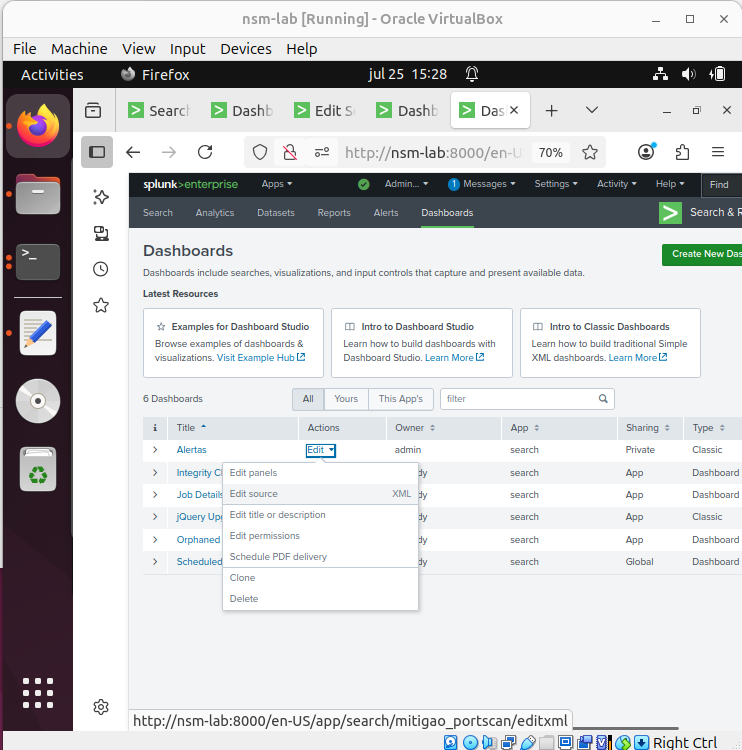

Cole o código abaixo:

```xml
<dashboard version="1.1" theme="light">
  <label>Alertas</label>
  <row>
    <panel>
      <title>Triagem</title>
      <table>
        <search>
          <query>
            index=main source="/var/log/suricata/eve.json" event_type=alert
            | search event_type=alert
            | stats latest(_time) as ultimo_alerta by src_ip alert.signature dest_ip
            | lookup ips_tratados.csv src_ip OUTPUT acao, data_tratamento
            | eval data_tratamento_epoch = if(isnull(data_tratamento), 0, strptime(data_tratamento, "%Y-%m-%dT%H:%M:%S"))
            | eval agora = now()
            | eval expirado = case(
                acao == "passar" AND (agora - data_tratamento_epoch) &gt; 600, 1,
                acao == "bloquear" AND (agora - data_tratamento_epoch) &gt; 3600, 1,
                isnull(acao), 1,
                true(), 0
              )
            | where expirado=1
            | eval Passar="🔓", Bloquear="🛑"
            | table ultimo_alerta, src_ip, dest_ip, alert.signature, Passar, Bloquear
          </query>
          <earliest>0</earliest>
          <latest>now</latest>
          <refresh>5</refresh>
          <refreshType>delay</refreshType>
        </search>
        <option name="count">20</option>
        <option name="drilldown">cell</option>
        <drilldown>
          <condition field="Passar">
            <link target="_blank">http://nsm-lab:5000/passar?ip=$row.src_ip$</link>
          </condition>
          <condition field="Bloquear">
            <link target="_blank">http://nsm-lab:5000/bloquear?ip=$row.src_ip$</link>
          </condition>
        </drilldown>
      </table>
    </panel>
  </row>
</dashboard>
```
- Salve e clique em **UI** para visualizar
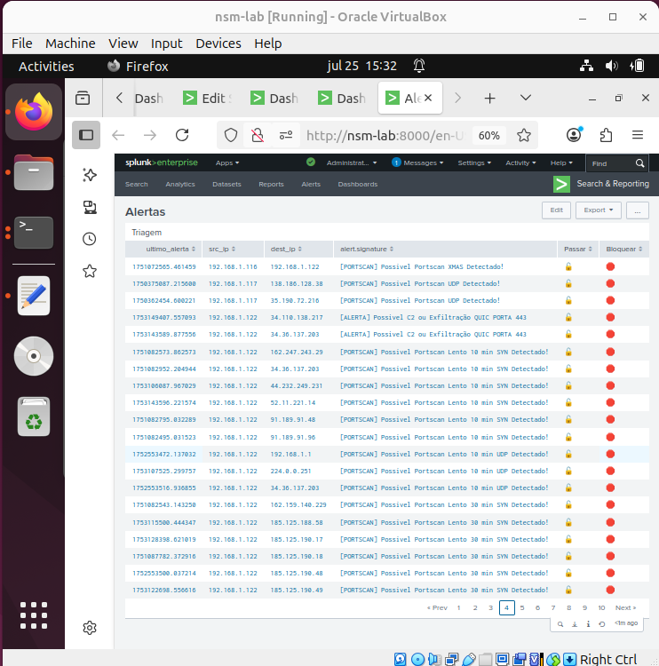

---

## 🌐 Etapa 4 – Backend Flask 

- Crie uma pasta em /opt e um arquivo para o flask

```bash
mkdir /opt/mitigador
cd /opt/mitigador
nano app.py
```
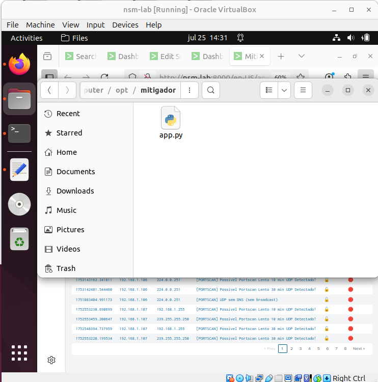
- Código app.py:

```python
from flask import Flask, request, render_template_string
import csv
from datetime import datetime
import subprocess

app = Flask(__name__)

LOOKUP_PATH = "/opt/splunk/etc/apps/search/lookups/ips_tratados.csv"
IPSET_BIN = "/sbin/ipset"  

def adicionar_entrada(ip, acao):
    with open(LOOKUP_PATH, 'a', newline='') as csvfile:
        writer = csv.writer(csvfile)
        writer.writerow([ip, acao, datetime.now().replace(microsecond=0).isoformat()])

    if acao == "passar":
        set_name = "whitelist"
        timeout = "600"  # 10 minutos
    else:
        set_name = "blacklist"
        timeout = "3600"  # 1 hora

    # Adiciona ao ipset com timeout
    try:
        subprocess.run(["sudo", IPSET_BIN, "add", set_name, ip, "timeout", timeout], check=True)
        print(f"{datetime.now()} - {acao.upper()} - {ip} (timeout: {timeout}s)")
    except subprocess.CalledProcessError:
        print(f"{datetime.now()} - {ip} já está no conjunto {set_name}.")

def resposta_com_close(msg):
    html = f"""
    <html>
      <head>
        <title>Ação realizada</title>
        <script>
          setTimeout(function() {{
            window.close();
          }}, 3000);
        </script>
      </head>
      <body>
        <h3>{msg}</h3>
        <p>Esta janela será fechada automaticamente em 3 segundos...</p>
      </body>
    </html>
    """
    return render_template_string(html)

@app.route('/passar')
def passar():
    ip = request.args.get('ip')
    if ip:
        adicionar_entrada(ip, "passar")
        return resposta_com_close(f"IP {ip} marcado como 'passar' e adicionado à whitelist por 10 minutos.")
    return resposta_com_close("IP inválido.")

@app.route('/bloquear')
def bloquear():
    ip = request.args.get('ip')
    if ip:
        adicionar_entrada(ip, "bloquear")
        return resposta_com_close(f"IP {ip} marcado como 'bloquear' e adicionado à blacklist por 1 hora.")
    return resposta_com_close("IP inválido.")

if __name__ == '__main__':
    app.run(host='0.0.0.0', port=5000)

```
---

## 🧱 Etapa 5 – Instalação dos Pacotes
- Instale as dependências:
```bash
sudo apt install flask iptables ipset
```
---

## ⛔ Etapa 6 – Criação das Listas

- Whitelist com 10min e black com 1h

```bash
sudo ipset create whitelist hash:ip timeout 600
sudo ipset create blacklist hash:ip timeout 3600
```

---

## 🚀 Etapa 7 – Execução do Flask

```bash
cd /opt/mitigador
python3 app.py
```
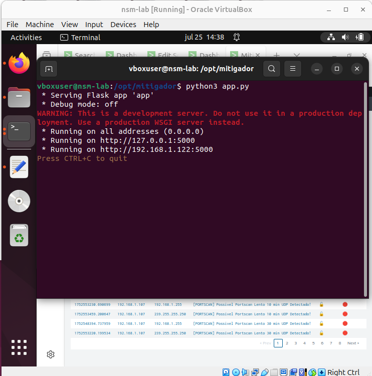

---

## 🖱️ Etapa 8 – Teste da Mitigação

- Vá ao dashboard no Splunk

- Clique em Passar ou Bloquear para qualquer alerta exibido
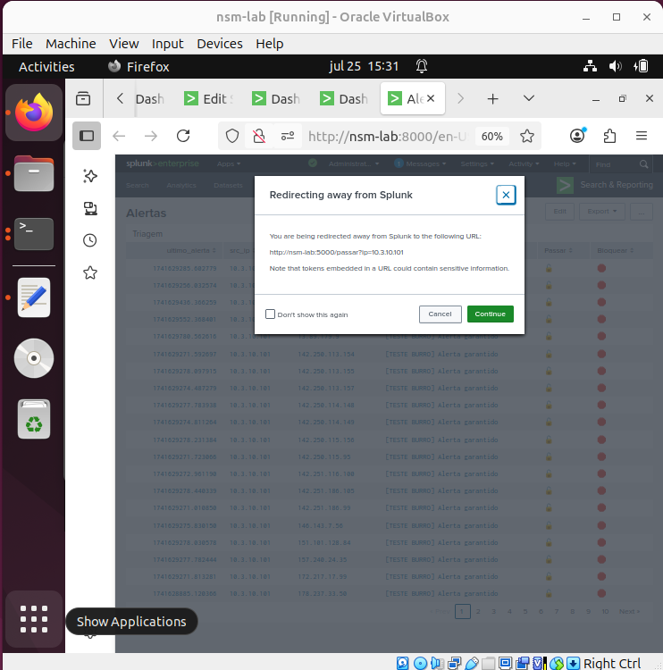

- Uma nova aba abrirá e será fechada automaticamente
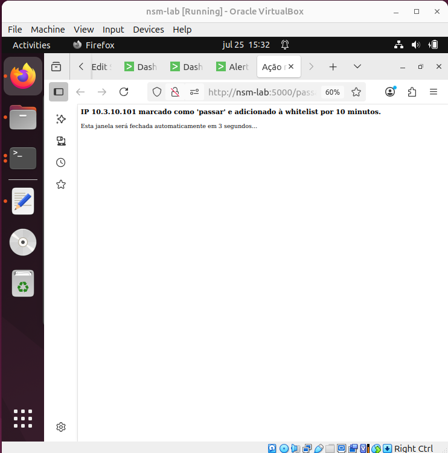

- O IP será registrado no ips_tratados.csv e incluído na ipset
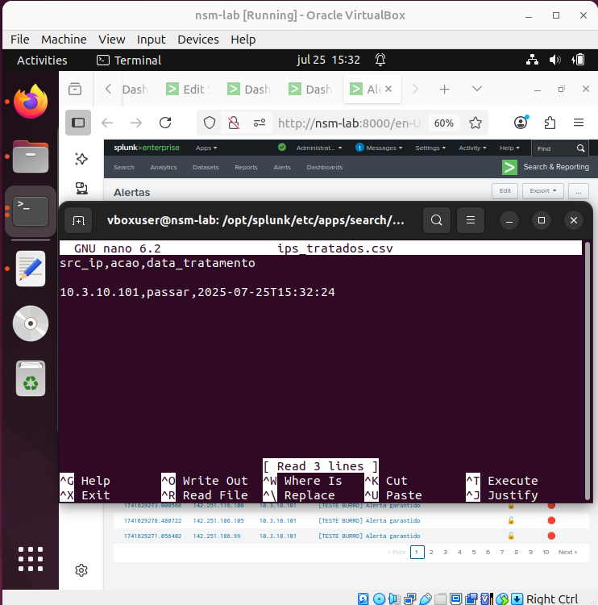
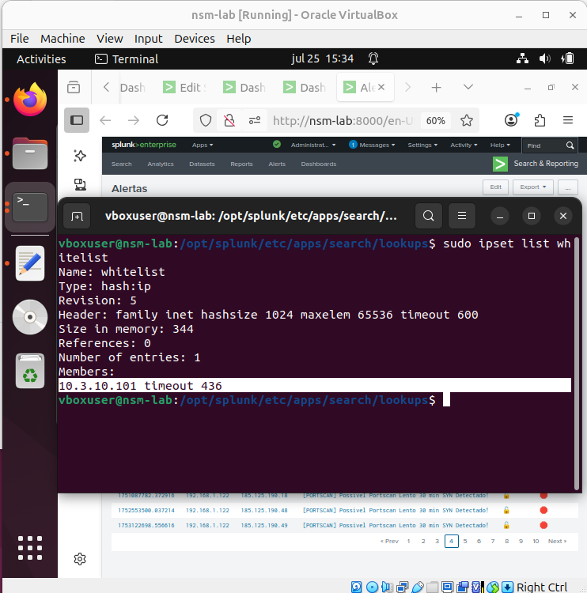

---

## ✅ Etapa 9 – Aplicação no iptables

- Depois de realizar os testes, execute o comando para validar as listas no iptables:

```bash
sudo iptables -I INPUT -m set --match-set whitelist src -j ACCEPT
sudo iptables -I INPUT -m set --match-set blacklist src -j DROP
```

---

## 💾 Etapa 10 – Persistência das Regras

- A ipset não é permanente e some após o reboot, para torna-la permanente:

```bash
sudo ipset save | sudo tee /etc/ipset.conf > /dev/null
sudo iptables-save > /etc/iptables/rules.v4
```

---

## 📌 Considerações Finais

- Este laboratório demonstra uma solução generalista de mitigação manual, permitindo responder a quaisquer alertas detectados pelo Suricata de forma interativa via Splunk e aplicação direta no firewall.

---

## ⚠️ Limitações (Intencionais)

- Falta autenticação no Flask

- Mitigação manual via clique, sem automação

- CSV como armazenamento simples, não escalável

- Criar um SOAR manual ao invés de utilizar as opções disponíveis: TheHive+Cortex
---

## 🚀 Próximos Passos

- Implementar autenticação e logging no Flask (Caso eu decidir progredir com o soar em flask)

- Automatizar respostas com critérios e limiares (Proximos labs)

- Migrar para backend persistente (Banco de dados, KVStore)


