# 🧪 Detecção de Portscans com Suricata + Splunk (PoC)

🎯 **Objetivo:** Detectar e classificar diferentes tipos de portscan utilizando regras personalizadas no Suricata e monitoramento em tempo real no Splunk Enterprise.

📄 Documento criado por **Renan D M**  
🗓️ Atualizado em **18/06/2025**
---

## 🔗 Ferramentas Utilizadas

- 🧱 [Suricata IDS](https://suricata.io/)
- 📊 [Splunk Enterprise](https://www.splunk.com/)
- 🛠️ [Nmap - Network Mapper](https://nmap.org/)

## ⚙️ Requisitos Iniciais

- 🖥️ **2 VMs em modo Bridge**
  - 🧪 **VM 1:** Suricata + Splunk (análise)
  - 🚨 **VM 2:** Máquina atacante (execução de portscan)
- 🌐 Conectividade entre as VMs (verificada via `ping`)

---

## 🛠️ Etapa 1 – Configuração do Suricata

Edite o arquivo:

```bash
sudo nano /etc/default/suricata
```

Atualize os seguintes parâmetros:

```bash
RUN=yes
RUN_AS_USER=
SURCONF=/etc/suricata/suricata.yaml
LISTENMODE=af-packet
IFACE=(sua interface de rede)
OPTIONS="-D"
```
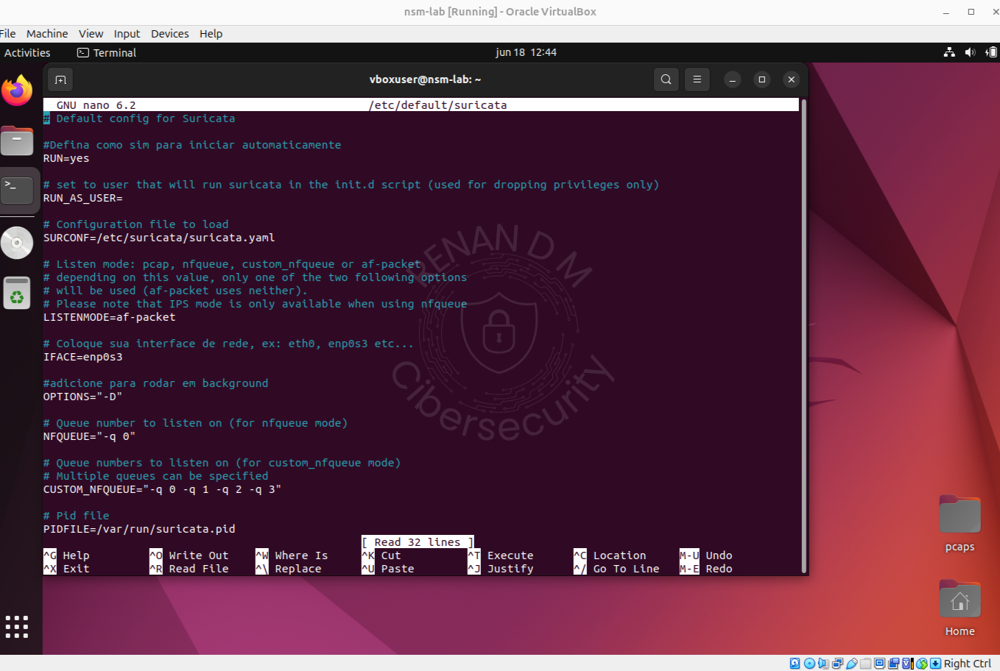

- ✅ Suricata configurado para iniciar automaticamente como daemon.

## 🔁 Etapa 2 – Habilitar Splunk no Boot

```bash 
sudo /opt/splunk/bin/splunk enable boot-start
sudo /opt/splunk/bin/splunk start
```
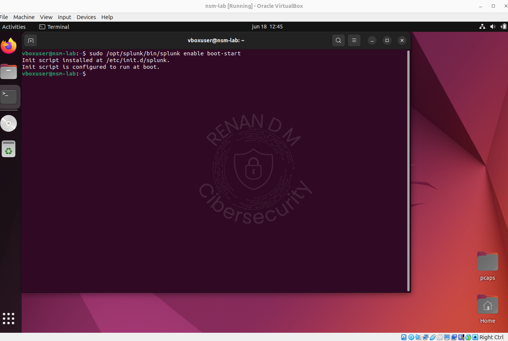
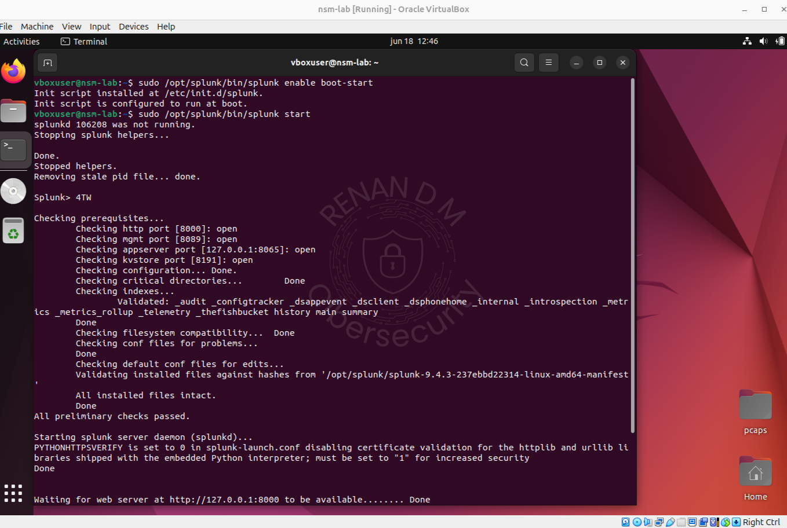

- ✅ Splunk configurado para inicialização automática.

## 📜 Etapa 3 – Criação das Regras no Suricata

Edite o arquivo de regras:

```bash
sudo nano /etc/suricata/rules/local.rules
```

- Cole as regras personalizadas abaixo:

```bash

# SYN Scan (barulhento)
alert tcp any any -> any any (msg:"[PORTSCAN] Possivel Portscan SYN Detectado!"; flags:S; threshold: type both, track by_src, count 20, seconds 20; sid:100001; rev:1;)

# FIN Scan (stealth)
alert tcp any any -> any any (msg:"[PORTSCAN] Possivel Portscan FIN Detectado!"; flags:F; threshold: type both, track by_src, count 5, seconds 20; sid:100002; rev:1;)

# NULL Scan (stealth)
alert tcp any any -> any any (msg:"[PORTSCAN] Possivel Portscan NULL Detectado!"; flags:0; threshold: type both, track by_src, count 5, seconds 20; sid:100003; rev:1;)

# XMAS Scan (stealth)
alert tcp any any -> any any (msg:"[PORTSCAN] Possivel Portscan XMAS Detectado!"; flags:FPU; threshold: type both, track by_src, count 5, seconds 20; sid:100004; rev:1;)

# UDP Scan (stealth)
alert udp any any -> any any (msg:"[PORTSCAN] Possivel Portscan UDP Detectado!"; threshold: type both, track by_src, count 10, seconds 20; sid:100005; rev:1;)
```
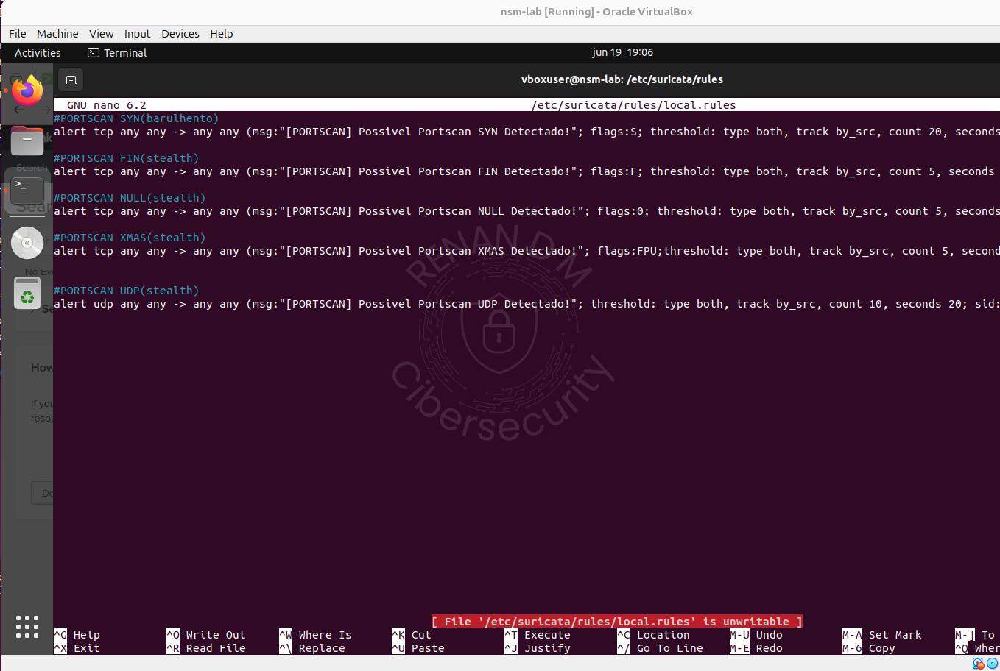

- ✅ Regras adicionadas com sucesso.

## ♻️ Etapa 4 – Reinício do Suricata

```bash
sudo rm /var/run/suricata.pid
sudo suricata -c /etc/suricata/suricata.yaml --af-packet=enp0s3 -D
```
### Esse processo deve ser repetido sempre que alguma alteração seja feita no local.rules.

- ✅ Suricata reiniciado com as novas regras ativas.

## 📡 Etapa 5 – Validação da Comunicação

Descubra o IP da VM com Suricata:

```bash
ip a
```
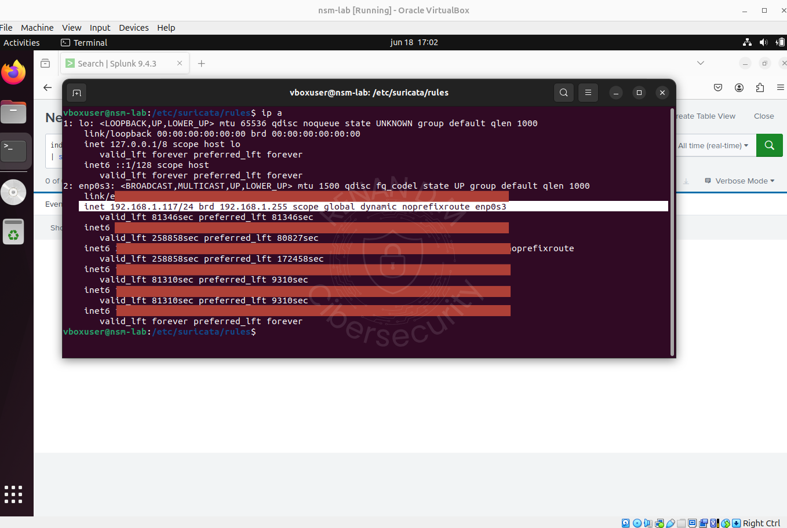

Realize o teste da VM atacante:

```bash
ping 192.168.x.x
```
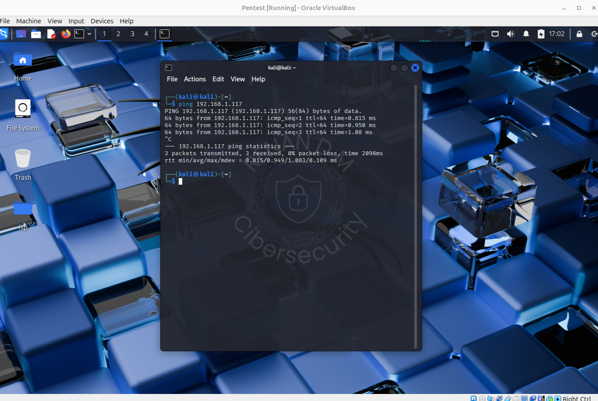

- ✅ Comunicação funcional entre as VMs.

## 🔎 Etapa 6 – Monitoramento no Splunk

Acesse o Splunk:
Search & Reporting > New Search

Cole a seguinte consulta:

```bash
index=* source="/var/log/suricata/eve.json" event_type=alert alert.signature_id IN (100001,100002,100003,100004,100005)
| stats count by src_ip, alert.signature_id
```

- 🧪 Habilite o modo "Real Time" e "Verbose Mode".

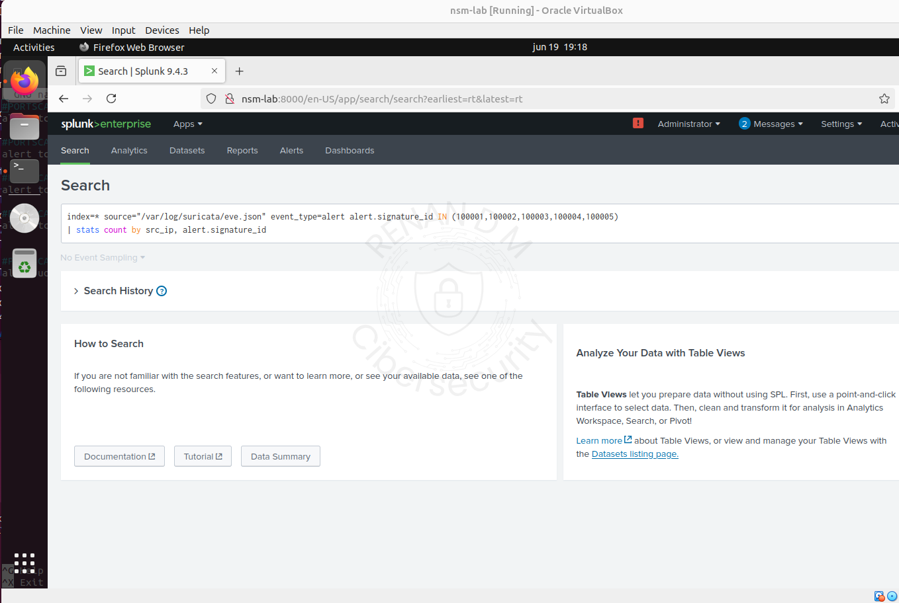

## 💥 Etapa 7 – Execução dos Ataques

Na VM atacante, execute os seguintes comandos:

| Tipo de Scan | Comando Nmap                      |
|--------------|-----------------------------------|
| FIN          | `nmap -sF -p- 192.168.x.x`        |
| NULL         | `nmap -sN -p- 192.168.x.x`        |
| XMAS         | `nmap -sX -p- 192.168.x.x`        |
| UDP          | `nmap -sU -p- 192.168.x.x`        |
| SYN          | `nmap -sS -p- 192.168.x.x`        |

- ✅ Alertas são capturados e exibidos em tempo real no Splunk.

### FIN

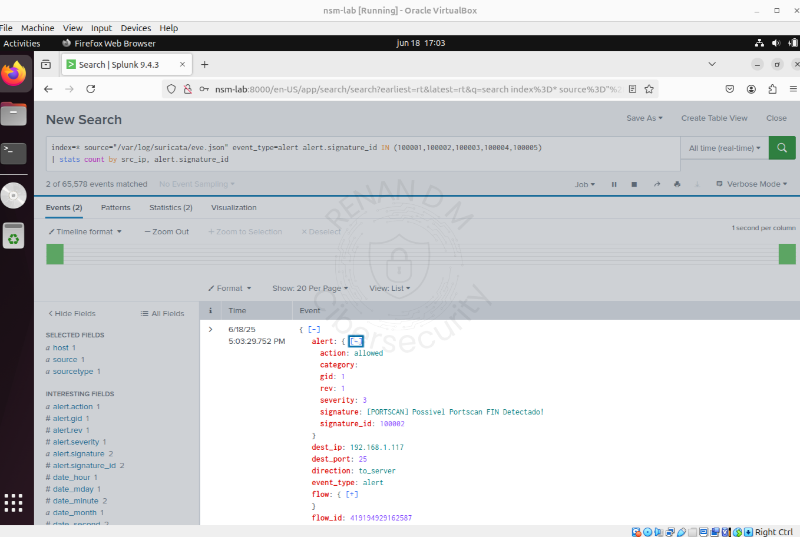
### NULL
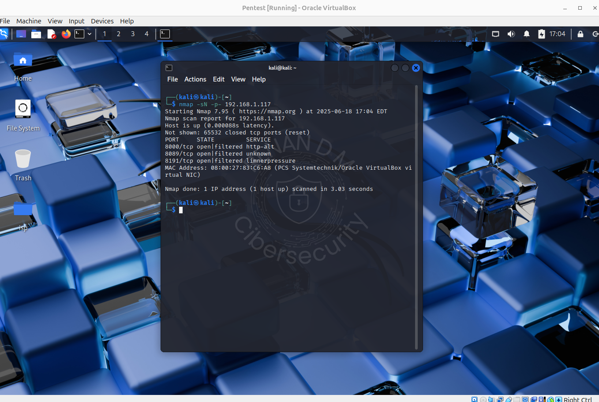

### XMAS

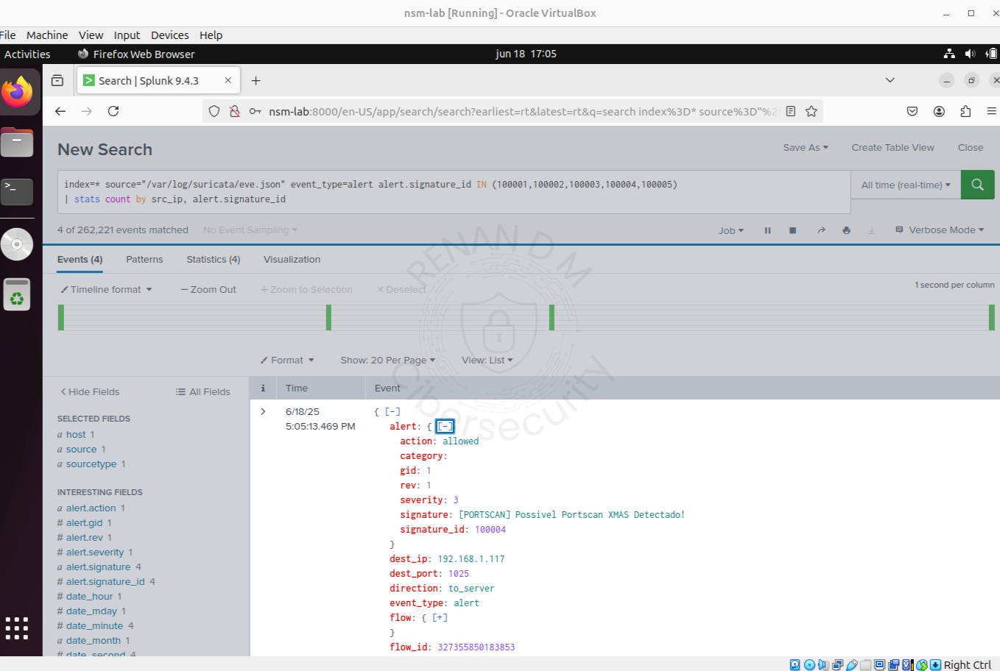
### UDP
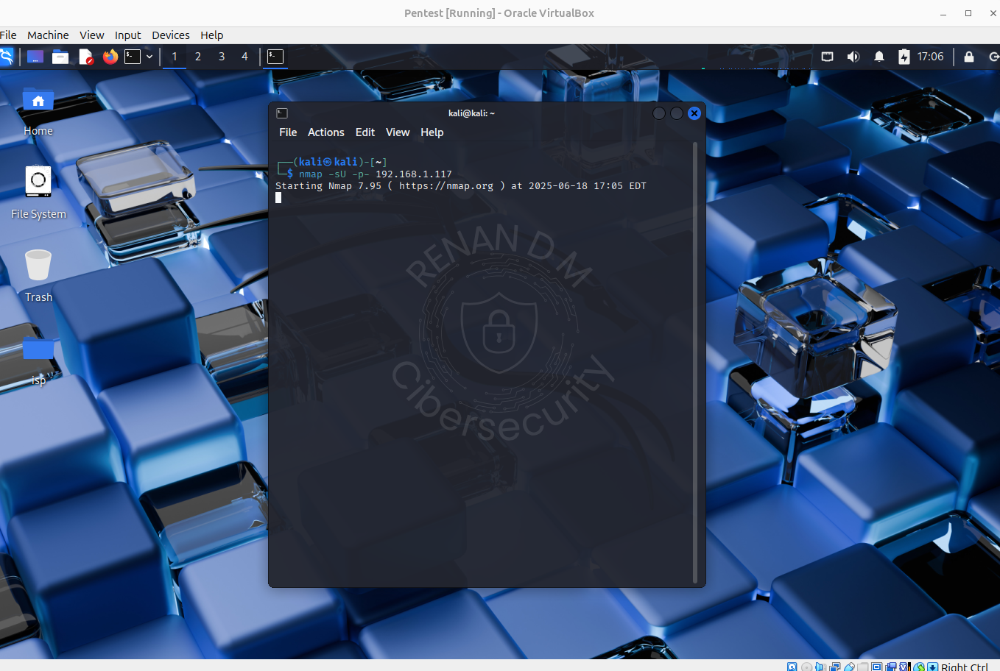

### SYN
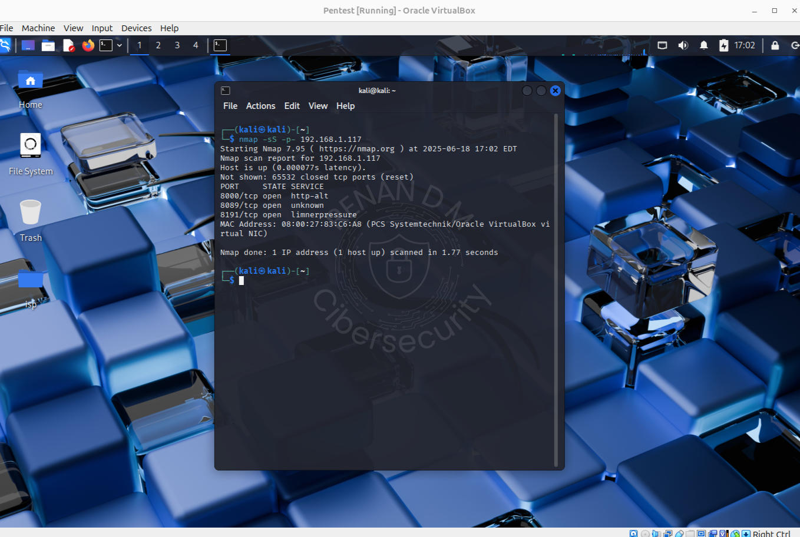
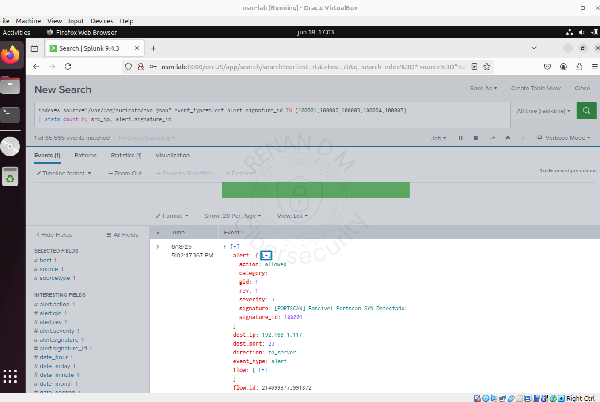

## 📊 Etapa 8 – Estatísticas no Splunk

Utilize o painel Statistics para visualizar os alertas agregados por IP e tipo de scan.

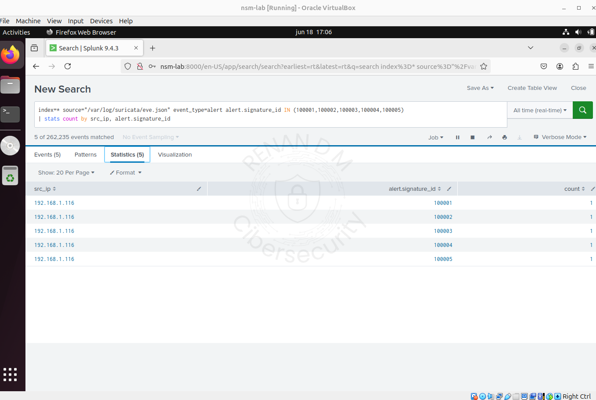

## ✅ Considerações Finais

Este laboratório demonstra uma PoC funcional de detecção de portscans utilizando:

- Regras personalizadas no Suricata

- Visualização em tempo real no Splunk

- Varreduras ativas com Nmap (incluindo técnicas stealth)

## 🔍 Por que este lab importa?

- Prova que ambientes enxutos podem ser eficazes

- Fortalece a compreensão prática de IDS e correlação

- Serve como base sólida para arquiteturas mais complexas

### ⚠️ Limitações (intencionais)

- Não há bloqueio automático ou respostas ativas

- O foco é puramente em detecção e visualização

## 🚀 Próximos Passos

- Mitigação ativa via iptables

- Criação de alertas automáticos ou scripts de resposta

- Integração com TheHive, Sigma ou Wazuh

- Dashboards e detecção por comportamento


🔐 Este laboratório é parte de uma série de testes práticos voltados à segurança ofensiva e defensiva, com foco em ambientes realistas e replicáveis.  
🧪 Siga o repositório para acompanhar novos experimentos de detecção, resposta e mitigação.
