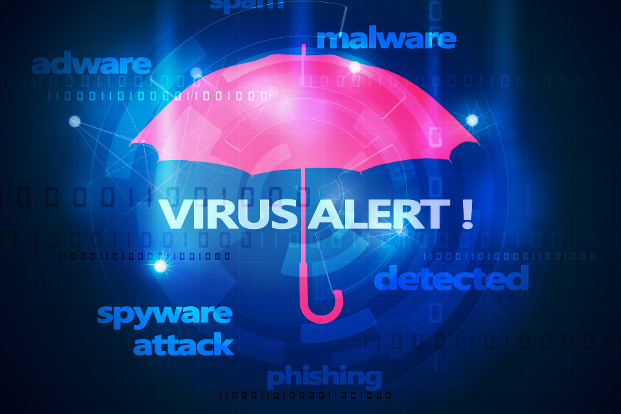

# 🧠 Regras e Alertas — Detecção Personalizada com Suricata

  

Esta pasta reúne **regras personalizadas para o IDS Suricata** com foco na detecção de comportamentos maliciosos em rede, como portscans, explorações de protocolo e tráfego anômalo.

Cada PoC é testada em ambiente controlado com **geração de tráfego simulada** e visualização em tempo real no **Splunk**, permitindo avaliar a eficácia das regras e sua aplicabilidade prática em NMS/SOC.

---

## 📦 Estrutura Atual

| PoC                         | Descrição                                                                                                                                      |
|-----------------------------|------------------------------------------------------------------------------------------------------------------------------------------------|
| [01-Portscan](01-Portscan/README.md)               | Regras para detecção de diferentes tipos de varredura de portas: SYN, FIN, NULL, XMAS e UDP. Inclui geração com Nmap e visualização no Splunk. |

---

## 🧩 Metodologia de Testes

1. 🎯 **Criação da regra Suricata personalizada**
2. 🧪 **Simulação do ataque** via ferramentas como `nmap`, `hping3` ou scripts próprios
3. 🔍 **Captura e análise** do tráfego com Wireshark e tcpdump
4. 📊 **Visualização e correlação** no Splunk com alertas e dashboards
5. 📁 **Documentação técnica** com prints, comandos e conclusões

---

## ✅ Benefícios da Detecção Customizada

- Adaptação às particularidades da rede (ISPs, empresas, infra interna, honeypots)
- Maior visibilidade sobre ataques em fases iniciais (reconhecimento)
- Base para **respostas automatizadas** e playbooks de mitigação

---

## 🚧 Em Desenvolvimento

As próximas regras a serem adicionadas incluem:

- 🚀 Exploração de protocolos (ex: HTTP malformed, DNS tunneling)
- 🐍 Tráfego anômalo (ex: beaconing, C2)
- 🧬 Regras baseadas em comportamento (ex: velocidade, repetição, burst)

---

## 🧪 Ambientes Utilizados

- **Suricata** como IDS
- **Splunk Enterprise** como SIEM
- **2 VMs** em modo bridge (ataque e monitoramento)
- **Ferramentas auxiliares**: Wireshark, Nmap, tcpdump, Kali Linux entre outras.

---

> ⚠️ Todo o conteúdo desta pasta é resultado de simulações em ambiente isolado e seguro, com objetivo puramente educacional e técnico.

