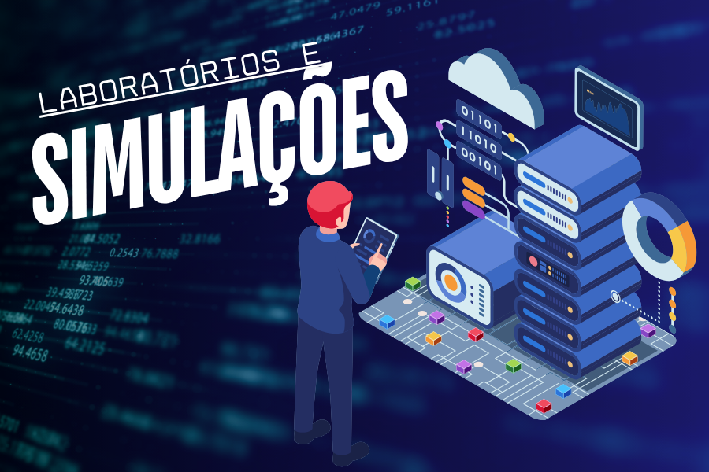

# 🧪 Laboratórios e Simulações

  

Esta seção reúne laboratórios práticos, ambientes de teste e simulações técnicas voltadas à **detecção, análise e mitigação de ameaças cibernéticas**.

Os experimentos foram realizados com ferramentas open source, documentação detalhada e foco em situações **realistas** — nada de exemplos genéricos ou simulados artificialmente.

---

## 📁 Estrutura das Pastas

### ⚙️ `Instalacao-do-Ambiente-Geral/` 
> Procedimentos para instalação e configuração do ambiente de laboratório.

- ✅ Habilitar Super usuário(sudo)  
- ✅ Configuração de Sistema com teclado pt-BR  
- ✅ Suporte a copiar e colar
- ✅ Comando curl habilitado

👉 [Clique aqui!](Instalacao-do-Ambiente-Geral/README.md)

---

### 📡 `NMS/`
> Laboratórios voltados à detecção e mitigação, análise de tráfego e uso de IDS/IPS em ambientes simulados.

- ✅ Detecção de varreduras e IoCs via Suricata  
- ✅ Integração com Splunk para alertas em tempo real  
- ✅ Testes com ferramentas de intrusão e visualização no dashboard  
- ✅ Criação de regras customizadas

👉 [Clique aqui!](NMS/README.md)

---

### 🔬 `FORENSE/`
> Análises estáticas e dinâmicas de amostras maliciosas em ambiente isolado.

- ✅ Análise de malware `.NET` com PE-bear, DIE, FLOSS e criação de regra YARA  
- ✅ Captura de Tráfego com Tcpdump e análise com Wireshark
- ✅ Identificação de comportamento em PCAPs (botnets com IRC e SSH)  
- ✅ Extração de IoCs, assinatura de comportamento e documentação técnica  
- ✅ Referência ao MITRE ATT&CK

👉 [Clique aqui!](Forense/README.md)

---

## 📌 Observações

- Todos os labs seguem uma **estrutura padronizada de documentação**.
- Prints, ferramentas utilizadas, passo a passo e considerações estão incluídos nos `README.md` internos.
- Os testes foram realizados com responsabilidade, em ambiente controlado.

---

> ⚠️ *Esta pasta é parte do portfólio prático e técnico de Renan D M. Todo o conteúdo foi desenvolvido com fins educacionais, éticos e sem fins lucrativos.*
