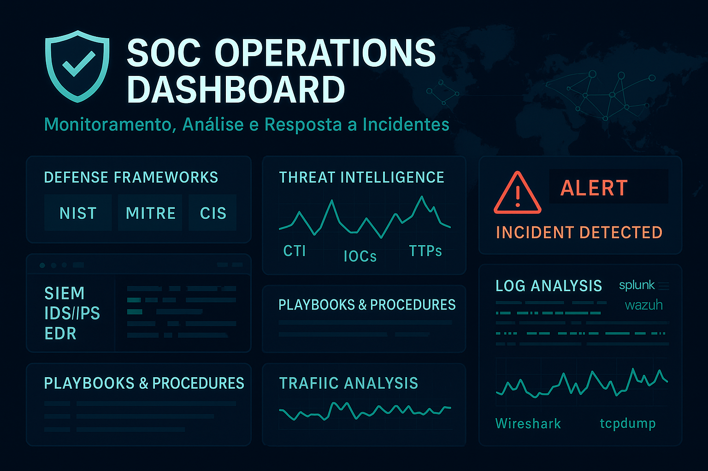

# 🖥️ 🛡️ SOC – Detecção e Mitigação

  

Laboratórios focados em detecção de ameaças em redes e host, simulando cenários corporativos.
O objetivo: aprender a detectar, responder e mitigar ataques usando ferramentas open-source.

---

### `🔗 Wazuh`
> Monitoramento e detecção com Wazuh (SIEM/EDR), agentes Windows/Linux e integrações Blue Team.

👉 [Ver pasta](Wazuh/README.md)

### `🔗 Splunk + Suricata`
> Integração entre o IDS Suricata e o SIEM Splunk para detecção e resposta.

👉 [Ver pasta](Splunk-Suricata/README.md)

---

## 🔜 Em breve...

> Novos laboratórios serão adicionados, com foco em ampliar as possibilidades de análise e resposta a incidentes:

---

> ⚠️ *Todos os testes foram realizados em ambiente isolado. As ferramentas utilizadas são de código aberto, e os experimentos têm fins exclusivamente educacionais.*
