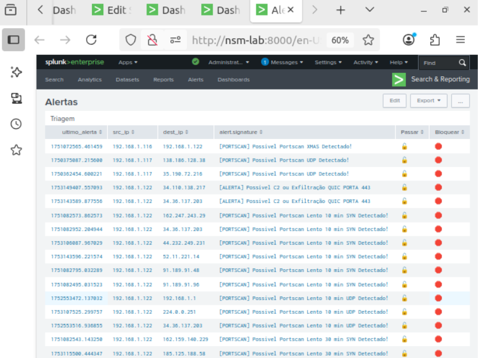

# Mitigações e Respostas

  

Esta seção é dedicada à implementação de respostas manuais e automáticas utilizando o Suricata como IDS/IPS e ferramentas como Splunk, iptables e scripts personalizados.

A proposta é transformar alertas em ações de contenção e mitigação, desde o bloqueio de tráfego até respostas condicionais mais avançadas.

---

## Objetivos

- Desenvolver políticas reativas com Suricata em modo IPS
- Integrar com iptables ou firewall para bloqueios dinâmicos
- Simular respostas a eventos como portscans e beaconing
- Testar integração com scripts externos, SOARs e automações de resposta

---

| Tópico                                        | Descrição                                                                                       |
|-----------------------------------------------|-------------------------------------------------------------------------------------------------|
| [Mitigação Manual a Alertas com Splunk + Flask + iptables](Mitigação-Manual-a-Alertas-com-Splunk+Flask+iptables/README.md)            | Backend em Flask controlando respostas via botões e aplicação de bloqueios       |

---

## Considerações
O foco aqui é sair do modelo passivo e evoluir para um ambiente reativo, utilizando o Suricata em modo ativo. A prioridade é contenção rápida, mas sempre com atenção a falsos positivos e impacto na rede.

---

> ⚠️ *Todos os testes realizados nesta pasta seguem em ambiente controlado. O objetivo é educacional e voltado à melhoria de práticas defensivas em redes reais.*
