# Detecção de Portscans com Suricata + Splunk (PoC)

**Objetivo:** Detectar e classificar diferentes tipos de varredura de portas utilizando regras personalizadas no Suricata, com visualização e alertas em tempo real no Splunk Enterprise.

Autor **Renan D M**  
Atualizado em **18/06/2025**

---

## Ferramentas utilizadas

- Suricata IDS
- Splunk Enterprise
- Nmap (geração de tráfego malicioso)

## Estrutura do laboratório

- Duas VM em modo bridge
  - VM 1: Suricata e Splunk para análise e correlação
  - VM 2: Máquina atacante responsável pela execução dos portscans
- Conectividade entre VMs validada com ping

---

## 1 – Configuração do Suricata

Edite o arquivo de configuração padrão do Suricata:

```bash
sudo nano /etc/default/suricata
```

Ajuste os seguintes parâmetros:

```bash
RUN=yes
RUN_AS_USER=
SURCONF=/etc/suricata/suricata.yaml
LISTENMODE=af-packet
IFACE=(sua interface de rede)
OPTIONS="-D"
```
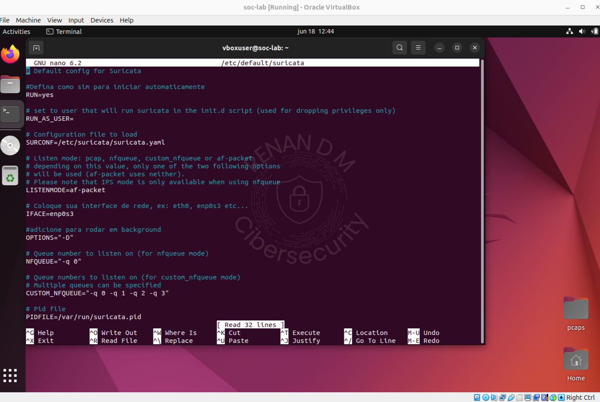

- Suricata configurado para iniciar automaticamente como daemon em modo af-packet.

---

## 2 – Ativação do Splunk na Inicialização
- Execute os comandos abaixo para habilitar o Splunk no boot e iniciar o serviço:

```bash 
sudo /opt/splunk/bin/splunk enable boot-start
sudo /opt/splunk/bin/splunk start
```
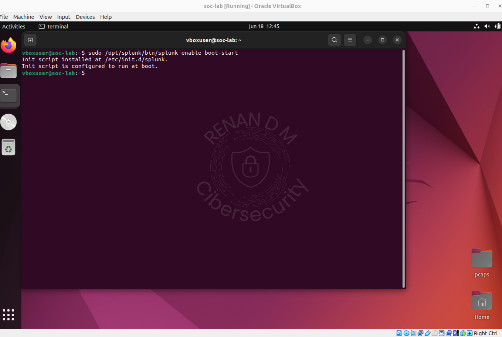
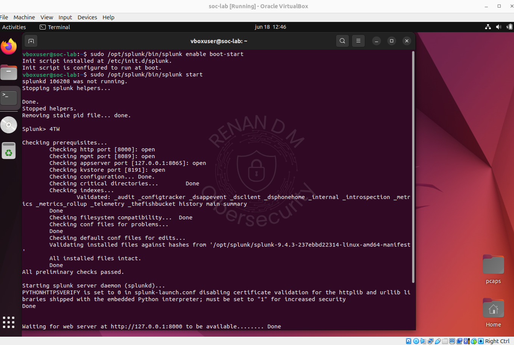

---

## 3 – Criação das Regras no Suricata

 - Edite o arquivo de regras:

```bash
sudo nano /etc/suricata/rules/local.rules
```

- Cole as regras personalizadas abaixo:

```bash

# SYN Scan (barulhento)
alert tcp any any -> any any (msg:"[PORTSCAN] Possivel Portscan SYN Detectado!"; flags:S; threshold: type both, track by_src, count 20, seconds 20; sid:100001; rev:1;)

# FIN Scan (stealth)
alert tcp any any -> any any (msg:"[PORTSCAN] Possivel Portscan FIN Detectado!"; flags:F; threshold: type both, track by_src, count 5, seconds 20; sid:100002; rev:1;)

# NULL Scan (stealth)
alert tcp any any -> any any (msg:"[PORTSCAN] Possivel Portscan NULL Detectado!"; flags:0; threshold: type both, track by_src, count 5, seconds 20; sid:100003; rev:1;)

# XMAS Scan (stealth)
alert tcp any any -> any any (msg:"[PORTSCAN] Possivel Portscan XMAS Detectado!"; flags:FPU; threshold: type both, track by_src, count 5, seconds 20; sid:100004; rev:1;)

# UDP Scan (stealth)
alert udp any any -> any any (msg:"[PORTSCAN] Possivel Portscan UDP Detectado!"; threshold: type both, track by_src, count 10, seconds 20; sid:100005; rev:1;)
```
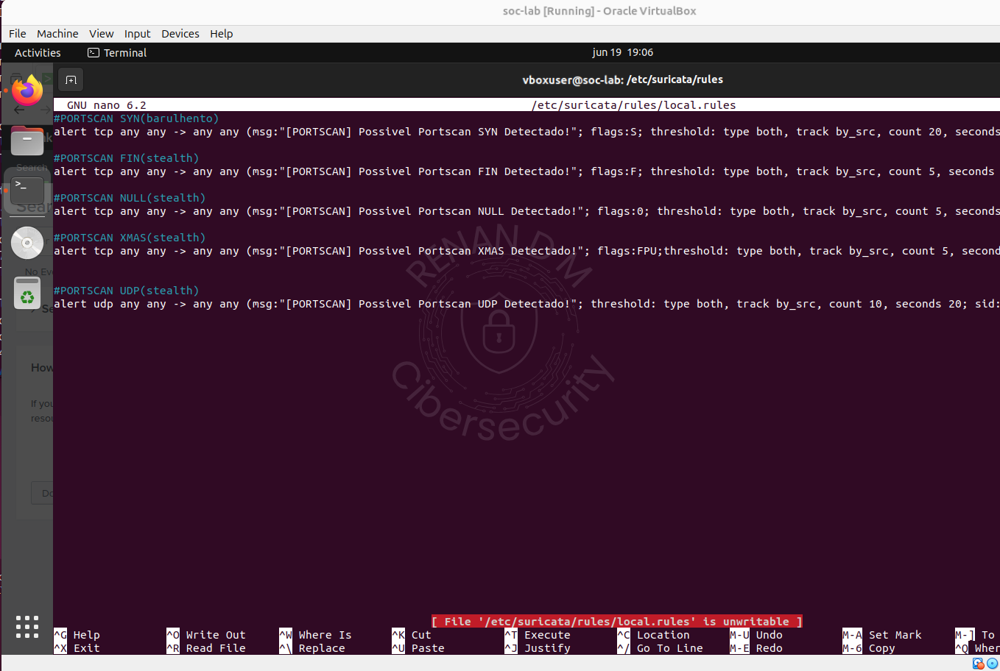

---

## 4 – Reinício do Suricata
> Sempre que você alterar local.rules, recarregue as regras ou reinicie o serviço.

```bash
sudo rm /var/run/suricata.pid
sudo suricata -c /etc/suricata/suricata.yaml --af-packet=enp0s3 -D
```

---

## 5 – Validação da Comunicação

- Descubra o IP da VM com Suricata:

```bash
ip a
```
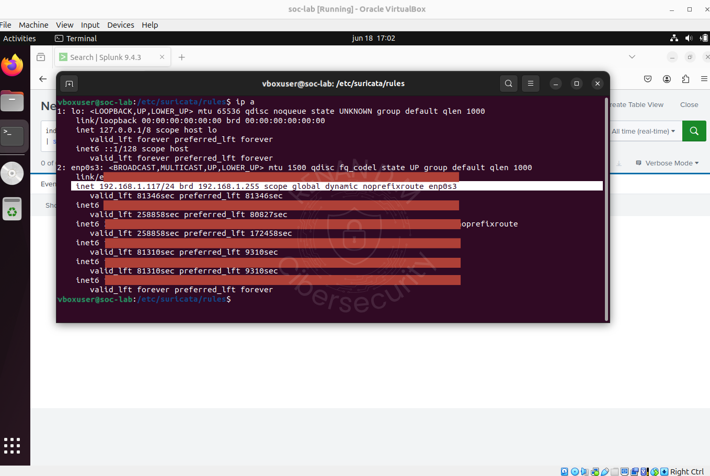

- Realize o teste com a VM atacante:

```bash
ping 192.168.x.x
```
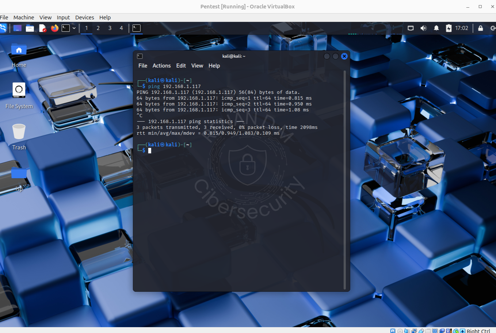

---

## 6 – Monitoramento no Splunk

Acesse o Splunk:
Search & Reporting > New Search

Cole a seguinte consulta:

```bash
index=* source="/var/log/suricata/eve.json" event_type=alert alert.signature_id IN (100001,100002,100003,100004,100005)
| stats count by src_ip, alert.signature_id
```

- Habilite o modo "Real Time" e "Verbose Mode".

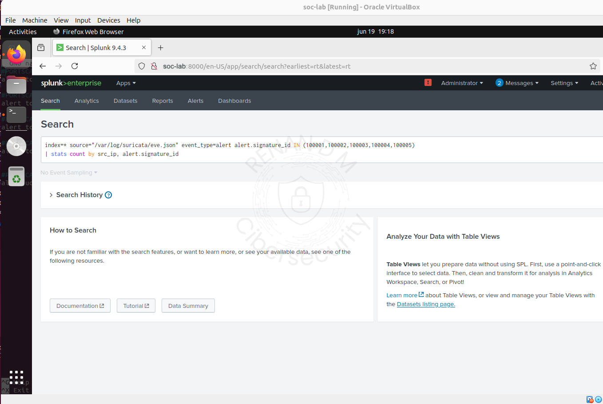

---

## 7 – Execução dos Ataques

Na VM atacante, execute os seguintes comandos:

| Tipo de Scan | Comando Nmap                      |
|--------------|-----------------------------------|
| FIN          | `nmap -sF -p- 192.168.x.x`        |
| NULL         | `nmap -sN -p- 192.168.x.x`        |
| XMAS         | `nmap -sX -p- 192.168.x.x`        |
| UDP          | `nmap -sU -p- 192.168.x.x`        |
| SYN          | `nmap -sS -p- 192.168.x.x`        |

- Os Alertas são capturados e exibidos em tempo real no Splunk.

### FIN


### NULL
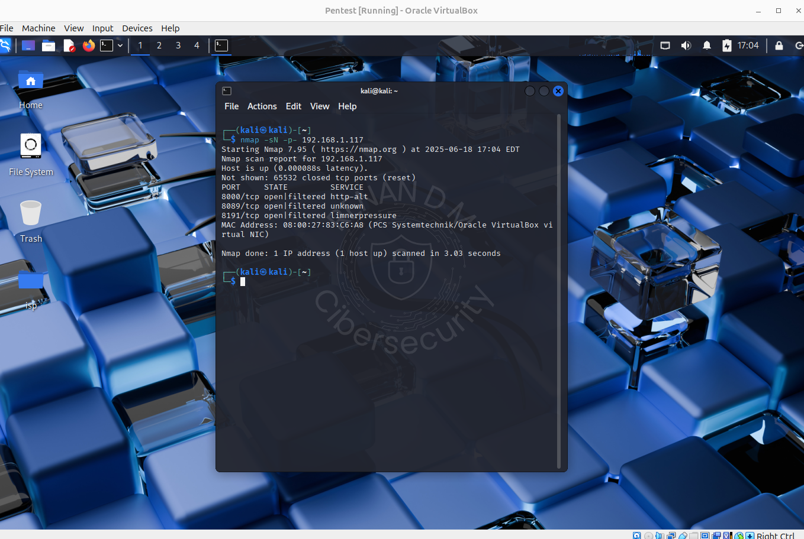

### XMAS

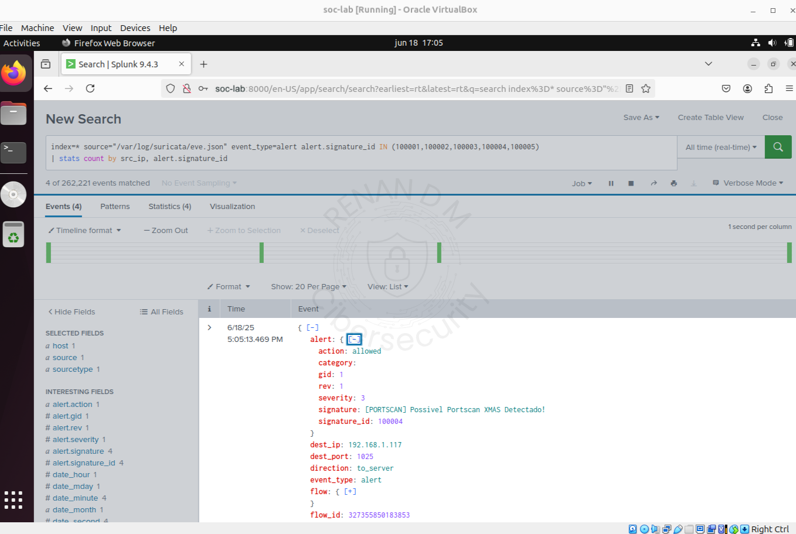
### UDP
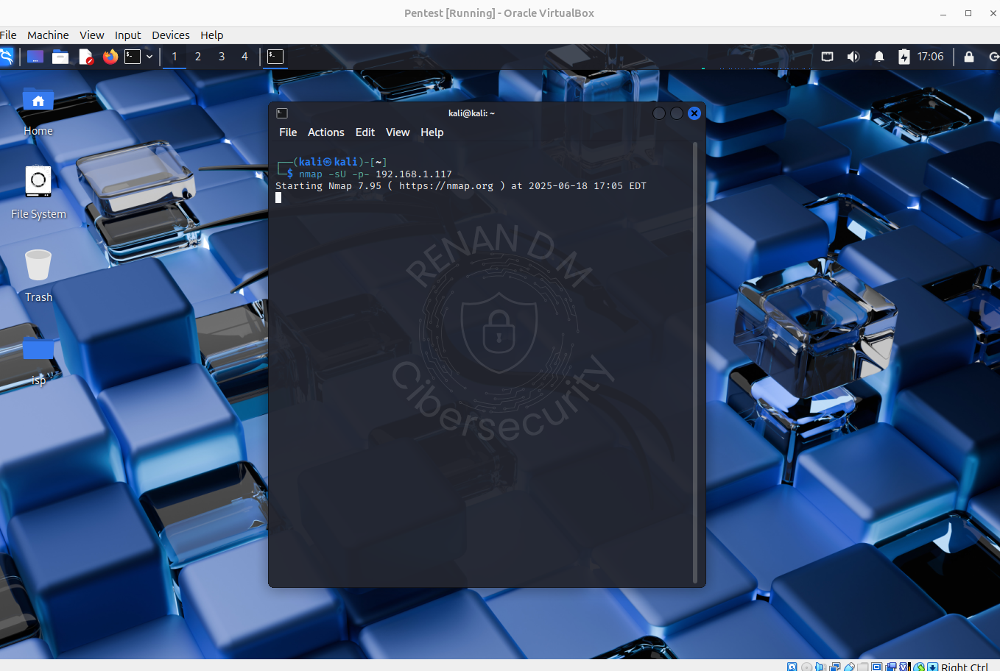

### SYN
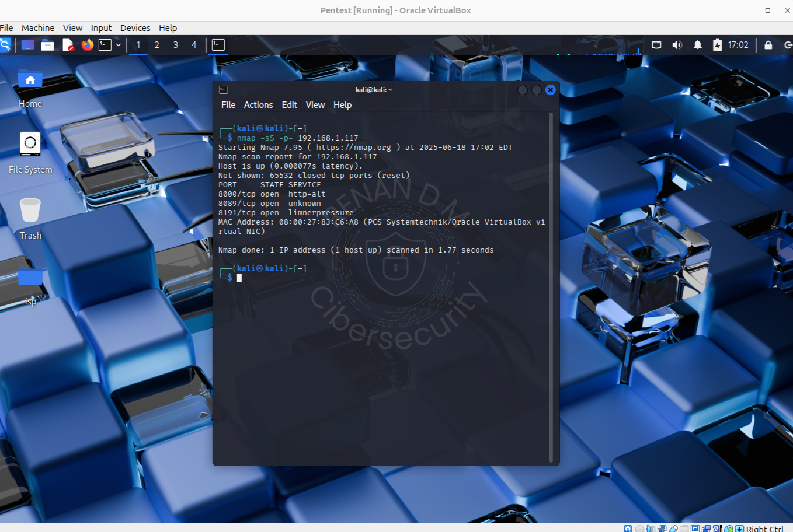


---

## 8 – Estatísticas no Splunk

Utilize o painel Statistics para visualizar os alertas agregados por IP e tipo de scan.

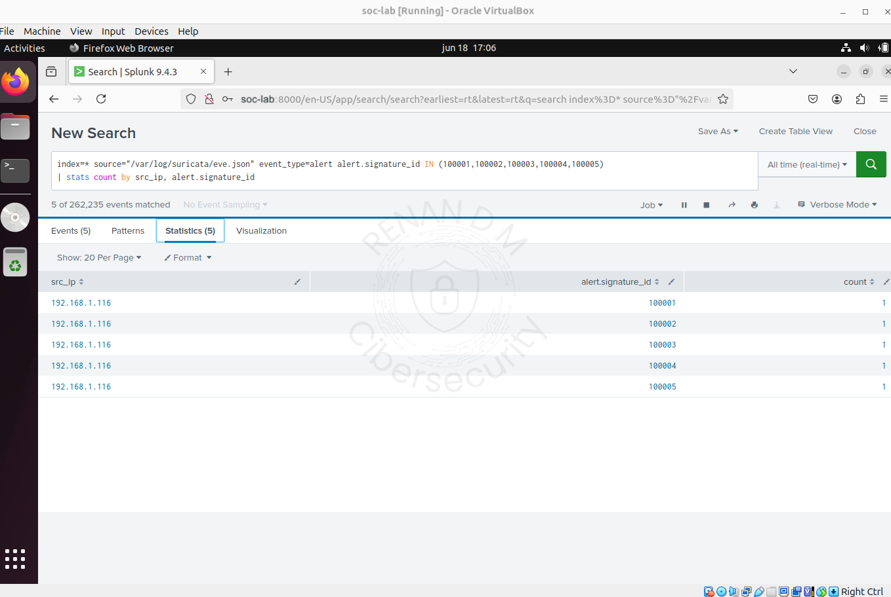

---

### Limitações (intencionais)

- Não há bloqueio automático ou respostas ativas

- O foco é puramente em detecção e visualização

---

## Próximos Passos

- Mitigação ativa via iptables

- Criação de alertas automáticos ou scripts de resposta

- Integração com TheHive, Sigma ou Wazuh

- Dashboards e detecção por comportamento

