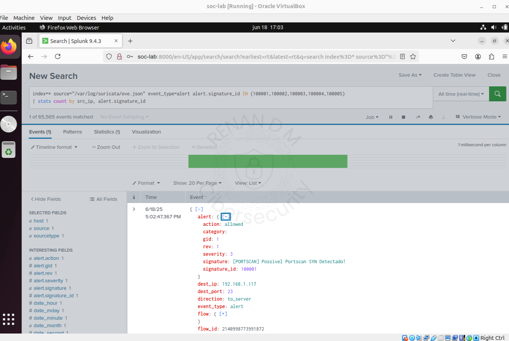

#  Regras e Alertas — Detecção Personalizada com Suricata

  

Esta seção reúne regras criadas para o Suricata, voltadas à detecção em rede como portscans, exploração de protocolos e tráfego suspeito. Cada PoC foi testada em ambiente controlado, com geração de tráfego simulada e visualização dos alertas no Splunk.

---

| PoC                         | Descrição                                                                                                                                      |
|-----------------------------|------------------------------------------------------------------------------------------------------------------------------------------------|
| [01-Portscan](01-Portscan/README.md)               | Regras para detecção de diferentes tipos de varredura de portas: SYN, FIN, NULL, XMAS e UDP. Inclui geração com Nmap e visualização no Splunk. |

---

## Metodologia dos Testes

- Criação da regra no Suricata
- Simulação do tráfego malicioso (Nmap, hping3, scripts customizados)
- Captura e análise com Wireshark e tcpdump
- Visualização no Splunk com dashboards e alertas
- Documentação com prints, comandos e observações técnicas

---

## Próximas Regras em Desenvolvimento

- Exploração de protocolos (ex: HTTP malformed, DNS tunneling)
- Tráfego anômalo (beaconing, C2)
- Padrões comportamentais (ex: bursts de conexão, repetição suspeita)

---

## Ambiente Utilizado

- IDS: Suricata
- SIEM: Splunk Enterprise
- Máquinas virtuais em modo bridge (monitoramento e ataque)
- Ferramentas de apoio: Wireshark, Nmap, tcpdump, Kali Linux e outras

---

> ⚠️ Todo o conteúdo desta pasta é resultado de simulações em ambiente isolado e seguro, com objetivo puramente educacional e técnico.

