# Detecção e Mitigação de Brute Force SSH com Wazuh + Hydra + IPTables

Este lab mostra, na prática, como identificar um ataque de brute force SSH usando Wazuh, simular o ataque com Hydra e aplicar bloqueio manual via IPTables.
É um fluxo típico de SOC N1: detectar > confirmar > validar impacto > mitigar.

-  Documento criado por **RENAN DIAS MENDES**
-  Atualizado em **28/11/2025**

---

## Ferramentas Utilizadas

- Wazuh
- Kali Linux (Hydra)
- Linux alvo (SSH)
- iptables

---

## 1. Preparação do Ambiente

**Caso não tenha o Wazuh e os agents, da uma olhadinha aqui:** [Intalação](../../Instalacao/README.md)

Baixe a VM pronta do Kali Linux:

https://www.kali.org/get-kali/#kali-virtual-machines

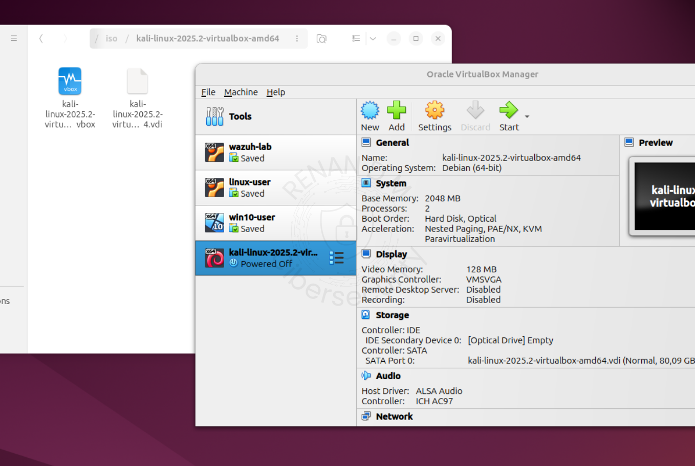

- Login: kali/kali
- Atualize:

```bash
sudo apt update && sudo apt upgrade -y
```
### Wordlist
O rockyou vem compactado por padrão, verifique se ela está presente na pasta e extraia.:

```bash
ls -lh /usr/share/wordlists/
sudo gzip -d /usr/share/wordlists/rockyou.txt.gz
```

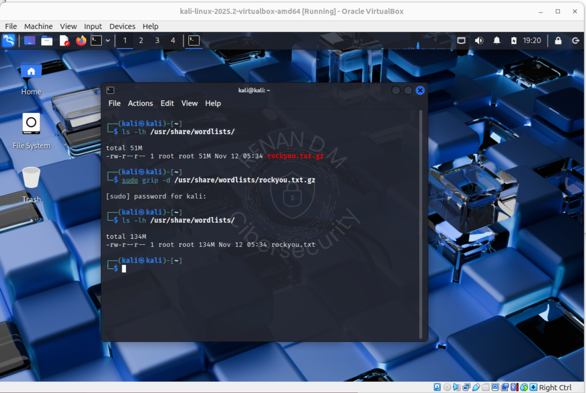

### VMs abertas

- Kali (atacante)
- linux-user (alvo)
- Wazuh Server

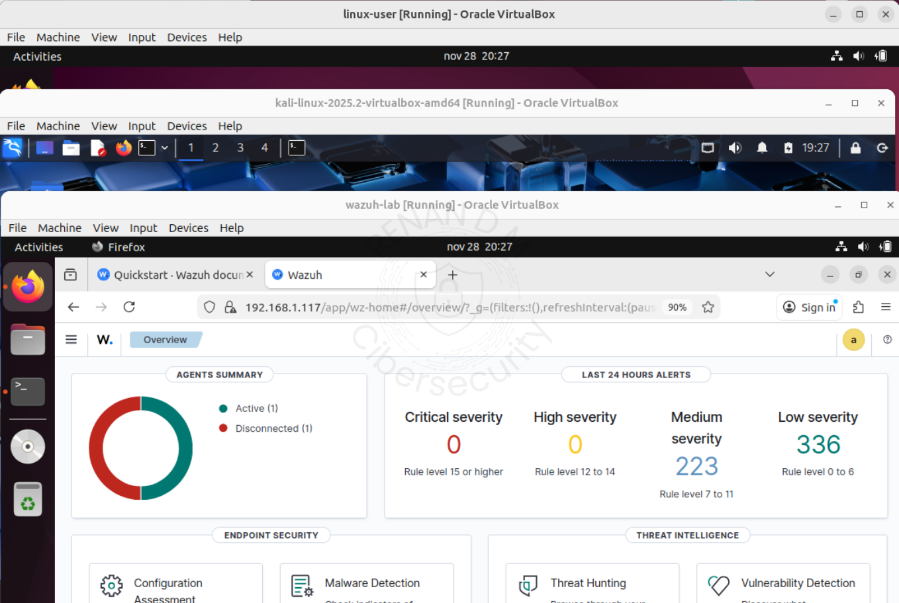

---

## 2. Ataque com Hydra (Brute Force)

Execute o ataque no Kali com o ip do alvo e usuario:

```bash
hydra -l root -P /usr/share/wordlists/rockyou.txt ssh://192.168.1.118
```

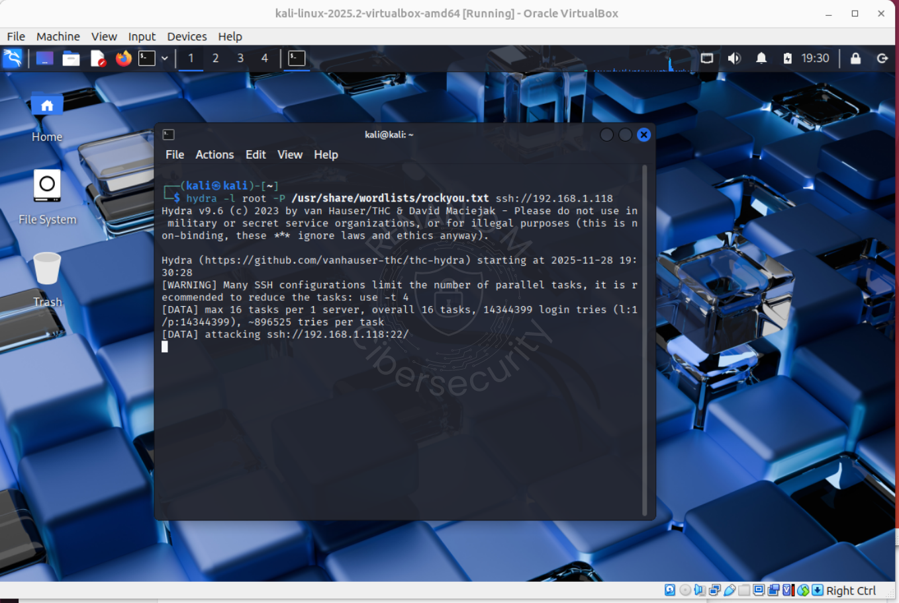

Deixe rodar alguns segundos e pare com **CTRL+C** a execução do script no kali. O Wazuh começará a gerar centenas de alertas

---

## 3 Analizando os alertas no Wazuh

Clique em **Threat Hunting** para ver a quantidade de eventos acionados.

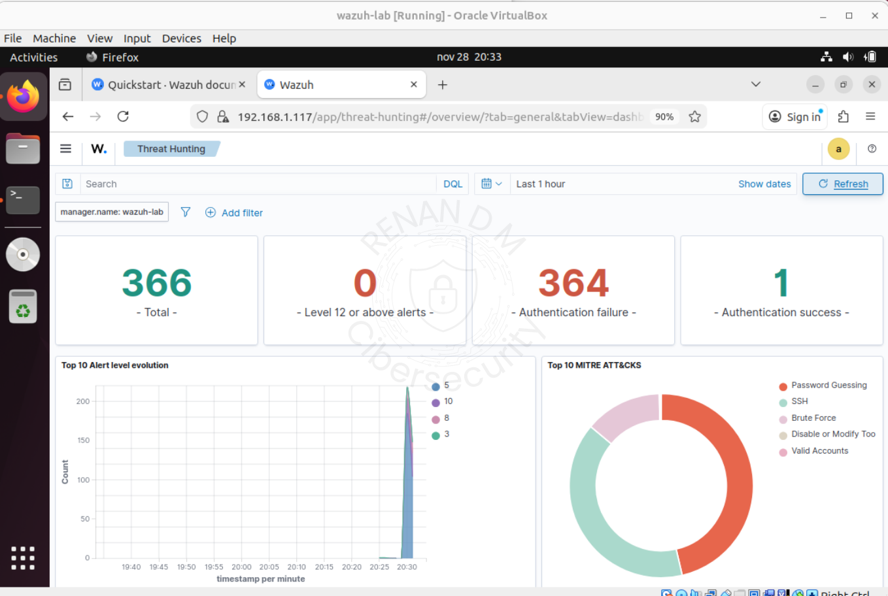

Na aba eventos será possível verificar com mais clareza os logs. Em **Avaliable fields** apliquei apenas o filtro de src.ip para facilitar a visualização do IP atacante.

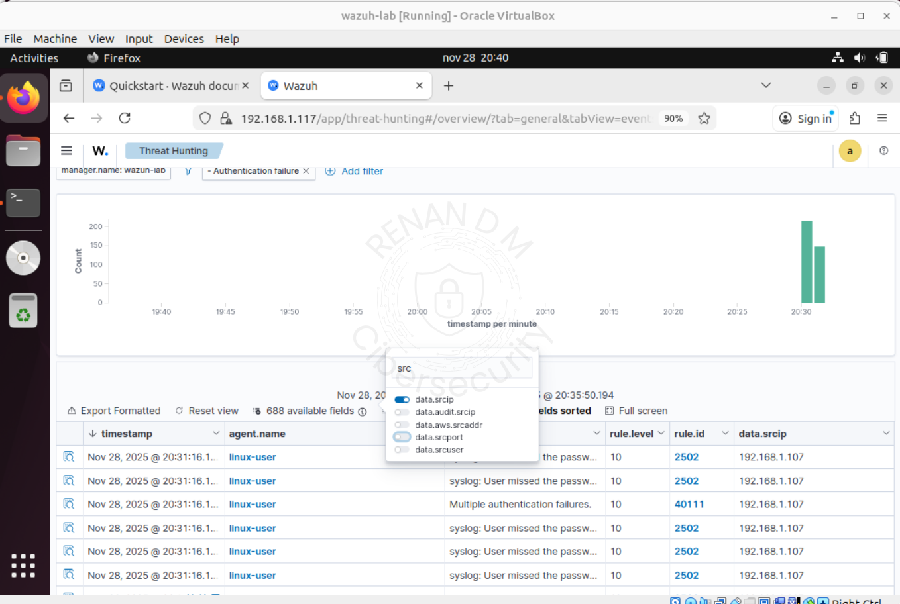

Ao lado da data de cada evento exite um icone **Inspect Document Details** onde aparecerá com mais clareza todas as informações do alerta.

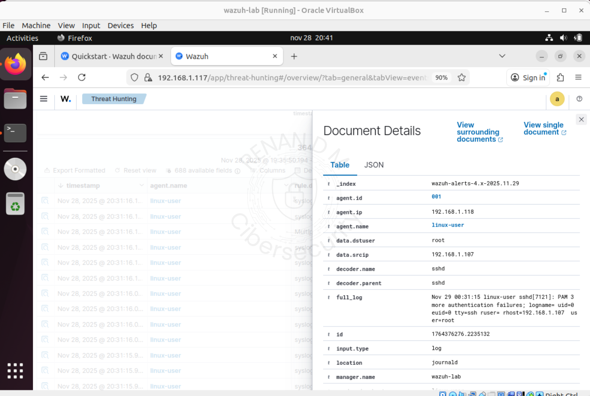

Pela quantidade de alertas de senha incorreta e tentativa de login ssh, o primeiro passo é verificar se **houve o acesso a conta** para avaliar a severidade do ataque. É possivel definir um filtro com as querys com base em regras e textos para verificar se houve sucesso ou não de login. Selecionei várias regras para realizar essa busca:

```bash
(rule.id:5712 OR rule.id:5501 OR rule.id:5502 OR rule.id:5503 OR rule.id:5505 OR rule.id:5506)
```

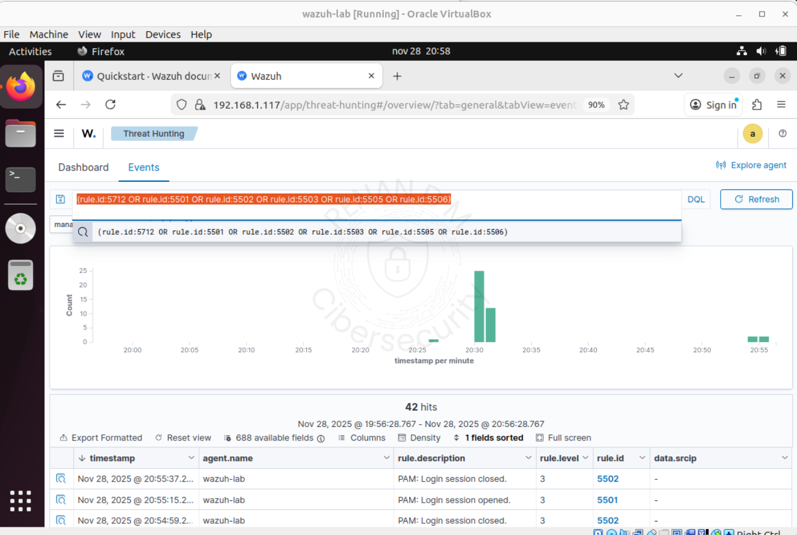
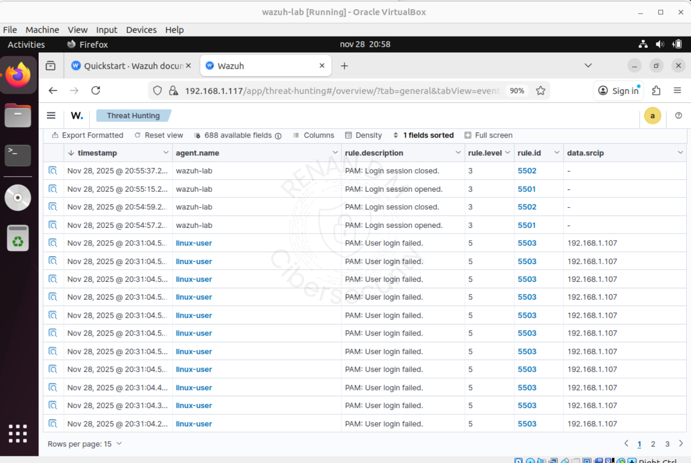

Se não houver nenhum "Accepted password ou sucess" = ataque sem sucesso.

Precisamos verificar tambem se houve tentativa em outros hosts utilizando o filtro **data.srcip** e em fields podemos adicionar o **data.dstuser** para verificar os usuários.

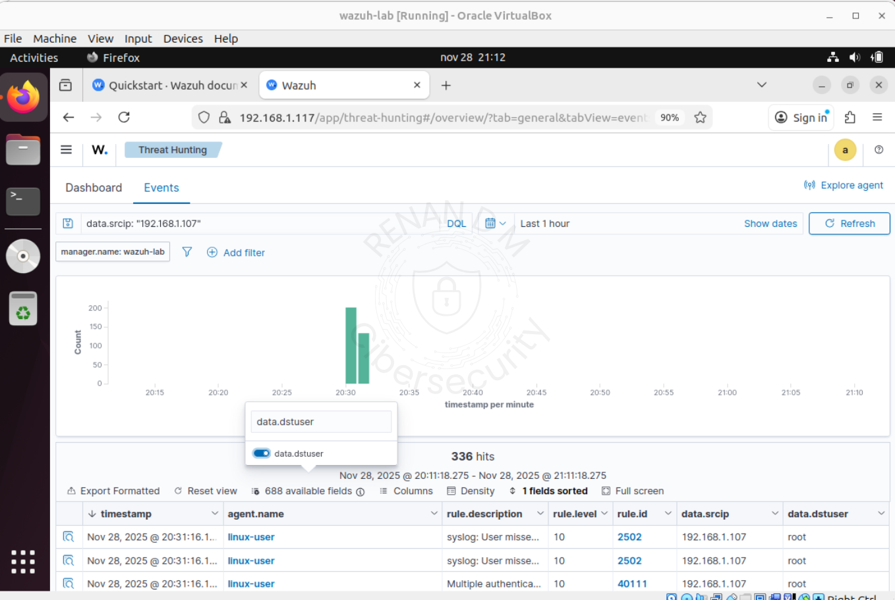

O IP é interno, então não há necessidade de consulta de reputação (VT, Talos, AbuseIPDB).

Se o mesmo atacante tentasse varios usuários ou multiplas maquinas, isso indicaria lateral movement dentro da rede. Isso não ocorreu neste cenário.

Com essas informações já validamos o ataque e iremos iniciar a mitigação bloqueando o ip atacante.

## 4. Mitigação com IPTables

Na VM alvo, bloqueie o IP atacante e verifique se a regra foi adicionada:

```bash
sudo iptables -A INPUT -s 192.168.1.107 -p tcp --dport 22 -j REJECT
sudo iptables -L INPUT --line-numbers -n
```
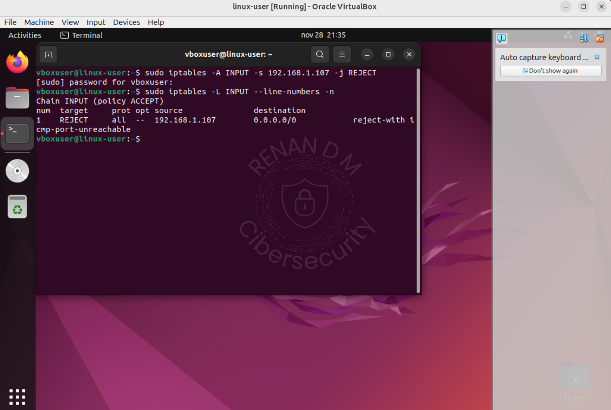

Teste o acesso pelo Kali:

```bash
ssh root@192.168.1.118 -vv
```

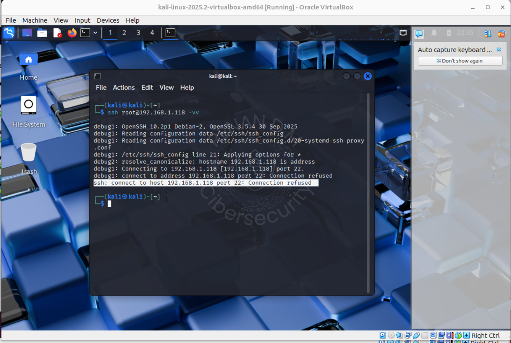

Deve ser rejeitado imediatamente.

**Obs:** Utilizei REJECT para mostrar visualmente, o correto em produção é DROP para o bloqueio.

Caso o ufw estiver ativo no linux-user a regra não será executada. Para desabilitar o ufw execute o comando e teste novamente a regra:

```bash
sudo iptables -A INPUT -s 192.168.1.107 -p tcp --dport 22 -j REJECT
sudo iptables -L INPUT --line-numbers -n
```

---

## 5. Registro do Incidente (Ticket N1)

Com as medidas de mitigação aplicadas podemos descrever os acontecimentos com mais calma e clareza. Vamos voltar ao Wazuh e coletar as informações.

### Ticket

**Incidente:** Tentativas de brute force SSH
**Status:** Mitigado
**Severidade:** Média

**Resumo:** Entre **20:30** e **20:31** Foram detectadas multiplas tentativas de senha incorreta contra o **usuário root** no host linux-user (192.168.1.118), originadas do IP 192.168.1.107. O Wazuh gerou alertas das regras **5503, 5760 e 2502** indicando falhas de autenticação consecutivas e padrão de **brute force** (MITRE T1110).

**Evidências principais:** pam_unix(sshd:auth): authentication failure, Failed password for root from 192.168.1.107, 336 eventos do ip atacante.

**Aplicado bloqueio manual:** iptables -A INPUT -s 192.168.1.107 -j REJECT
**Resultado:** Ataque interrompido. Sem logins bem-sucedidos.

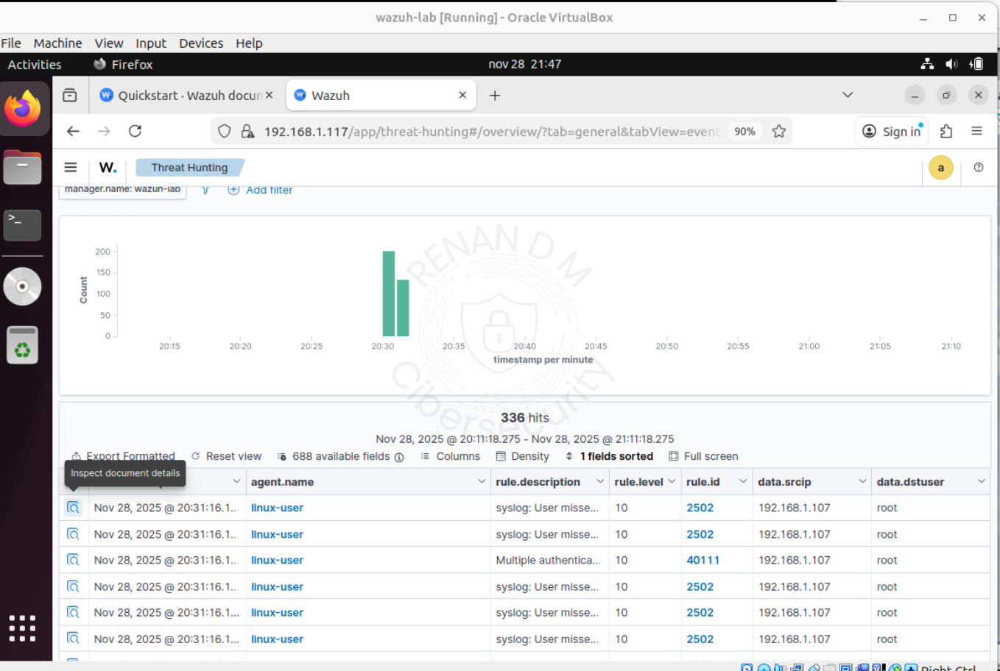
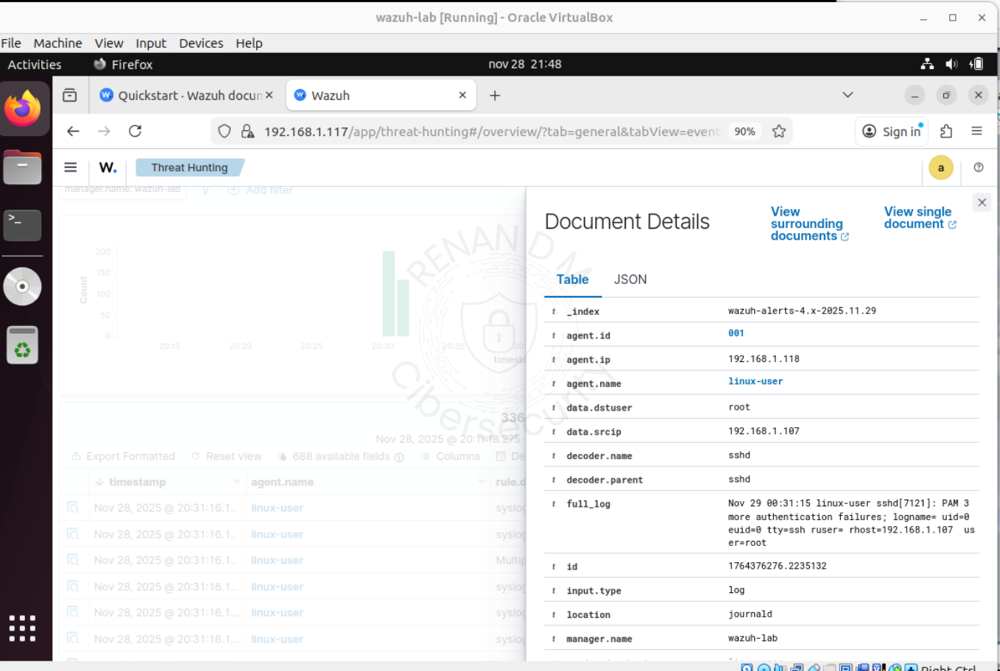
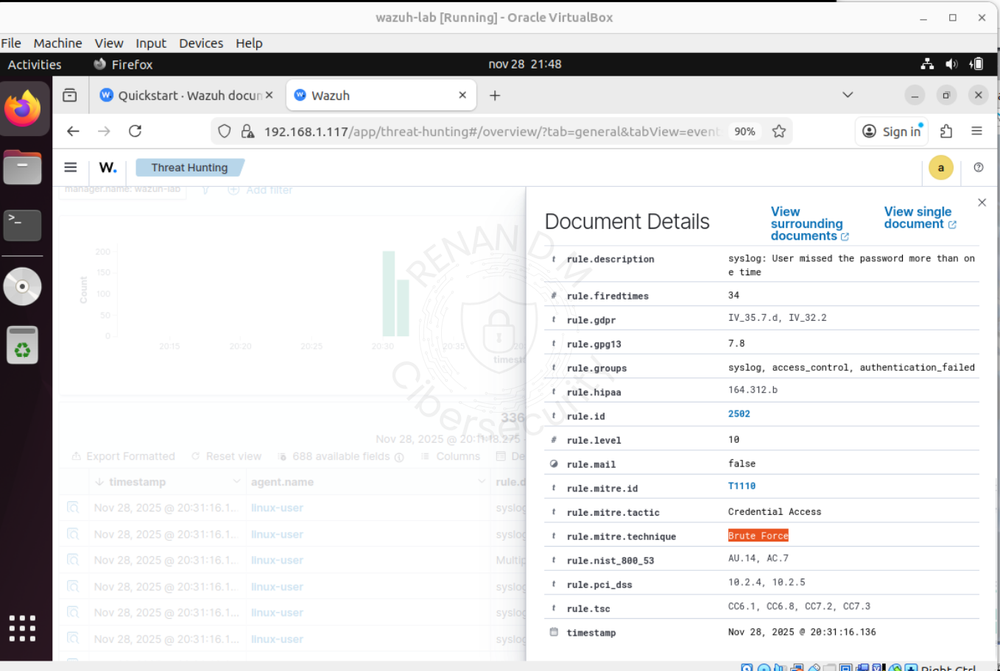

## 6. Conclusão

Este laboratório demonstra um fluxo realista de operação SOC N1:
detectar > analizar > confirmar > mitigar > registrar.

O Wazuh identificou o padrão de brute force (MITRE T1110), os logs confirmaram que não houve acesso bem-sucedido e a mitigação via iptables bloqueou o atacante imediatamente.
O ticket foi registrado com evidências, regras acionadas e ações aplicadas.


