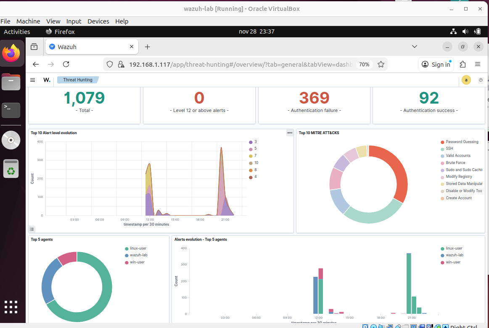

# Eventos, Detecções e Mitigação.

  

Esta seção foca na implementação de respostas manuais e automáticas utilizando o Wazuh como SIEM/EDR, integrando iptables e scripts personalizados.
O objetivo é transformar alertas em ações de contenção e mitigação, desde bloqueios de tráfego até respostas condicionais mais avançadas.

---

## Objetivos

- Integrar Wazuh com iptables ou outros firewalls para bloqueios dinâmicos

- Simular respostas a eventos como portscans, brute-force, beaconing, C2 e lateral movement

- Testar integração com scripts externos, SOARs e automações de resposta

---

| Tópico                                        | Descrição                                                                                       |
|-----------------------------------------------|-------------------------------------------------------------------------------------------------|
| [BruteForce-SSH+Miticagao-Iptables](BruteForce-SSH+Mitigacao-Iptables/README.md)            | Detecção de BruteForce em SSH e mitigação manual com iptables.       |

---

## Considerações

O foco desta pasta é evoluir do modelo passivo para um ambiente reativo.
A prioridade é contenção rápida, mantendo atenção a falsos positivos e impactos na rede.

---

> ⚠️ *Todos os testes realizados nesta pasta seguem em ambiente controlado. O objetivo é educacional e voltado à melhoria de práticas defensivas em redes reais.*
