# Instalação e Configuração do Ambiente - Wazuh + Agents Linux e Windows.

**Data do ambiente:** 28/11/2025  
Esse é o passo a passo completo para instalar Wazuh e integrar com agents Linux e Windows para monitoramento em tempo real. A porta 22 foi aberta para possibilitar testes futuros (opcional).

**Stack:**
- Ubuntu-Wazuh: 6gb ram, 2 nucleos, 50gb hd.
- Win10: 4gb ram, 2 nucleos, 30gb hd.
- Ubuntu: 2gb ram, 1 nucleo, 30gb hd.

**Ambiente Linux Utilizado:**  [Instalação do Ambiente Geral](../../../Instalacao-do-Ambiente-Geral/README.md)

---

**Obs:** Antes de iniciarmos a instalação do Wazuh, coloque a VM em modo bridge para que possa ser possível se comunicar com os outros hosts na mesma rede. Esse passo deve ser repetido em todos os agents.
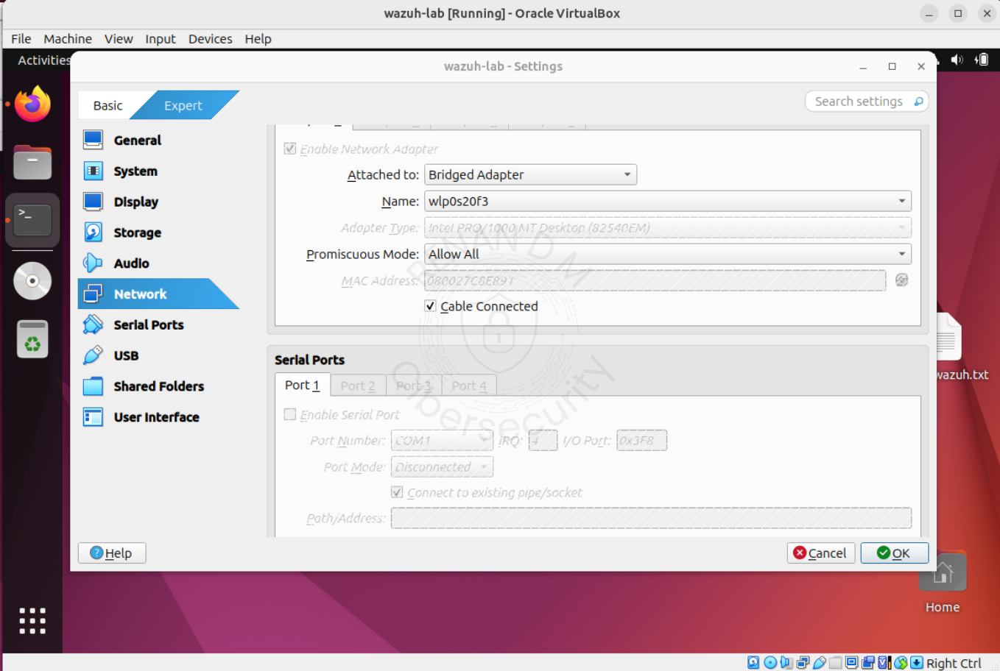

## 1. Instalação do Wazuh

acesse o site do wazuh e baixe a instalação rapida: https://documentation.wazuh.com/current/quickstart.html
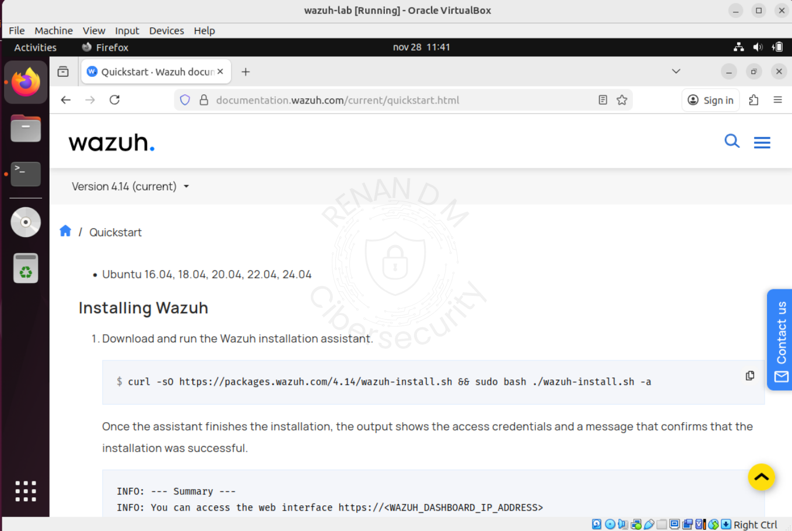

copie o código de instalação e execute no terminal.

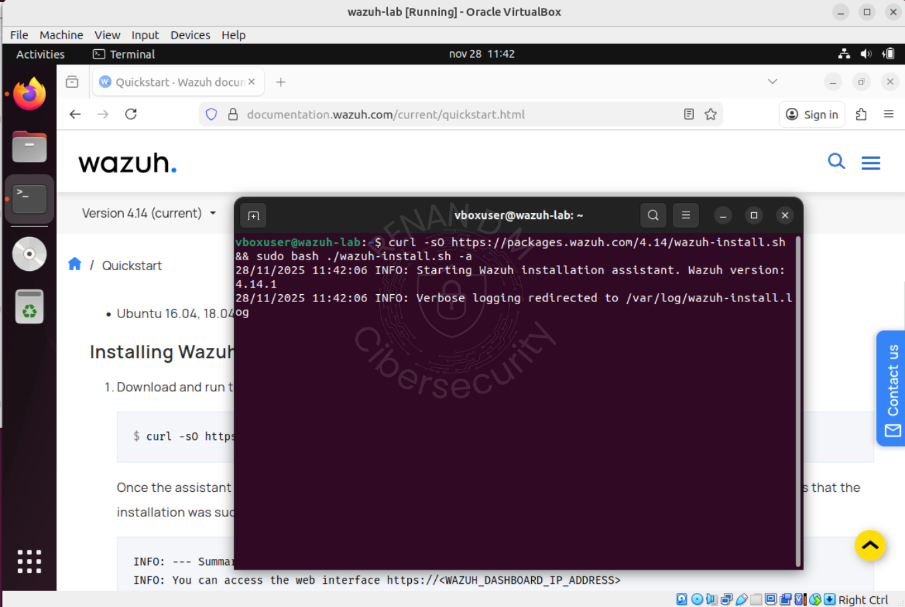

Após a conclusão o usuário admin e a senha serão gerados.

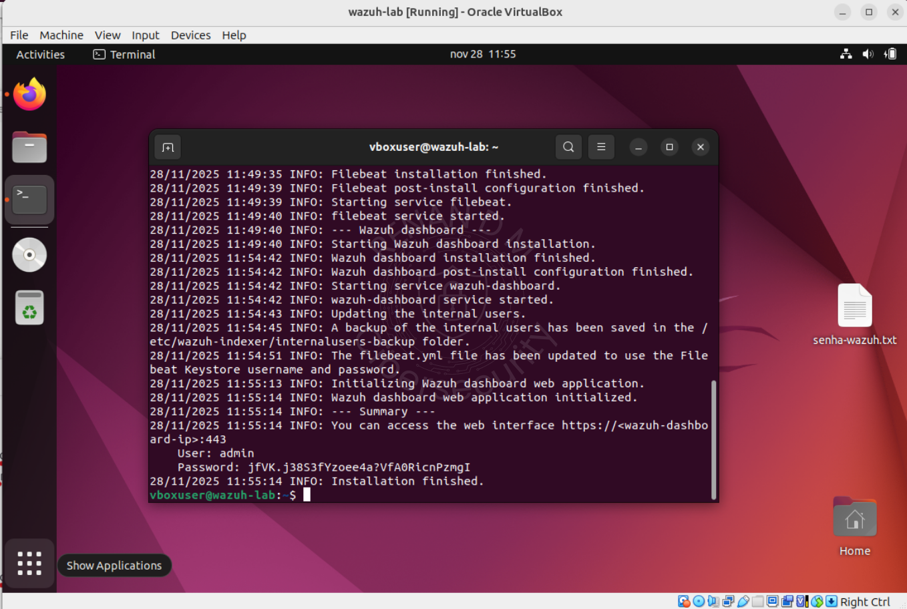

Acesse pelo navegador com o seu ip, digite o usuario e a senha para login

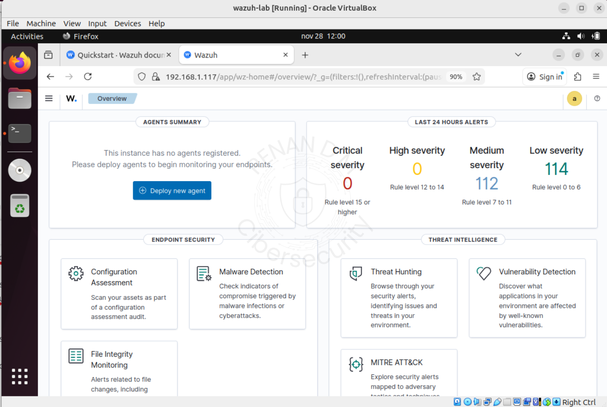
---

## 2. Criando Endpoint Linux

Siga  passo a passo da  [Instalação do Ambiente Geral](../../../Instalacao-do-Ambiente-Geral/README.md)

Instale e Habilite o SSH:

```bash
sudo apt-get install openssh-server -y
sudo systemctl enable ssh --now
```

verifique se o serviço está rodando e se aporta 22 está aberta e escutando::

```bash
sudo ss -tuln | grep :22
sudo systemctl status ssh
```
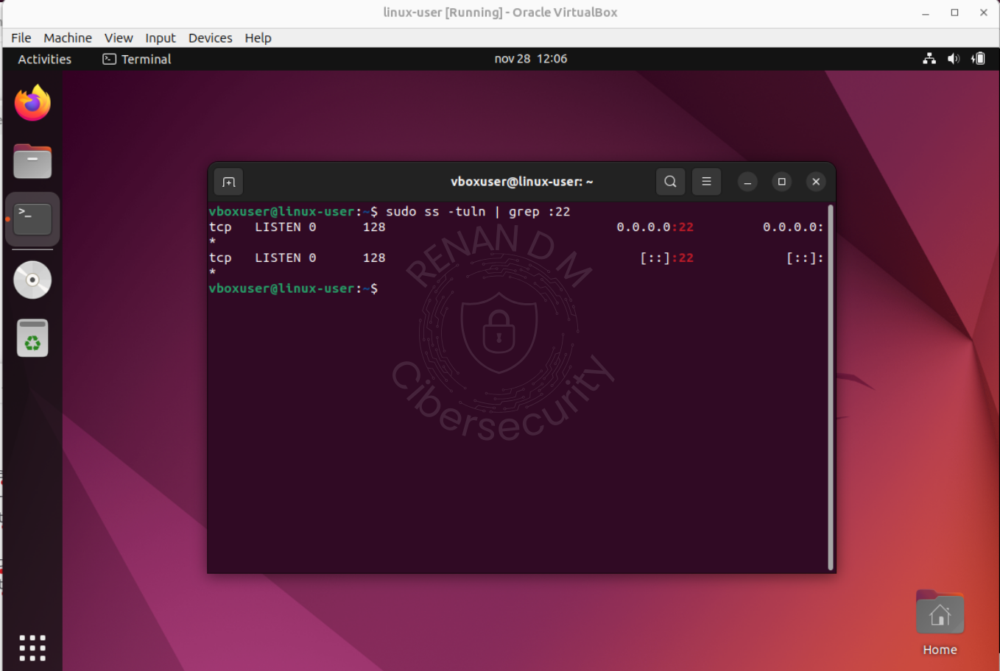
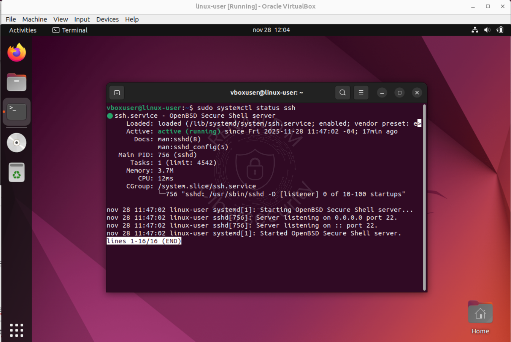


## 2.1 Adicionando Wazuh-Agent no Endpoint Linux

Clique em Deploy new agent, Selecione o S.O Linux DEB amd64, adicione o ip da vm do wazuh e coloque o hostname como Linux.

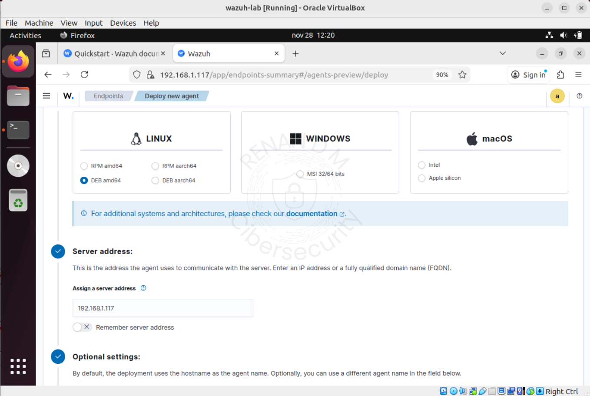

Copie o código e execute no Endpoint.

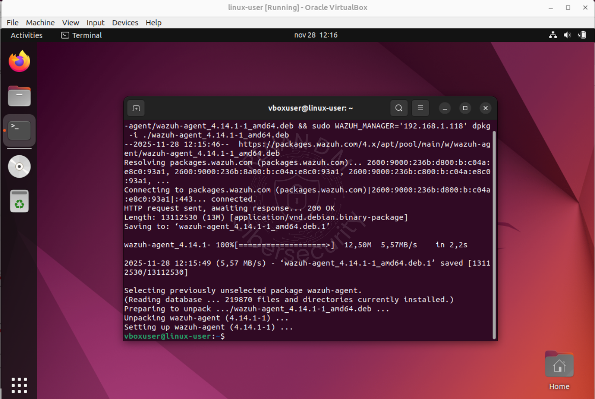

Verifique se o host foi adicionado.

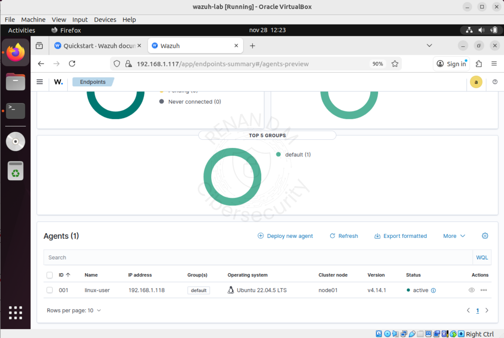

## 3. Criando Endpoint Windows 10

Baixe a iso e crie a VM: https://www.microsoft.com/pt-br/software-download/windows10iso

Abra o powershell como administrador e instale o openssh e habilite o inicio automatico:

```bash
Add-WindowsCapability -Online -Name OpenSSH.Server~~~~0.0.1.0
Start-Service sshd
Set-Service -Name sshd -StartupType Automatic
```

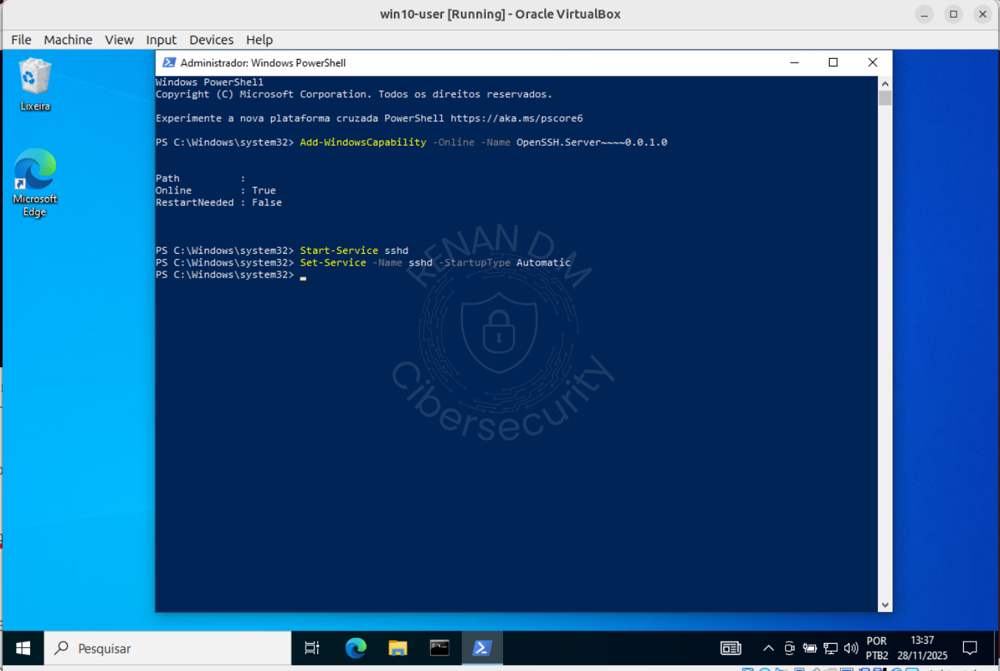

Abra a porta 22 no firewall do windows.

```bash
New-NetFirewallRule -Name "OpenSSH" -DisplayName "OpenSSH" -Protocol TCP -LocalPort 22 -Action Allow -Direction Inbound
```


## 3.1 Adicionando Wazuh-Agent no Endpoint Windows 10

Vá no Wazuh e clique em Deploy new agent

Selecione o S.O Windows, adicione o ip do host do wazuh, hostname win-user.

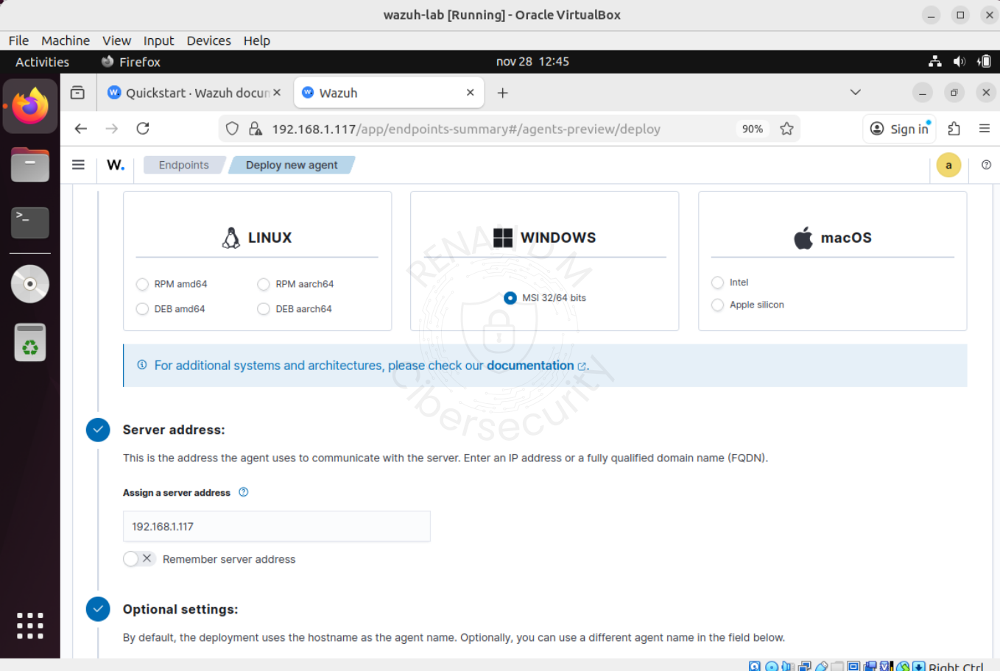

Copie o código e abra o powershell como administrador, cole o código gerado.

Após o download habilite o wazuh com o codigo:

```bash
NET START Wazuh
```

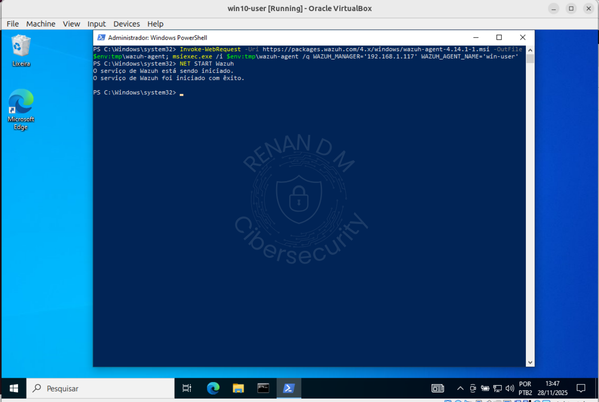

Verifique no Wazuh se o Windows foi adicionado.

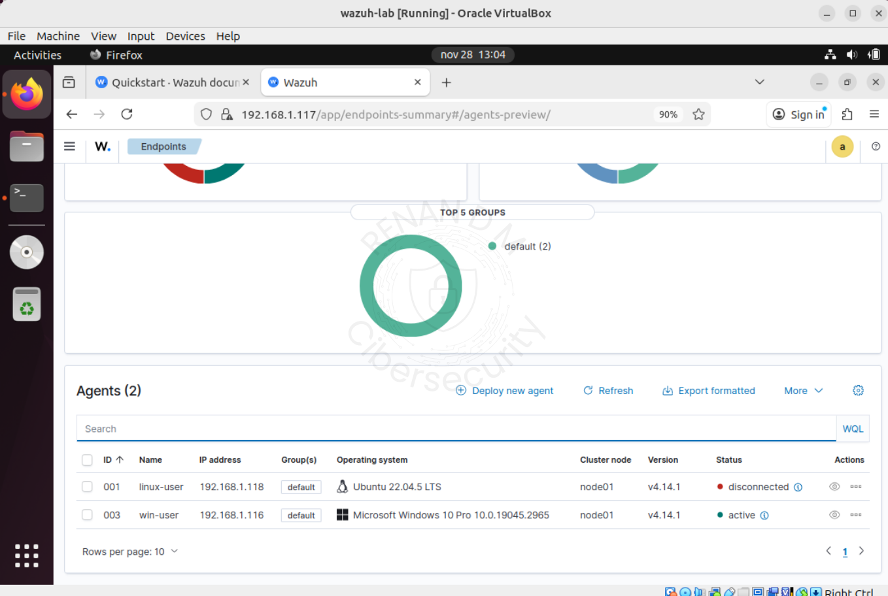

**Obs:**

Caso não se conecte o windows, talvez seja necessário abrir as portas 1514 e 1515:

```bash
netsh advfirewall firewall add rule name="Wazuh 1515" dir=in action=allow protocol=TCP localport=1515
netsh advfirewall firewall add rule name="Wazuh 1514" dir=in action=allow protocol=TCP localport=1514
```

##  4. Estrutura Final do Ambiente
-  Wazuh instalado e pre-configurado
-  Agent Windows e Linux adicionados
-  Portas ssh abertas em ambos os endpoints.
-  Criação de regra de firewall para Windows e Linux.
