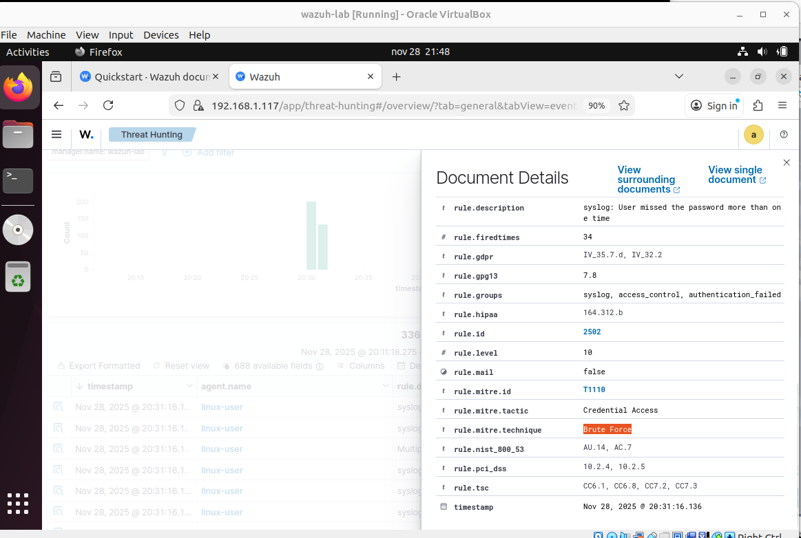

# Wazuh - SIEM/EDR Open Source para Monitoramento, Detecção e Resposta

  

Este laboratório documenta a instalação, configuração e uso do Wazuh como solução central de monitoramento, detecção e resposta em endpoints (Linux/Windows).
Inclui deployment de agentes, análise de eventos reais, troubleshooting e integrações futuras com Suricata, Cortex, MISP, Shuffle e outras ferramentas do ecossistema blue team.

---

## O que você vai encontrar aqui:

- Instalação completa do Wazuh (Manager + Dashboard)
- Deploy e configuração de agentes Linux e Windows
- Coleta, correlação e visualização de eventos
- Detecção de autenticações suspeitas (SSH/Winlogon, C2, Beaconing, Bruteforce, Lateral Moviment, etc.)
- Base para integração com Suricata, Cortex, Misp, Shuffle e automações
- 

---

## Por que essa integração?

- SIEM + EDR open-source, leve e altamente customizável
- Monitora endpoints em tempo real (logon, processos, arquivos, rede, integridade)
- Suporte nativo a regras, decoders, scripts e Active Response
- Ideal para laboratórios SOC, threat hunting e resposta a incidentes
- Ele permite montar um pipeline completo: coleta → detecção → visualização → resposta.

---

| Pasta                        |                     Finalidade                                                     |
|------------------------------|------------------------------------------------------------------------------------|
|  [Instalacao](Instalacao/README.md)                | Instalação do Wazuh Manager + Dashboard, registro e troubleshooting de agentes Linux e Windows. |
|  [Eventos-e-Deteccoes](Eventos-e-Deteccoes/README.md)          | Logs analisados (SSH, Winlogon, escalonamento, processos, etc).  |
|  [Integracoes]()    | Base para integrações futuras com Suricata, Cortex, MISP, Shuffle e automações.       |

> Cada subpasta tem seu próprio README explicando o contexto, o cenário simulado e os resultados obtidos.

---

## Em Desenvolvimento

- Regras customizadas para detecções avançadas
- Active Response com firewall (bloqueio automático)
- Integração com Suricata + Filebeat + Shuffle + Cortex + Misp
- Detecção de IOC, beaconing, brute force e exfiltração
- Automação de triagem e categorização de incidentes

---

## ⚠️ Aviso

> Todos os testes foram feitos em ambiente de laboratório, isolado da internet. O conteúdo é técnico, prático e com finalidade exclusivamente educacional.
