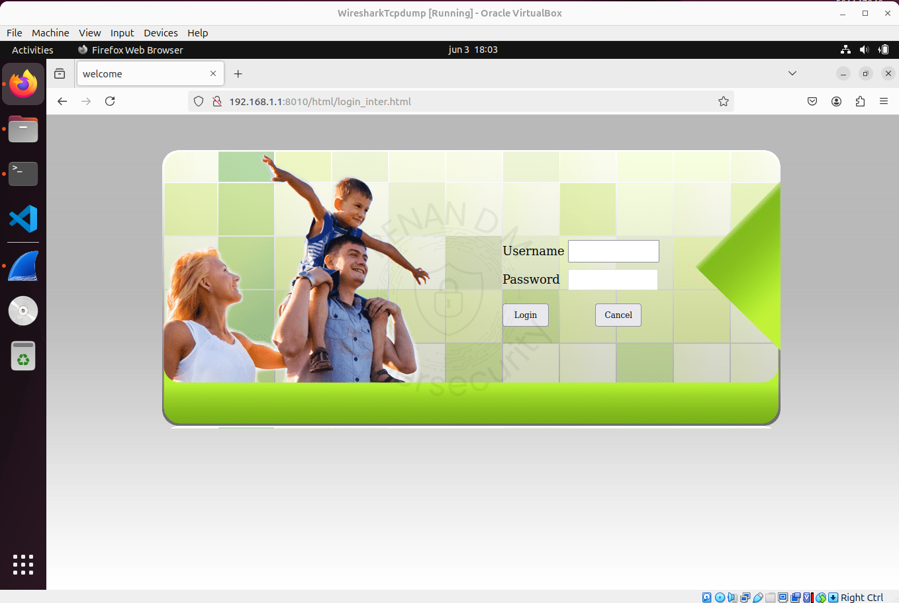
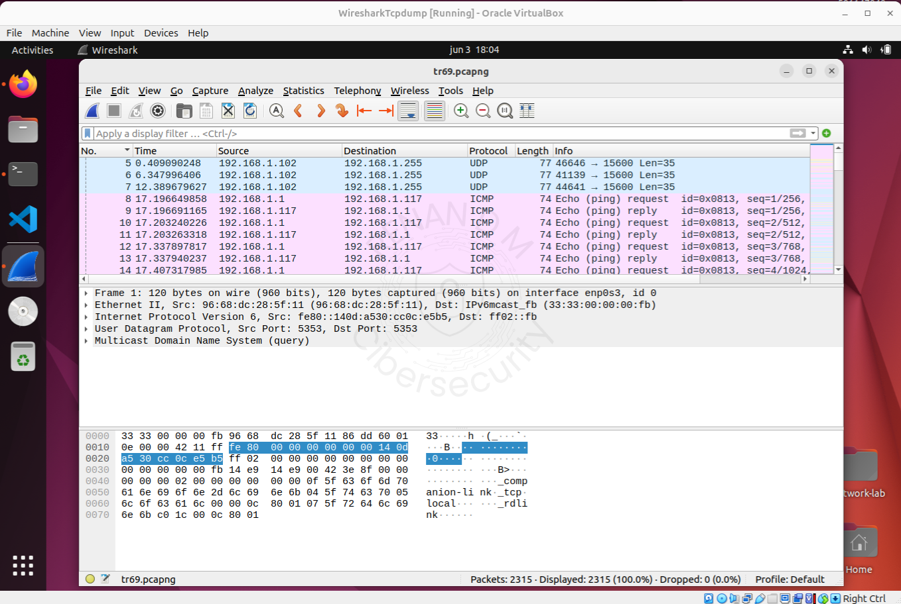
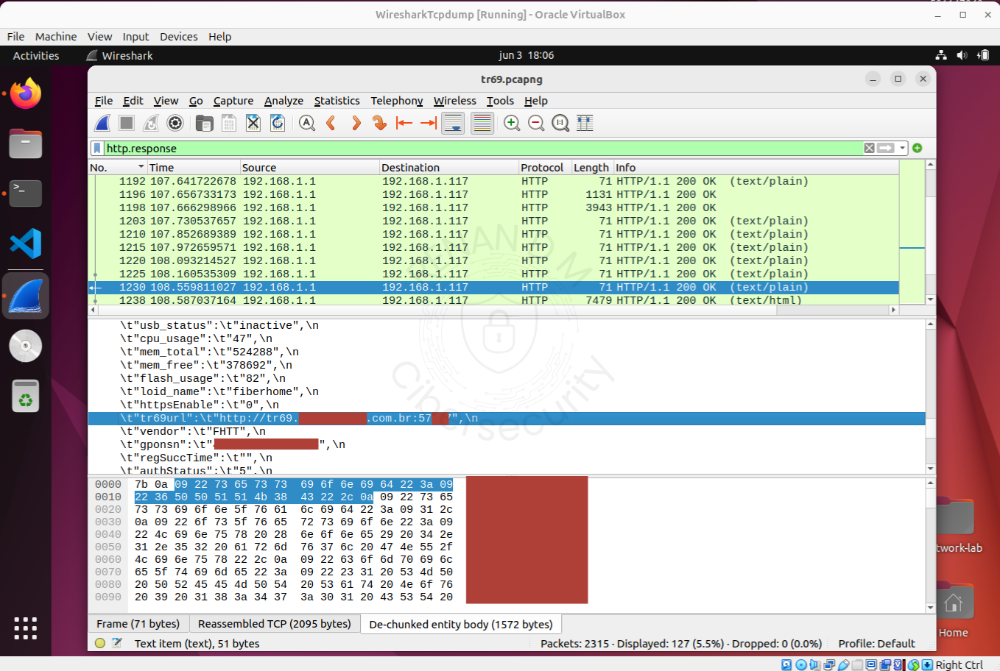
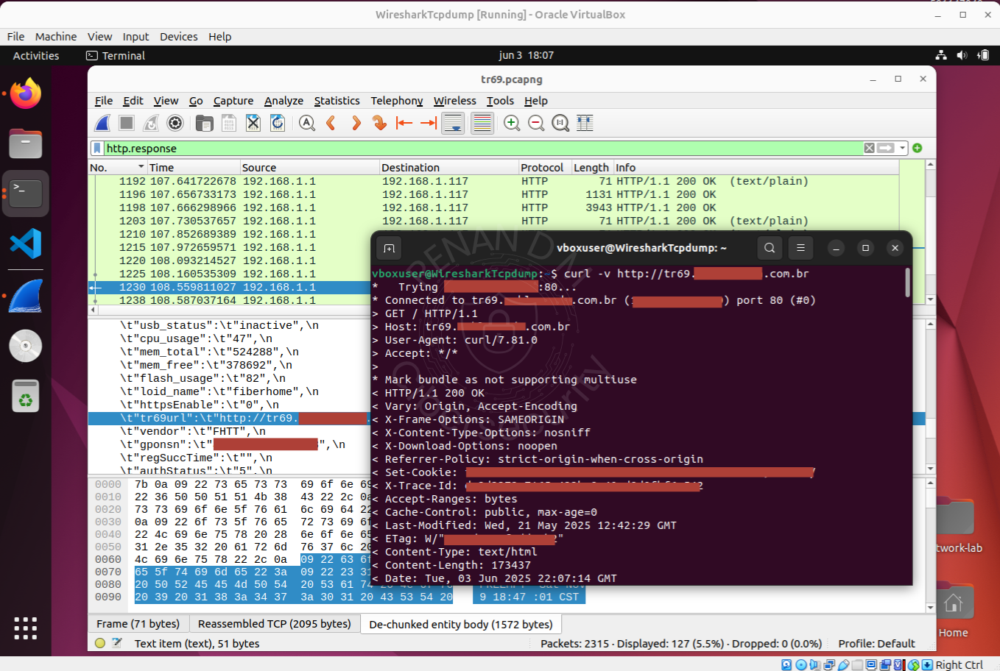
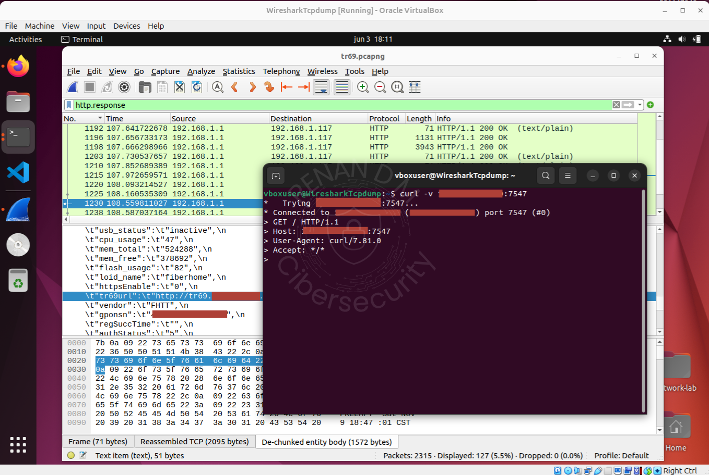
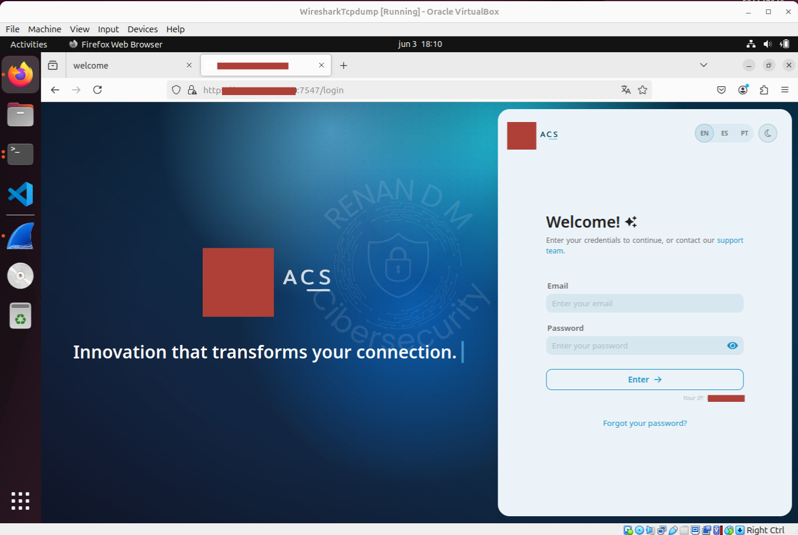

# Análise Inicial de Exposição TR-069 em Ambiente ISP Real

**Data da análise:** 03/06/2025  
**Autor:** Renan Dias Mendes  
**Objetivo:** Documentar e reportar a exposição de um painel ACS (TR-069) em ambiente de produção de um ISP, a partir da análise do tráfego entre um roteador doméstico e a rede da operadora.

---

## 1 – Fonte do Arquivo PCAP

- A captura foi feita na minha própria rede residencial, como cliente do ISP.
- Durante a análise, identifiquei:
  - **IP público acessível**
  - **URL com acesso HTTP ao painel ACS (TR-069)**
- O tráfego foi interceptado com **Wireshark**, sem nenhuma interferência manual no processo de conexão.

---

## Ambiente

- **Host:** Máquina virtual (Ubuntu)
- **Interface:** `enp0s3` (modo *bridge*)
- **Rede:** Roteador doméstico fornecido pelo ISP
- **Ferramentas:** Wireshark, curl, navegador

---

## 2 – Captura e Reconhecimento do Tráfego

- Iniciei o Wireshark na interface `enp0s3`.
- Reiniciei o roteador para capturar todo o tráfego de boot.
- Acessei à interface local do roteador: `http://192.168.1.1:8010` (credenciais padrão: user/user1234).
- Captura pausada após carregamento completo.




## 3 – Aplicação de Filtros e Identificação

- Utilizei o filtro `http.response`
- Diversas requisições HTTP apareceram com dados sensíveis:
  - Modelo e firmware do roteador
  - Referências ao TR-069
  - URL de um servidor ACS



---

## 4 – Teste da URL ACS

```bash
curl -v http://<url_encontrada>
```
- Retorno: HTTP/1.1 200 OK

- Servidor ACS respondeu normalmente via HTTP

- IP público visível na resposta



## 5 – Teste da Porta 7547

```bash
curl -v http://<ip>:7547
```
- Novamente: HTTP/1.1 200 OK

- Porta 7547 (TR-069) acessível externamente



## 6 – Acesso via Navegador

Acesso direto ao IP:7547 exibiu o painel de login.

Painel sem HTTPS e sem autenticação robusta.



---

## Reflexão Pessoal

Essa análise nasceu de uma curiosidade em entender como funcionava a conexão entre roteador > ISP, mas revelou uma possível falha de segurança.
Minha intenção não é expor, mas construir e contribuir.

---

## IOCs

- IP público do ACS: XXX.XXX.XXX.XXX

- Porta ativa: 7547

- Protocolo: HTTP (sem SSL/TLS)

- Dados trafegados: Informações do dispositivo, ACS endpoint

---

## Recomendações

-  Bloquear o acesso externo ao painel ACS

-  Habilitar HTTPS com certificado válido

-  Implementar autenticação forte (hash + MFA)

-  Restringir acesso à porta 7547 com firewall (whitelist)

-  Monitorar varreduras externas com SIEM e IDS

-  Atualizar firmware e reforçar configurações seguras

---

## Referências utilizadas para investigação

[Fiberhome HG6145F](https://fiberhomebrasil.com.br/produtos/hg6145f/)

[Manual Intelbras HG6145F (PDF)](https://backend.intelbras.com/sites/default/files/2024-01/Manual%20do%20Usu%C3%A1rio%20HG6145F.pdf)

[TR-069 – Wiki Made4IT](https://wiki.made4it.com.br/pt-br/made4graph/user_manual/TR-069/Onboarding/home)

[TR-069 Overview – Incognito](https://www.incognito.com/pt/tutorials/tr-069)

[TR-069 Code Injection – QA Cafe](https://www.qacafe.com/resources/2017-01-12-tr-069-code-injection-attack/)

[CVE-2024-56316](https://nvd.nist.gov/vuln/detail/CVE-2024-56316)

[Mirai Attack TR-069](https://www.qacafe.com/resources/home-router-attack-tr-069-vulnerability/)

[CloudShark – Captura](https://www.cloudshark.org/captures/5e15ace66abc?filter=dns%20or%20icmp)

