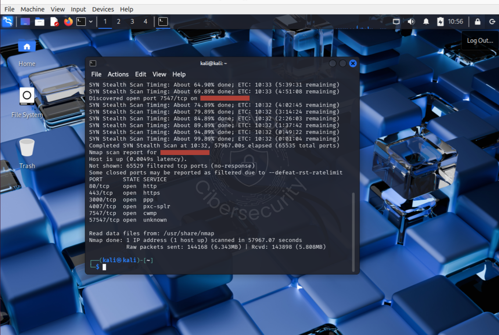
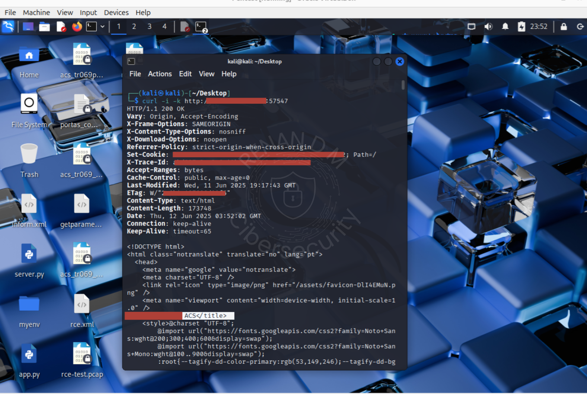
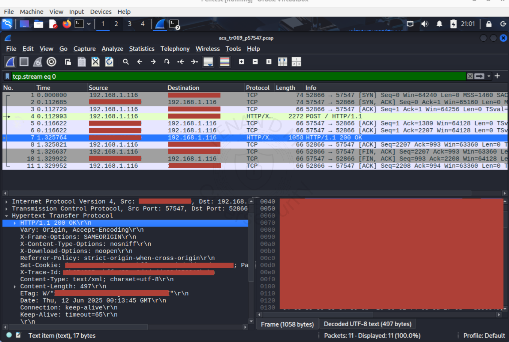
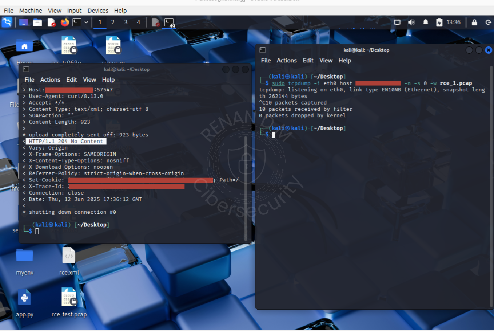
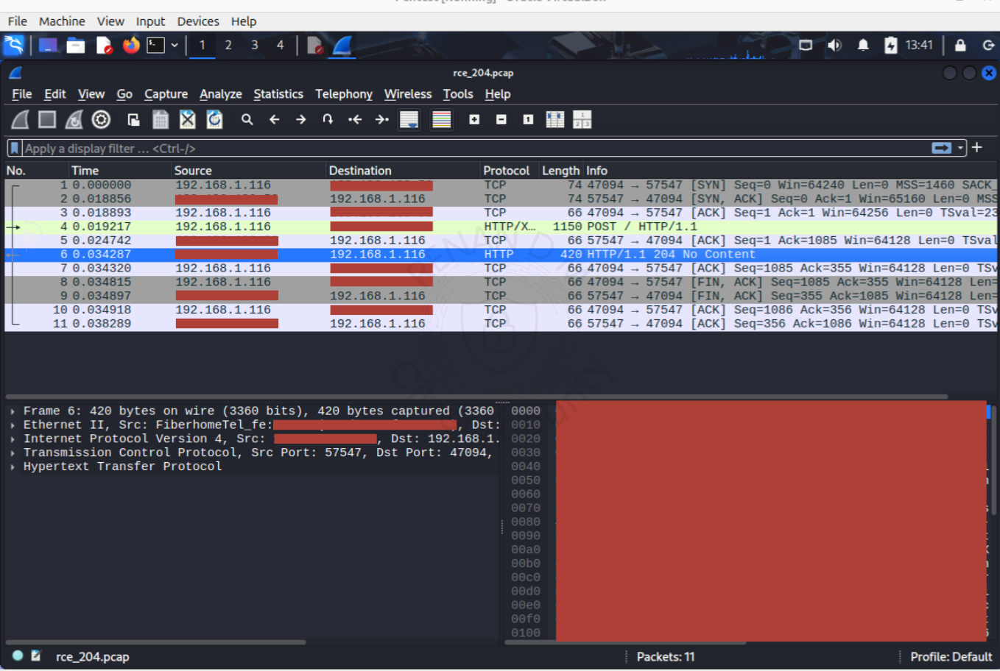

# 📄 Resumo Técnico da Análise de Exposição CWMP (TR-069) em Ambiente ISP Real

---

## 🧩 Contexto

- O protocolo **TR-069 (CWMP)** é usado pelos ISPs para gerenciar remotamente os roteadores dos clientes (CPEs).
- Um servidor ACS (Auto Configuration Server) é o sistema que controla essa comunicação.
- Foi identificado que o ACS do ISP está exposto externamente nas portas **7547 (HTTPS)** e **57547 (HTTP)**.
- Ambos aceitam comandos SOAP arbitrários, simulando a comunicação de um roteador real, **sem exigir qualquer autenticação**.
- A porta 57547 transmite dados em texto puro (sem TLS), facilitando interceptação de dados sensíveis.
- O painel web na porta 57547 não carrega via navegador, mas o backend CWMP responde normalmente às requisições SOAP.

---

## 🔍 O que foi testado

- Envio de payloads SOAP (`inform.xml` e `rce.xml`) simulando roteadores legítimos.
- Ambos os ACS responderam com **HTTP 204 (No Content)**, indicando aceitação e processamento dos comandos.
- Nenhuma autenticação HTTP foi solicitada durante os testes.
- Capturas com Wireshark e tcpdump confirmaram a comunicação e resposta do ACS.

---

## 💡 Recomendações Simples

- 🔐 **Exigir autenticação obrigatória** em qualquer comando enviado ao ACS.
- 🧱 **Bloquear acesso externo às portas 7547 e 57547 no firewall.**
- 🔒 **Migrar a porta 57547 para HTTPS imediatamente**, evitando vazamento de dados.
- 📊 **Implementar monitoramento com Suricata + Splunk** para detectar e bloquear tentativas suspeitas 

---

## ✅ Medidas já adotadas

- Adição de certificado HTTPS na porta 7547, criptografando a comunicação externa.
- Porém, a ausência de autenticação e validação das requisições mantém o risco **alto**.

---

## 📌 Considerações Finais

> 🚨 Resumo crítico: Um atacante externo consegue simular um roteador da rede e enviar comandos ao servidor ACS sem qualquer autenticação, mesmo via internet pública. Isso representa um risco imediato de comprometimento da infraestrutura e dos clientes.

Durante a análise, foram identificados **dois servidores ACS (TR-069)** expostos à internet pública:

- 🔓 **Porta 7547 (com HTTPS)**
- ❌ **Porta 57547 (HTTP, sem criptografia)**

Essa exposição é uma **vulnerabilidade crítica**, já explorada em incidentes reais:  
[CVE-2017-17215](https://nvd.nist.gov/vuln/detail/CVE-2017-17215)

Ambos os serviços **aceitam comandos SOAP arbitrários sem autenticação, sem filtragem de IP, sem qualquer controle de origem.**

---

## ✅ Comparação com CVE-2017-17215

| Elemento    |      CVE-2017-17215          | Teste Atual         |
|-------------|------------------------------|---------------------|
| Método      | `SetParameterValues`         | `SetParameterValues`|
| Payload     | `wget /tmp/m; chmod +x; ./m` | `ping -c 1 8.8.8.8` |
| Autenticação| Nenhuma                      | Nenhuma             |
| Resposta    | 200/204                      | 204                 |

---

### 🧨 Riscos Graves Confirmados

- ⚠️ **Servidor gerenciando os roteadores dos clientes está exposto diretamente à internet.**
- ✅ **Comandos administrativos foram aceitos e processados com resposta HTTP 204**, confirmando interpretação real.
- ❌ **Não há senha, token ou verificação de origem** — qualquer host pode enviar instruções ao ACS.
- 📡 **Porta 57547 trafega tudo em texto claro (HTTP)**, permitindo interceptação passiva.
- 🤖 **Estrutura explorável por scripts automatizados, scanners de botnet e ataques de enumeração**, documentados em múltiplos CVEs.

---

### 🚩 Possíveis Consequências (Cenário Real)

- 🎮 Controle remoto não autorizado de roteadores dos clientes (DNS malicioso, reboot, redirecionamento).
- 🧨 Execução remota de comandos internos sem retorno visível (RCE silenciosa).
- 🔀 Uso da infraestrutura para ataques DDoS ou movimentação lateral.
- 🕵️ Exposição de dados sensíveis (SN, firmware, modelo) — violação direta da LGPD.
- 💥 Comprometimento em larga escala, impacto reputacional e possível responsabilização jurídica.

---

> 💡 Essa vulnerabilidade não depende de bug no software, mas sim de falha grave de configuração: o servidor está exposto e não valida comandos recebidos. Correção imediata possível com políticas de acesso e autenticação SOAP.

---

### 🔎 Conclusão Técnica

O servidor ACS está **visível publicamente, vulnerável e mal configurado**.

A estrutura atual representa um vetor de invasão crítico, compatível com padrões explorados por botnets como **Mirai**.

> ⏳ Cada dia com essa exposição ativa é uma janela aberta para invasão automatizada.  
> A correção é simples. O custo de não corrigir **pode ser desastroso** — técnica, jurídica e financeira.

