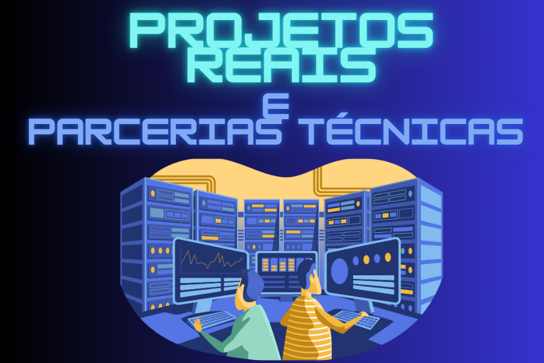

# 🚀 Projetos Reais & Parcerias Técnicas

  

Esta seção reúne análises e investigações em ambientes reais, com casos de segurança em infraestruturas de telecomunicações e redes corporativas. 

Aqui você encontrará a documentação detalhada, provas de conceito e situações vivenciadas em parceria com ISPs e outros parceiros.

---
## 📂 Conteúdo da Pasta
| Pasta                             | Descrição                                                                                       |
|-----------------------------------|-------------------------------------------------------------------------------------------------|
| [Caso TR-069](01-Caso-TR069-Exposicao-ACS-ISP/README.md) |Investigação completa em Ambiente Real (ISP)|

---

> ⚠️ *Todo o conteúdo é resultado de trabalhos éticos, realizados com consentimento das partes envolvidas e voltados para o aprimoramento da segurança da informação.*
