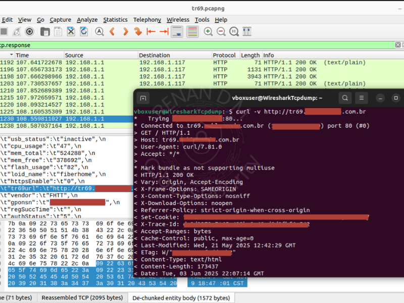

# 💻 Laboratórios - Renan Dias Mendes

### **Caçando ameaças e construindo defesas desde 2024** 👾

> SOC | Threat Hunting | Malware Analysis | Resposta a Incidentes | Hands-on com ferramentas open-source

--- 

## 🛠️ O que você vai encontrar aqui

- Laboratórios práticos: ataques controlados, detecção de ameaças, simulações realistas.

- Análises forenses: malware, tráfego de rede e investigação de incidentes.

- Respostas a incidentes: integração de alertas, regras customizadas e mitigação.

- Ambientes reais e simulados: aprendizado aplicado, documentado passo a passo.

- Ferramentas open-source: Suricata, Splunk, Wazuh, YARA, FLOSS, PE-bear, DIE e muito mais.

Tudo documentado passo a passo e com explicações claras, feito na prática. ✍️

---

## 🔧 Ferramentas que utilizo

- Wazuh, Shuffle, Cortex

- Suricata, Splunk, Iptables

- MISP, RTIR, OpenSearch

- YARA, FLOSS, PE-bear, DIE

- Crowdstrike, Nmap, Metasploit...

- [Ferramentas](Laboratorios-e-Simulacoes/Forense/Ferramentas/README.md)
---  
                                   
| Seção                                                                 | Descrição                                                                                 |
|-----------------------------------------------------------------------|-------------------------------------------------------------------------------------------|
| [Laboratórios e Simulações](Laboratorios-e-Simulacoes/README.md)   | 	Ambientes simulados, varreduras, ataques controlados e detecções em tempo real.                 |
| [Projetos Reais e Parcerias Técnicas](Projetos-Reais-e-Parcerias-Técnicas/README.md) | Investigações em ambientes reais — com exposição de falhas e réplicas técnicas. |

---

## ✨ Destaques

### SIEM & Regras Customizadas

  

- [Mitigação Manual a Alertas com Splunk + Flask + iptables](Laboratorios-e-Simulacoes/SOC-Detecção-e-Mitigação/Splunk-Suricata/Mitigacoes-e-Respostas/Mitigação-Manual-a-Alertas-com-Splunk+Flask+iptables/README.md): Alertas do Suricata vão para o Splunk, que aciona um backend Flask e aguarda a decisão de bloquear ou passar via iptables.

- [Detecção de Portscan com Suricata + Splunk](Laboratorios-e-Simulacoes/SOC-Detecção-e-Mitigação/Splunk-Suricata/Regras-e-Alertas/01-Portscan/README.md):  Regras personalizadas para identificar portscans em tempo real com visualização no Splunk.

### Análises de Malware

  

- [Engenharia Reversa de Malware (Trojan Loader)](Laboratorios-e-Simulacoes/Forense/Analise-de-Malware/01-Trojan-GuLoader/README.md): Análise de malware com PE-bear, DIE e FLOSS → criei uma regra YARA do zero para detectar persistência, evasão e execução de scripts.

- [Análise Forense de PCAP — Botnet IRC + Persistência SSH](Laboratorios-e-Simulacoes/Forense/Analise-de-Malware/02-Botnet-IRC-SSH/README.md): Tráfego capturado de botnet usando IRC como C2 e persistência por SSH. A análise foca em IOCs, técnicas de exfiltração e comportamento da ameaça.

### Caso TR-069 – Investigação em Ambiente Real (ISP)

  

- [01 - Exposição Inicial](Projetos-Reais-e-Parcerias-Técnicas/01-Caso-TR069-Exposicao-ACS-ISP/01-Analise-Inicial-Exposicao/README.md): Servidor ACS exposto publicamente, sem TLS e autenticação fraca. Riscos reais, analisados em ambiente de provedor de internet local.

- [02 - Vulnerabilidades em Requisições SOAP](Projetos-Reais-e-Parcerias-Técnicas/01-Caso-TR069-Exposicao-ACS-ISP/02-Analise-Tecnica-ACS-SOAP/README.md): Detalhamento das vulnerabilidades nas requisições SOAP e riscos de execução remota.

- [05 - Réplica Técnica ao ACS](Projetos-Reais-e-Parcerias-Técnicas/01-Caso-TR069-Exposicao-ACS-ISP/05-Replica-Tecnica/README.md): Documento-resposta à análise da equipe responsável, reforçando os riscos encontrados e propondo medidas segurança.

---

## Contato

📫 LinkedIn: [Renan Dias Mendes](https://www.linkedin.com/in/renan-dias-mendes-571926373/)
✉️ E-mail: renandmm96@gmail.com

---

> ⚠️ **Este portfólio está em constante evolução.**  
> Prometo trazer mais atualizações!
> Cada erro virou aprendizado, cada acerto virou documentação. Tudo feito na raça, com dedicação e muuuito café ☕.
> **Obrigado pela visita!**
