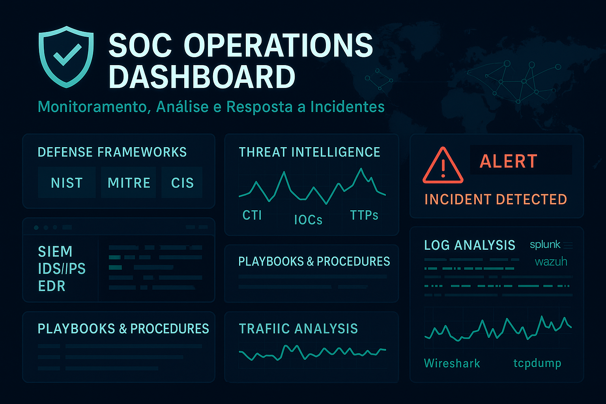

# Laboratórios de Cibersegurança – Renan Dias Mendes

  

Meu nome é Renan, e aqui você encontra minha trajetória na Segurança da Informação, com foco em **SOC, Threat Hunting e Resposta a Incidentes.**

Esse repositório é onde concentro tudo o que venho testando, analisando e aprendendo. Cada projeto aqui nasceu de uma dúvida real, de uma falha observada ou de uma curiosidade técnica.

--- 

## O que você vai encontrar aqui
Laboratórios práticos, análises forenses, detecção de ameaças, resposta a incidentes e testes em ambientes reais. Sempre com ferramentas open-source, explicações clara e documentação feita na unha.

---

## Ferramentas que utilizo

- Wireshark, tcpdump, Zeek

- Suricata, Splunk

- YARA, FLOSS, PE-bear, DIE

- Nmap, Metasploit...

---  
                                   
| Seção                                                                 | Descrição                                                                                 |
|-----------------------------------------------------------------------|-------------------------------------------------------------------------------------------|
| [🔬 Laboratórios e Simulações](Laboratorios-e-Simulacoes/README.md)   | 	Ambientes simulados, varreduras, ataques controlados e detecções em tempo real.                 |
| [🛠️ Projetos Reais e Parcerias Técnicas](Projetos-Reais-e-Parcerias-Técnicas/README.md) | Investigações em ambientes reais — com exposição de falhas e réplicas técnicas. |

---

## 📌  Destaques

### Caso TR-069 – Investigação em Ambiente Real (ISP)
- [01 - Exposição Inicial](Projetos-Reais-e-Parcerias-Técnicas/01-Caso-TR069-Exposicao-ACS-ISP/01-Analise-Inicial-Exposicao/README.md): Análise de um servidor ACS exposto publicamente, sem criptografia e com autenticação fraca. Tudo flagrado em um ambiente real de provedor.

- [02 - Vulnerabilidades em Requisições SOAP](Projetos-Reais-e-Parcerias-Técnicas/01-Caso-TR069-Exposicao-ACS-ISP/02-Analise-Tecnica-ACS-SOAP/README.md): Detalhamento das vulnerabilidades nas requisições SOAP e riscos de execução remota.

- [05 - Réplica Técnica ao ACS](Projetos-Reais-e-Parcerias-Técnicas/01-Caso-TR069-Exposicao-ACS-ISP/05-Replica-Tecnica/README.md): Documento-resposta à análise da equipe responsável, reforçando os riscos encontrados e propondo medidas segurança.

### Análises de Malware

- [Botnet IRC + SSH via PCAP](Laboratorios-e-Simulacoes/Forense/Wireshark-Tcpdump/Analise-de-Malware/01-Botnet-IRC-SSH/README.md): Tráfego capturado de botnet usando IRC como C2 e persistência por SSH. A análise foca em IOCs, técnicas de exfiltração e comportamento da ameaça.

- [AgentTesla (.NET) – Análise Estática + YARA](Laboratorios-e-Simulacoes/Forense/Yara-PEBear-Die-Floss/Analise-de-Malware/01-AgentTesla/README.md): Reversão manual de sample da família AgentTesla com ferramentas como PE-bear, DIE e FLOSS. A análise resultou em uma regra YARA construída na mão pra detectar variantes com foco em persistência, evasão e execução de scripts.

### SIEM & Regras Customizadas

- [Detecção de Portscan com Suricata + Splunk](Laboratorios-e-Simulacoes/NMS/Splunk-Suricata/Regras-e-Alertas/01-Portscan/README.md):  Regras personalizadas para identificar portscans (SYN, FIN, NULL, XMAS, UDP) em tempo real com visualização no Splunk.

- [SOAR Manual com Suricata + Splunk e Backend em Flask + Iptables](Laboratorios-e-Simulacoes/NMS/Splunk-Suricata/Mitigacoes-e-Respostas/soar-manual/README.md): Resposta a incidentes feita do zero: alertas do Suricata vão para o Splunk, que aciona um backend Flask e aguarda a decisão de bloquear ou passar via iptables.

---

## Contato

📫 LinkedIn: [Renan Dias Mendes](https://www.linkedin.com/in/renan-dias-mendes-571926373/)
✉️ E-mail: renandmm96@gmail.com

---

> ⚠️ **Este portfólio está em constante evolução.**  
> Cada erro virou aprendizado, cada acerto gerou documentação.  
> Tudo aqui foi feito com paciência, dedicação e muito café.  
> **Obrigado pela visita!**
